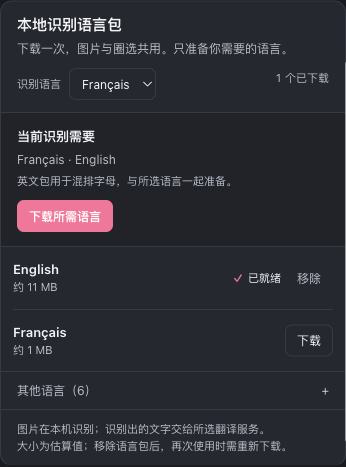
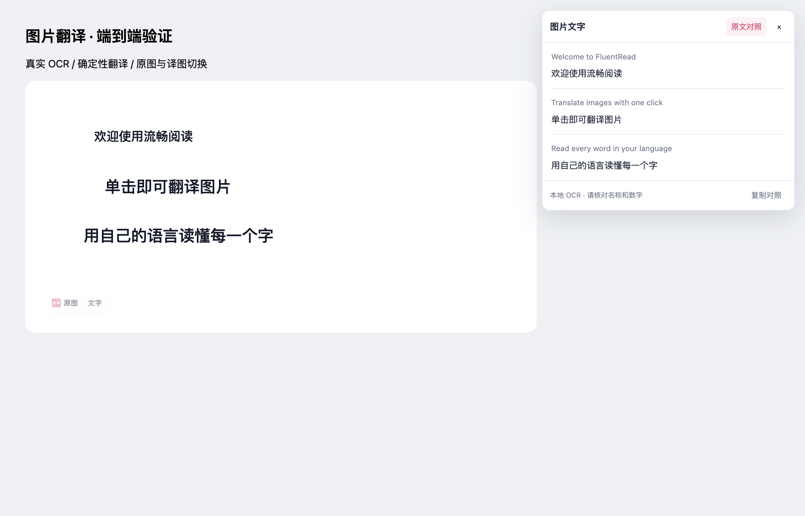

# 图片识别体验设计与验收

目标：用户能知道需要准备什么、现在进行到哪里，并能舒适地核对识别与译文。

## 产品决策

- 保留整图翻译和圈选阅读两个入口。整图保留原排版，圈选侧重快速阅读；模型识图仍由能力与用户配置决定。
- 语言包采用一个分组、紧凑分隔行和中性次要按钮。只给当前源语言缺失包一个主要准备操作，避免八个品牌色按钮竞争注意力。
- 显示真实排队、下载、完成和失败状态，不以假百分比掩盖下载等待。后台逐包保存，重复请求合并，关闭设置不丢失任务进度。
- 原文和译文必须可以核对、选择和复制。长文字阅读面板不受图片尺寸裁切。
- 圈选截图完成后允许继续滚动阅读；截图前滚动仍须使旧坐标失效，切换标签时停止任务并释放截图。
- OCR 采取有界策略，验证真实样本。避免凭合成夹具宣称手写和复杂背景识别准确率。

## 完成设计后的产品复审

| 用户遇到的情况 | 最终行为与取舍 | 对应验证 |
| --- | --- | --- |
| 首次看到语言包，不知道该下载哪些 | 当前识别语言决定准备列表；保留一个主要下载按钮。自动检测明确列出简繁中、英文和日文；其余语言按需展开 | 真实设置页默认列表、法语选择、展开/收起与跨页持久化 |
| 列表过长、下载按钮抢眼 | 使用一个边界、62px 分隔行、中性单包按钮；状态与操作靠近。深色与窄屏复用设置页颜色变量 | 桌面与 390px 截图、行高和无横向溢出断言 |
| 等待时不知道是否在工作 | 显示后台真实排队/下载阶段；不把引擎加载进度当作字节下载百分比 | 实际下载法语和英语包，观察下载与排队状态 |
| 关掉设置再回来，或另一设置页也在下载 | 后台持有任务，组件仅订阅状态；单包下载去重，结果逐包持久化 | 下载中关页，重开圈选设置，再开图片设置；移除后另一页同步 |
| 一包失败，担心全部重下 | 继续处理其他包并保留成功项；只重试缺失包；失败留在对应行 | 部分失败/重试、重复请求、下载与移除交错的后台测试 |
| 图片小、译文长或想核对专有名词 | 独立视口阅读面板保留每段原文与译文，支持复制对照；仅改变的文字参与位图绘制 | 真实图片流程与阅读面板的可信操作、复制失败、Escape、清理测试 |
| 返回文字与原文相同 | 仍显示可阅读、可复制的识别结果，保留原图；不把品牌名或目标语言误判成失败 | Offscreen 无变化结果用例 |
| 识别漏掉小图片中的文字 | 空结果的小图增加一次单块分割尝试；空结果不进入成功缓存；大图保持原有识别预算 | OCR 重试、预算、坐标映射、缓存与取消测试 |
| 重复检测同一文字框 | 仅去除文字、方向相同且 IoU 至少 0.9 的重叠框；保留不同位置的重复行、按钮和数字 | 归一化去重测试 |
| 圈选后想继续阅读网页 | 截图完成后滚动保留结果，窗口变化重新约束面板；截图前改变页面使旧坐标失效，切换标签继续取消 | 真实滚动、窄屏、切换标签、取消后迟到结果验证 |

整图保留布局和圈选快速阅读仍是两个清晰入口。模型识图继续遵循已有能力判断和用户设置，服务错误不触发静默切换。图片、文字及配置仍使用已有隔离、请求取消和持久化边界。本次没有复制或依赖参考仓库代码。

## 验证范围

- 14 个相关功能测试文件共 335 项通过；9 个核心覆盖测试文件共 184 项通过。覆盖的 `core`、OCR 运行时、Offscreen 编排、后台任务、图片操作条与新阅读面板，其 statements / branches / functions / lines 均为 100%。这是受影响范围验证，并非全仓回归。
- 类型检查、测试归类审计、Chrome MV3 / Firefox MV2 / userscript 构建及 userscript 产物验证通过；中英文使用文档同步更新。用户脚本仅更新共享多语言资源及固定提交，不启用图片功能。
- 真实生产扩展的设置、图片与圈选报告、截图见 [验收证据](../reports/image-recognition-experience-20260930/report.json)。使用临时隔离 Edge，后台正常尺寸窗口位于第二屏，`macos-background-cdp` / `launchservices-no-foreground`，没有操作用户浏览器。
- OCR 使用真实 Tesseract 和实际下载的语言包。受控英文截图样本覆盖清晰 26px、小字 14px、深色 20px；翻译响应为确定性 Google/OpenAI 传输夹具，不代表实时供应商翻译质量。未验证手写、任意复杂背景的普遍准确率、Firefox 实际 UI 或移动真机。

### 整合主分支时发现的现有检查失败

整合基线 `51e7540e` 后，两项架构断言已有失败：分享卡片的 7 个模块未进入 `vitest.coverage.config.ts` 的登记，视频字幕 `content/runtime.ts` 有 1909 个非空行，超过原上限 1887。这些源文件在本任务与基线完全相同；本任务未抬高门槛、添加忽略或把它们计为通过。其余相关架构断言通过。本次新增图片阅读模块已登记并通过四维严格覆盖验证。

## 界面证据

