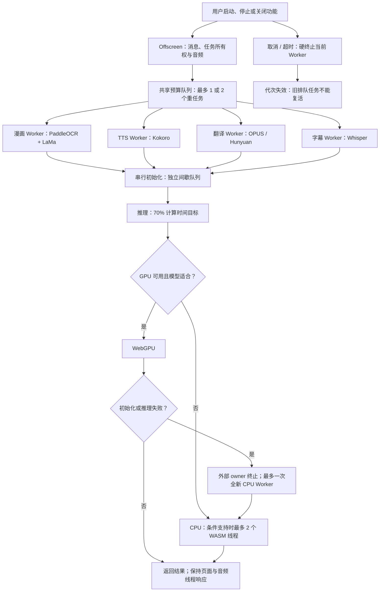
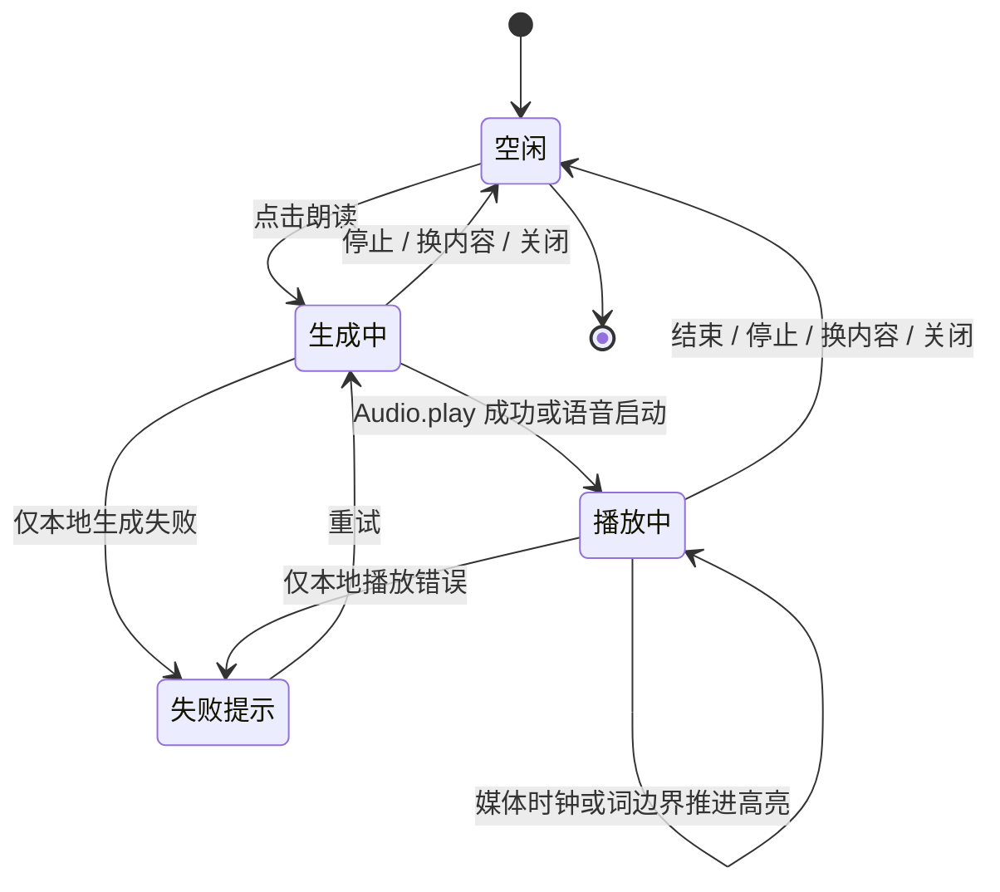

# 本地推理可靠性、资源与跟读优化报告

## 背景与目标

扩展开发包此前达到约 166.40 MB。[上一轮体积优化](./extension-size-20261006.md)已在 PR #861 合入：统一锁文件中已有的 ONNX JS/WASM、复用 Worker 共享块、关闭普通开发构建的内联源码映射，并改进模型按需下载和缓存。Chrome 正式包从 107.92 MB 降至 60.23 MB，开发包从 166.40 MB 降至 63.44 MB。图片合计仅约 0.21 MB，并不是这次膨胀的主因。

模型权重继续在使用相关功能前下载；简体中文浏览器优先尝试 `hf-mirror.com`、`hf-mirror.net`，其他语言环境优先官方 Hugging Face，Whisper 保留已登记的魔搭来源。固定版本、摘要校验、离线导入和缓存复用保持原有约束。包内 JS/WASM 属于执行代码，受 [Chrome 扩展远程代码规则](https://developer.chrome.com/docs/extensions/develop/migrate/remote-hosted-code)约束；不能将执行代码当成普通模型文件远程加载。

体积减小不等于完整功能验收。随后用户反馈 MANGA Plus 漫画停在“准备模型 100%”，清除原文时 CPU 接近单核满载，朗读显示播放中却没有声音；漫画提示遮挡画面，最新提示条里的转圈也似乎停住。本轮目标是找到这些路径的根因，修复状态、资源和兼容性问题，并提供生成状态与跟读显示。

## 诊断与改动

| 路径 | 之前的行为或发现 | 本轮处理 |
| --- | --- | --- |
| GPU 能力判断 | 旧 `GPUDevice.prototype.adapterInfo` 检查在实际支持 WebGPU 的 Edge 上拒绝 GPU，复杂封面全部使用 CPU | 使用项目已有的真实 adapter/device 探测；漫画 OCR 与 LaMa 优先 GPU，失败可回退 CPU |
| 模型初始化 | Paddle SDK 同时创建检测和识别 session；共享 Asyncify runtime 的初始化交错可能卡住。直接删旧 GPU 门禁的诊断版真实复现高占用挂起 | 独立漫画 Worker 内串行创建 session；外部看守不受该 Worker 原生计算阻塞 |
| 重计算线程 | 漫画识别、气泡分析和 LaMa 与 Offscreen 音频/消息处于同一执行上下文 | 移入静态模块 Worker；Offscreen 保留消息、取消和音频所有权，输出张量转移所有权 |
| 准备进度 | 下载 100% 后仍有初始化，旧显示无法区分；重建后的推理也可能沿用初始化时限 | 分开下载、初始化和推理；下载看无数据等待，GPU 初始化 15 秒，GPU 推理 60 秒，CPU 120 秒。重建后在 `run()` 前切回推理阶段 |
| GPU 失败路径 | 推理预算内部重建 session，若初始化共用同一串行队列会互相等待 | 初始化和推理各有独立计算间歇队列；会话创建仍串行。失败、取消、超时由外部 owner 终止，GPU 生命周期失败最多新建一次 CPU Worker |
| 取消与空闲 | 排队旧任务可能在清理后重新创建 Worker；旧空闲计时器可能取消等待资源的新任务 | 各 owner 校验 Worker 代次；预算排队前清除旧空闲计时器，结束后重新计时；取消排队不启动模型 |
| TTS 状态 | 请求发起即显示播放；失败可能残留状态。词卡将结果对象当成布尔值，失败时跳过备用朗读 | 显示“正在生成语音…”并可停止；按 `handled` 判定结果；失败、关闭、结束与新请求统一清理。仅本地模式保留本地错误提示 |
| TTS 音频 | 只检查浮点值非零不足以保证 PCM16 非静音 | 同时检查有限值、有效采样率和编码后的非零 PCM16；实际模型、WAV 解码和媒体时钟专项验证 |
| 漫画提示 | 大块居中提示遮挡，滚动可见区域变化时显得跳动；关闭装饰动画会连加载转圈一起关闭 | 使用贴近当前可见图片边缘的约 31px 高紧凑条，不接收指针事件；加载转圈独立于装饰动画设置，尊重系统减少动态效果偏好 |
| 跟读 | 用户无法看出正在读哪个词 | 基于媒体真实 `currentTime` 显示当前词扫读；保持富文本字符偏移和前导空白映射；停止或换内容清理高亮 |

没有恢复旧版 WASM，也没有升级依赖或锁文件。保留原有识别分辨率、512 上限局部修补、字形蒙版、背景复用与原图恢复能力，未通过降低图片质量绕开故障。未修改或依赖参考项目。

## 共享资源策略

`src/shared/onnx/resources.ts` 为四类本地模型复用策略，而不是为每个功能各造一套线程数量设置。

| 能力 | 策略 |
| --- | --- |
| Offscreen 全局重任务 | 少于 8 个逻辑核或已知内存不超过 4GB 时最多 1 个；其余最多 2 个独立 Worker 任务；硬件核数不可用按 1 处理 |
| ONNX WASM 线程 | 仅跨源隔离、`SharedArrayBuffer` 可用且设备核数足够时最多 2 个；其余 1 个 |
| pthread 初始化失败 | owner 只重建一次，新的 Worker 锁定为单线程，不循环重试不可用的能力 |
| 计算间歇 | 每次实际计算后登记其耗时的 `3/7` 作为下一次计算前的间歇，即 70% 计算时间目标；已有自然空闲抵扣间歇 |
| 初始化与推理 | 同样计算间歇策略、独立串行队列，避免在推理异常回退里等待自己 |
| 用户取消/销毁 | 当前请求终止拥有的 Worker，排队旧代次不能重新启动；下载取消沿用模型层原有协议 |

70% 为预处理、模型初始化和浏览器调度留出余量，服务于持续占用约 80% 的目标。它不是操作系统硬限制：不可中断的原生算子执行期间仍可接近单核 100%；多线程与多个 Worker 的进程占用也会累计。[Chrome CPU 指标](https://developer.chrome.com/docs/extensions/reference/api/processes)以一个 CPU 核心的满载为 100%，不能将它与整台多核机器 100% 混淆。

当前生产 manifest 没有强行增加 COOP/COEP。实际生产 Worker 的 `crossOriginIsolated=false`，因此 ONNX 使用单线程，但独立模型 Worker 可以受控并行。额外的临时跨源隔离扩展副本已验证真实 pthread 创建；这只证明条件支持时可启用两个 WASM 线程，不代表所有部署与跨源资源已完成隔离兼容验收。[ONNX 官方线程配置说明](https://onnxruntime.ai/docs/api/js/interfaces/Env.WebAssemblyFlags.html)列出了线程与隔离条件。

Hunyuan 使用自身 wllama 引擎，仍保持其包内单线程 CPU 兼容设置、支持时优先 GPU；它同样进入共享任务预算和计算间歇。OPUS 轻量翻译保持 CPU 优先：上一轮实际短句测量的 GPU 路径更慢，不能仅因 GPU 可用就强制使用。漫画、Kokoro 与 Whisper 保持 GPU 优先、有界 CPU 回退。



## 朗读状态与跟读精度

生成阶段显示明确状态和停止按钮。播放进度由真正媒体时钟驱动，结束、错误、替换与关闭会清理计时器、Blob URL 和高亮。跨后台、Offscreen 与 content 的消息按原有 tab/request 路由校验，旧请求进度不能覆盖新内容。

本地 Kokoro 流式输出提供实际句段音频样本数，因此能计算句段真实时长；模型没有提供逐词时间戳，句段内词/字扫读按播放比例估算并在提示中标明。普通只有音频的服务也使用估算。浏览器语音提供 `boundary` 时使用其真实字符边界；不支持该事件的声音无法保证逐词推进。中英文混排按汉字/词处理，原文空白和代码字符索引保留；网页原始 DOM 不改写。

没有为了逐词对齐追加大模型或重新打包 Whisper，因此不会把跟读功能变成额外下载前置条件。估算扫读可能与具体发音有偏差，不能当作强制对齐结果。



## 实测与验收边界

最终记录见 [验证摘要](./assets/local-inference-reliability-20261006/validation.json)。浏览器测试使用自有临时 profile、第二屏正常窗口、后台 LaunchServices 启动与前台保护，结束后仅清理自己的浏览器、扩展副本和 profile。

同一用户复杂封面、相同生产模型、提前导入已校验权重，用于对比初始化与暖模型处理耗时；文字翻译传输固定，避免外部翻译服务抖动混入本地性能结果。基线 GPU 实际提交数为 0，暖模型整页处理约 54.9 秒。新实现验证实际 GPU queue 提交与完整输出，不将“能力探测成功”等同于用了 GPU。

| 相同复杂封面 | 已缓存模型的首次处理 | 暖模型处理 | 漫画计算进程平均 CPU：首次 / 暖运行 |
| --- | ---: | ---: | ---: |
| 优化前，实际使用 CPU | 63.3 秒 | 54.9 秒 | 原用户截图约 99.2%；此值不是同条件区间平均 |
| 本轮，GPU 优先 | 25.4 秒 | 15.8 秒 | 67.2% / 16.7% |
| 本轮，强制 CPU 对照 | 81.0 秒 | 72.9 秒 | 78.1% / 68.7% |

同条件暖模型 GPU 处理约减少 71.3% 耗时。强制 CPU 路径用更多间歇换取资源余量，不能声称 CPU 处理速度也提升。GPU 两轮分别实际提交 3,860 和 2,577 次 queue 操作；CPU 对照均为 0。两轮各 12 次提示圈 transform 采样全部不同，最大页面心跳间隔约 63ms，提示条高 30.5px。

CPU 专项强制禁用 GPU；高频调试采样有工具开销，因此单独报告漫画计算进程平均值，不把所有浏览器辅助进程合计当作扩展推理占用。CPU 测量完成于整合上游词书提交前，相关漫画/资源源码未改变；GPU 与音频采用整合上游后的构建。

Chrome 正式包 60,189,410 字节，Firefox 正式包 60,188,445 字节；包内 WASM 合计仍为 34,895,939 字节，图片仍为 205,888 字节。用户脚本 1,949,013 字节，保持原 1,950,000 字节预算；仅对嵌入的静态多语言数据排序键并使用 gzip level 9，解析后的内容保持一致，没有提高体积阈值。

限定的 24 个相关测试文件、660 个用例通过；19 个已登记受影响模块的语句、分支、函数和行覆盖率全部 100%。另 16 文件、1,352 用例验证划词组件实际 setup 生命周期、静态契约、源文件职责头、模块/provider 边界与浏览器前台保护，部分用例与前一组重叠，不累加为独立总数。类型检查、Chrome/Firefox/用户脚本构建、用户脚本 verifier、manifest 与测试分类审计通过。

验证归属审计仍有一项失败：18 个既有模块未登记严格覆盖边界。当前干净 `main` 的 `a65b0447` 实测得到完全相同的 18 个路径；本轮新增模块已登记，未扩大该缺口。测试分类审计通过不代表这项架构检查也通过。

最终构建在用户给出的 [MANGA Plus 原网址](https://mangaplus.shueisha.co.jp/viewer/1028732)通过 11 项验收：准备时取消与恢复、只处理可见页、译图与原图切换、滚动新页、缓存复用、安静阅读、紧凑入口、设置重新打开持久化、总开关关闭后样式恢复、下载源持久化与缓存资源状态/清理。图片 OCR 与 LaMa 为真实模型；文字传输固定，所以不声称在线翻译服务质量或整章文字识别质量已验收。

本地 TTS 对用户截图中的英文与中文生成实际非静音 WAV，完成解码、真实 HTMLAudio 媒体时钟推进、播放结束与进度计时器停止。测试音频设为静音，避免打扰用户；这证明音频生成与播放器链路，不等于已验证用户扬声器、系统音量或原始环境的所有“无声音”原因。原始两句模型本身可生成非静音音频，不能把原始问题全归因于模型生成失败。

临时隔离副本的 TTS 与 Whisper 双线程条件测试均记录真实 `em-pthread` 创建，Whisper 回报 `threads=2`；注入 pthread 创建失败后，各自只重建一次单线程 Worker。TTS 完成同样 WAV 与播放时钟验收，Whisper 单线程 q4 成功识别受控英文音频，四例整轮通过。

最终限定音频脚本跳过设置页与截图，GPU/CPU 两例整轮通过。此前同一构建的音频案例通过后，在额外打开设置页时触发前台保护，脚本已停止并清理；该轮不计为完整通过，失败原因单独保留在摘要中。Firefox 与用户脚本本轮有编译/构建和静态契约验收；未将其表述为 Firefox 实机 GPU/音频或用户脚本管理器完整运行验证。

两个 Mermaid 图的最终正文已用固定 Mermaid 11.4.1 实际解析并渲染 SVG，通过语法与渲染检查；此步骤使用独立无扩展的静态文档，不混入扩展的真实浏览器验收。

## 复现入口

```sh
pnpm compile
pnpm build
pnpm build:firefox
pnpm generate:userscript-languages
pnpm build:userscript
node scripts/verify-userscript-build.mjs
pnpm verify:extension-manifests
pnpm test:audit
pnpm docs:build

# 自有临时隔离浏览器：同一原图，预先导入四个已校验模型文件
node scripts/testing/run-manga-translation-test.cjs \
  --extension-dir .output/chrome-mv3 \
  --playwright-root /path/to/node_modules \
  --focus-safe-helper /path/to/focus-safe-browser.cjs \
  --preload-models-dir /path/to/validated-manga-models \
  --pipeline-inputs /path/to/original.png --pipeline-rounds 2 \
  --worker-diagnostics --artifacts-dir /path/to/evidence
# CPU 对照增加 --pipeline-cpu；原站生命周期增加 --live-site 并选择原网址
```

相关测试采用显式受影响文件筛选；没有运行全量回归，也没有进行商店发布。浏览器环境、多线程隔离、具体 GPU 驱动和网络来源的可用性仍需要按实际设备观察。
