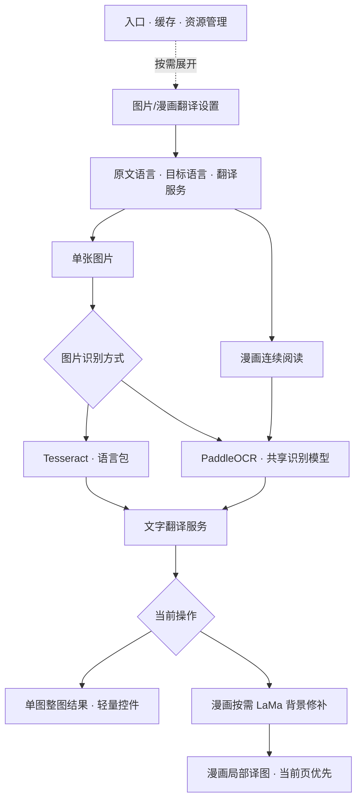
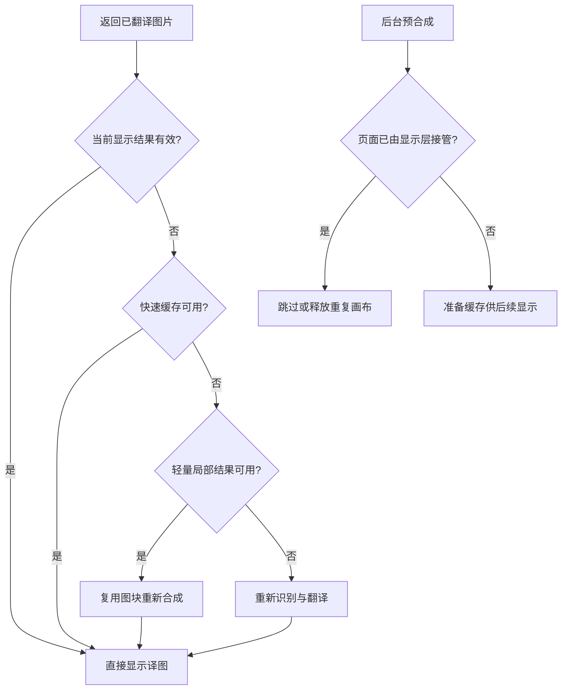
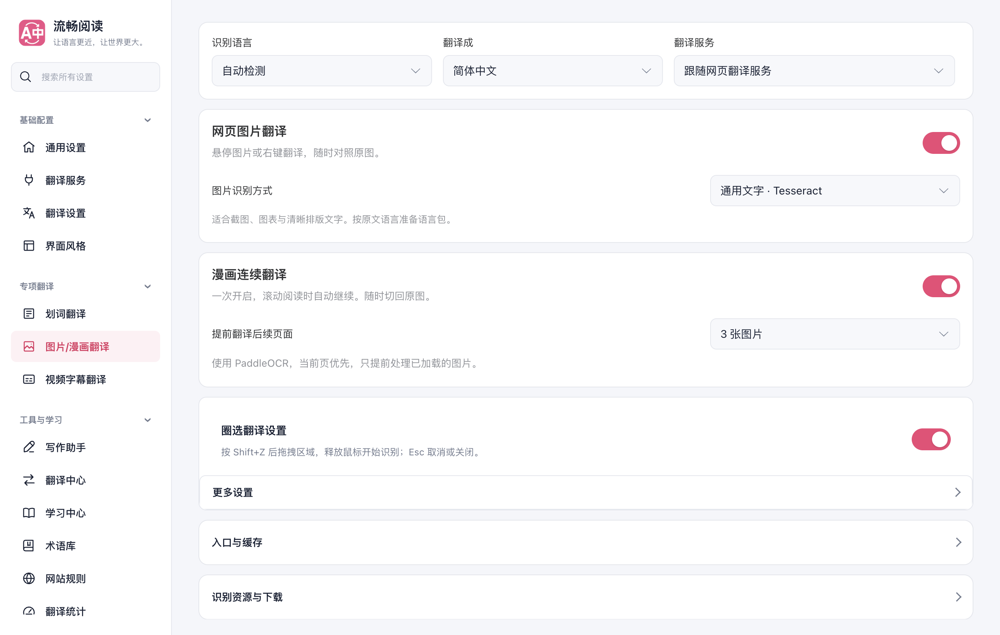
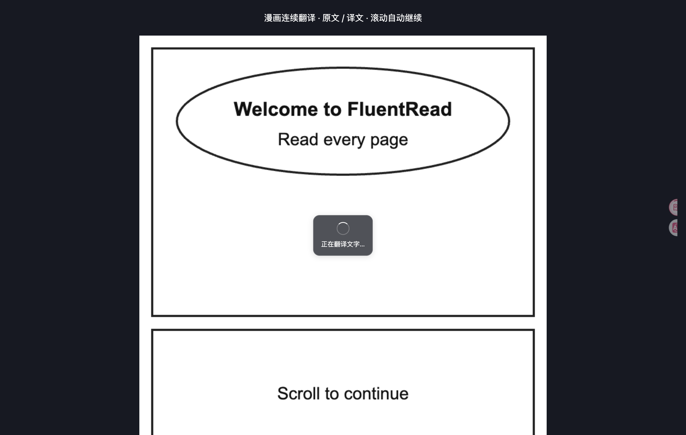
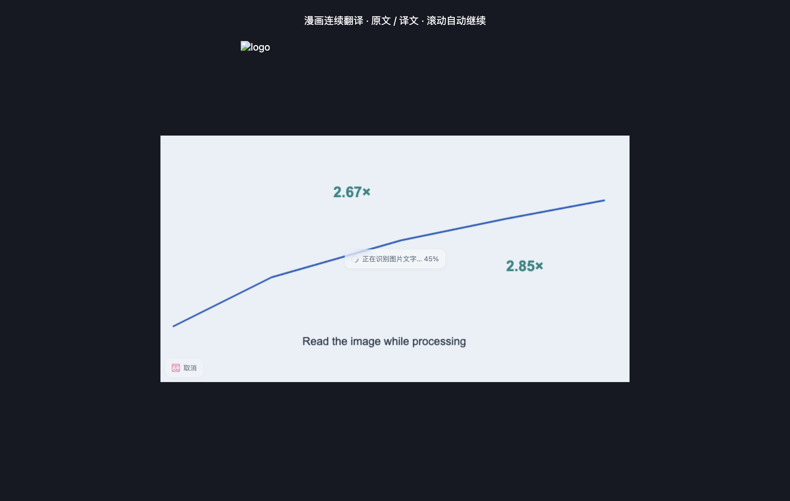

# 图片识别选择、漫画反馈与设置整理

日期：2026-10-04。普通图片恢复原有轻量界面，新增可选 PaddleOCR，漫画保持独立的连续阅读交互。设置首先展示语言、服务和识别方式，其余内容按需展开。

## 用户看到的变化

- 普通图片保留小型、半透明的阶段文字；取消按钮位于图片操作条，不再出现中央大卡片。选择漫画识别模型也使用这一界面。
- 漫画仅在正在处理的图片上显示小型深色阶段提示。有真实下载、识别或清除百分比才显示数值；等待文字翻译时不估算总百分比。完成或显示原图后提示消失，不拦截点击与滚动。
- 漫画不显示左下角“原图／文字”操作条，使用阅读按钮反复切换原图和译图。
- 漫画按钮采用书页与对话图形，直径 32 px；闲置约 2.5 秒后收起。键盘聚焦时保持展开，Escape 可收起。收起后的可见半边位于滚动条内侧，避免被 macOS 浮动滚动条挡住点击。
- 设置顶部集中原文语言、目标语言、翻译服务；单图选择识别方式，漫画选择提前翻译数量。圈选只保留一个开关和折叠详情。“入口与缓存”“识别资源与下载”“支持的网站”默认收起，资源管理组件展开后才挂载。

## 哪种模型负责什么

| 能力 | 单张网页图片 | 漫画连续阅读 | 资源与边界 |
| --- | --- | --- | --- |
| Tesseract | 默认，可选“通用文字” | 不使用 | 按原文语言准备语言包；适合截图、图表和清晰文字 |
| PaddleOCR | 可选“漫画文字” | 固定使用 | 识别资源约 30 MB，共享同一缓存和运行时；适合气泡和漫画文字 |
| LaMa | 选择 PaddleOCR 不会加载 | 按需用于复杂背景修补 | 约 197 MB；用于清除原字，不是文字识别模型 |
| 模型识图 | 由圈选自己的识图配置控制 | 本次未改变 | 使用所选、具备识图能力的模型与服务 |

识别与翻译是不同步骤：PaddleOCR 改变文字提取，不会替换用户选定的文字翻译服务。效果取决于图片、源语言和翻译服务，不承诺某个模型对所有图片都更好。

切换单图识别方式只保存偏好，不下载文件。首次明确翻译时准备缺失资源；已下载漫画模型直接复用，不重下。后台从已保存设置决定单图引擎，Offscreen 校验枚举，漫画标记保持独立。切换方式后旧单图译图失效，避免误用另一引擎结果。

下载来源、完整性校验和离线导入沿用现有实现。关闭漫画、仅启用单图 PaddleOCR 时，资源区隐藏无关的漫画修补模型。镜像与离线导入用于不同地区网络，实际连通仍取决于网络条件；不能保证全球所有网络持续可达。

## 返回第一页为何变成原图

此前，附近图片的预合成任务发现快速缓存槽被淘汰后，会释放当前显示层再装入新画布。缓存淘汰与显示状态混用，导致读者返回第一页时正在显示的译图被撤下。

修复在任务开始及异步合成完成时检查当前有效结果。已由显示层接管的页面不重复预合成；排队期间已恢复的页面丢弃重复画布。当前译图的生命周期不依赖某个缓存槽是否存在。

缓存容量、GPU 回退和站点适配没有在本次扩张。已有性能与空间分析见[漫画管线性能报告](./manga-pipeline-performance-20261004.md)和[滚动稳定性报告](./manga-scroll-stability-20261004.md)。本次不引入新依赖、不修改参考仓库。

## 验证与证据

类型检查及 Chrome、Firefox、userscript 生产构建按相关范围验证；新增非中文识别文案覆盖英、日、韩、法、俄、西语，userscript 配套语言资源重新生成。

针对性回归分两组：图片处理与消息链路 432 项；配置、设置结构、悬浮交互、文案及源码边界 1094 项。以下七个模块的 statements、branches、functions、lines 均为 100%：`controls`、`mangaReader`、`mangaSession`、图片后台 `handlers`、`offscreenAdapter`、`offscreenRuntime`、Offscreen `messageRouter`。未运行全量回归。

干净基线 `bff3fe5242a0afd5073fcddbb653e6f62431b5bf` 中已复现六项原有失败，专项运行通过名称筛选排除，并保留基线日志：

| 测试文件 | 原有失败 |
| --- | --- |
| `backgroundFeatureHandlers.test.ts` | 输入框默认服务预期仍为 Microsoft；设置旧别名预期仍指向区域页 |
| `imageGlossaryContext.test.ts` | 两项仍假设文字三路并发的回执顺序；其中一项产生未处理拒绝 |
| `i18n.test.ts` | 全界面扫描的 275 项既存缺失；四个词书人工校正文案已不在界面使用 |

上述基线失败未在此修改。新增识别文案专项、模型选择链路和此次设置结构检查均单独通过，不能将结果描述为全仓测试通过。

真实浏览器专项使用生产 Chrome 扩展、独立临时 profile：`launchMode=macos-background-cdp`、`focusPolicy=launchservices-no-foreground`、`windowPlacement.mode=background-visible-no-focus`，前台检测保持 `browserFrontmost=false`。测试结束删除临时 profile。

设置专项 7 项、漫画与单图专项 13 项均通过，页面与扩展控制台无错误。设置专项验证真实选择与立即关闭再打开、选择时零模型下载、按用途显示资源、提前翻译保存、英文及 390 px 深色布局。漫画专项验证返回页连续帧不闪回、快速缓存淘汰后当前译图保留、多次原译切换不重复识别、按钮收起和键盘操作；单图在没有 Tesseract 语言包的情况下实际复用 PaddleOCR，仍使用轻量控件。

OCR 使用已校验本地真实模型；文字翻译响应为确定性夹具。45% 进度截图通过扩展自己的 Offscreen 消息注入，仅证明数值和文案展示，不是 OCR 性能测量。此证据不等于实际第三方翻译质量、原报告章节的线上复现、全球网络可达性或 Firefox 实机验证。

### 设置主要内容

### 漫画当前页反馈

### 普通图片轻量界面

