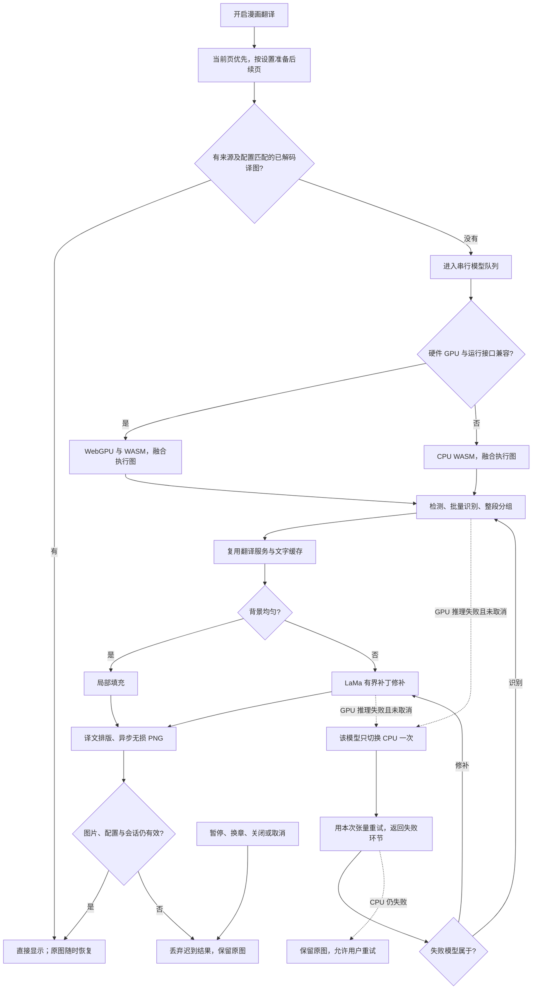

# 漫画翻译 GPU 与流水线性能报告

漫画识别和背景修补现在自动选择兼容的硬件 GPU，缺少 WebGPU、只有软件适配器或接口不兼容时使用 CPU。本轮同时启用 ONNX 执行图优化、把同步 PNG 压缩改为异步编码，并保留来源 PR #783 的滚动结果复用。用户无需选择显卡、安装驱动或配置技术参数。

同一设备、同一 Chrome 154、同一原图的最终生产构建对照：复杂背景页连续处理由 **9.21 秒降至 2.11 秒，耗时减少 77.1%**；多对白页由 **7.64 秒降至 5.47 秒，耗时减少 28.4%**。这是两个实际漫画样本的本机测量，不能代表所有设备、图片或翻译服务。

## 做了什么

| 环节 | 改动与边界 |
| --- | --- |
| 模型执行 | PaddleOCR 与 LaMa 使用锁定的 ONNX Runtime 1.23.2；开启 `graphOptimizationLevel: 'all'`。WebGPU 与 WASM 共同注册，后端按模型支持情况执行，不能仅凭 provider 配置宣称每个算子都跑 GPU |
| GPU 兼容 | 两秒有界探测硬件；排除软件适配器；检查该运行时需要的 `GPUDevice.adapterInfo`。例如测试用 Edge 131 缺少该接口，直接走 CPU；实际 Chrome 154 使用 Apple/Metal 硬件 |
| 初始化与故障 | OCR SDK 保留其初始化回退，修补模型初始化失败也有一次 CPU 回退；运行中 GPU 推理失败只为该模型创建一次 CPU 替代会话，复用本次张量重试。取消时不触发重试；CPU 再失败则正常报错。SDK 吞掉识别异常时仍向上交付真实错误，避免误当“没有文字” |
| 资源恢复 | 故障会话释放后不继续复用，用户重试创建新会话。当前取消信号逐页、逐补丁更新；排队取消不会销毁另一页正在使用的模型；空闲三分钟释放 |
| 编码 | 漫画使用 `toBlob('image/png')` 和 FileReader，沿用无损 PNG 与现有 data URL 协议；取消立即结束等待，30 秒有界超时。编码墙钟时间未明显改善，收益是减少同步压缩对 Offscreen 消息处理的阻塞 |
| 打包 | Paddle SDK 与漫画入口共享同一 ONNX 实例；仅限定该 SDK 的构建解析，不影响音频模型的运行时版本。GPU 模块按需导入，匹配的 Asyncify WASM/MJS 随扩展打包，符合本地 CSP；没有增加模型或远程执行依赖 |
| 显示与预处理 | 保留默认提前三张、可设置 0–5 张；当前页优先、大模型串行；有效已解码译图返页直接显示。关闭预译也保留前后各两张附近页的已完成结果，共享 800 万原图像素预算，仅保留不启动新识别。处理期间保留原图，没有新增阅读弹窗、自动展开面板或逐图进度卡片 |

没有更换模型、量化权重、降低置信度、缩小输入、减少对白或扩大擦除范围。普通图片和圈选继续使用原有路径，不给它们加载漫画模型。模型下载、校验、备用来源和离线导入逻辑沿用已有实现；本轮没有重新证明各国网络可达性。

实页测试还发现一个由加速暴露的交接缺陷：关闭预译时，下页在用户返回前页期间完成，原逻辑立刻释放它；再次翻到下页会重复识别。相同 Pixiv 原图指纹的请求连续重复三次，DOM 节点和图片来源均未变化。现在附近页的已有结果双向保留，前后各最多两张、合计 800 万原图像素；不额外下载或识别这些页。源码级回归与实页重测分别记录。

图中 CPU 重试适用于识别和修补各自的失败模型，随后回到失败环节；不会重新翻译整页。GPU 图捕获要求满足相应模型和形状约束，本轮没有启用；漫画图片、对白裁切和修补补丁都存在动态尺寸，不能直接套用静态模型优化。[ONNX WebGPU 文档](https://onnxruntime.ai/docs/tutorials/web/ep-webgpu.html)

## 测量方法与结果

基线为来源 PR #783 的精确 head `22aa69496490a05d5f7907930992ec6c3fca82c8` 的生产 Chrome MV3 扩展，优化版为本任务最终生产构建。每张原图 784×1145；每版每张三轮：第一轮单列，后两轮中位数作为连续处理结果，样本量很小。每轮重新打开受控阅读器、恢复相同原始 PNG，确认实际执行全部模型推理及输出译图，未使用整页 OCR 或译图缓存跳过处理。插桩提前导入 ORT 命名空间以包装公共会话接口，所以首次时间包含模型会话、WASM 初始化、着色器和推理，不包括模型下载及 ORT 模块首次加载解析；不能当作全新用户首次使用的完整等待时间。

识别、修补、编码、扩展消息、可信按钮点击和实际译图显示均为真实实现；文字服务使用相同受控 Google 传输，首次请求延迟 250 毫秒，返回固定测试译文，重复文字缓存设置两版一致。目的是隔离本地流水线，不测供应商网络速度，也不以固定译文证明语义翻译质量。模型经设置页导入并验证四个资源的字节数及 SHA-256，阻断所有模型下载来源，两个报告均没有模型下载请求。

| 样本 / 环节 | 基线 | 最终优化版 | 耗时减少 |
| --- | ---: | ---: | ---: |
| 复杂背景页：会话首次处理到显示 | 13.17 秒 | 7.99 秒 | 39.3% |
| 复杂背景页：连续处理到显示 | 9.21 秒 | 2.11 秒 | 77.1% |
| 复杂背景页：OCR 推理总和 | 1.45 秒 | 0.81 秒 | 43.8% |
| 复杂背景页：修补推理 | 6.54 秒 | 0.41 秒 | 93.8% |
| 多对白页：连续处理到显示 | 7.64 秒 | 5.47 秒 | 28.4% |
| 多对白页：OCR 推理总和 | 5.94 秒 | 4.20 秒 | 29.4% |
| 多对白页：修补推理 | 0.75 秒 | 0.11 秒 | 85.9% |

基线连续两轮原始时间分别为 9610/8818 毫秒和 7648/7637 毫秒；最终优化版为 2216/2006 毫秒和 5521/5416 毫秒。较早独立 GPU 验证得到约 1.91 秒和 5.19 秒，体现运行波动；结论表使用最终代码重建后的测量。第二张第一轮为 8.81→6.69 秒，此时模型已加载，只是新的输入形状，因此不称作完整冷启动。

GPUQueue 的实际提交次数：基线六轮都是 0；优化复杂页首次 1090、后两轮各 314，多对白页三轮各 566。不是用配置中的 `webgpu` 字样代替执行证据。检测模型由 SDK 使用 WASM，执行图优化明显降低检测耗时；识别模型注册 GPU/WASM，实际后端可以混合或回退；LaMa 在该设备上实际使用 GPU。对白较多时，识别仍占主要时间，不能承诺任何页面都达到两秒。

模型首次加载、图优化、着色器编译仍有成本。复杂页首次修补会话初始化约 4.6 秒；本轮没有提前到用户同意之前下载或运行模型。未压缩 Chrome 构建体积由 93.84 MB 增至 107.18 MB，约增加 13.34 MB；这来自本地 GPU 运行时，已有模型下载体积不变。应在后续真实低端设备、耗电和发布包大小评估中继续衡量。

交付时还同步了主分支的官网和云备份更新；最终集成构建为 107.22 MB。漫画模型、ONNX/Paddle 版本及图像处理算法保持不变，重新通过针对性测试与真实 GPU 冒烟；新编码错误提示复用已有多语言文案。上表保留同一环境、同一阶段的对照测量，详细集成验证另见记录。

## 质量与交互验证

六轮前后识别文字批次一致；输出尺寸和透明度一致。对最终一轮译图逐像素比较：多对白页完全相同；复杂背景页只有 13 个像素相差一个色阶。人工查看输出确认背景和排版仍可读。该结果仅适用于这两个英文样本，不是日文、手写字、低清漫画或真实翻译服务的质量基准。

相关异常测试验证 GPU 失败→CPU、取消不重试、CPU 失败正常交付、故障清理异常不遮蔽原错误、新请求可以重新创建会话，以及异步编码的取消、超时和迟到结果。滚动、返页、暂停和默认提前三张使用真实浏览器专项；完整结果见[验证记录](../reports/manga-pipeline-performance-20261004/verification)。

## 下一步的性能重点

对白页仍以 OCR 为主。已有 SDK 按裁切宽度批量识别，额外并发多个完整页面会竞争大模型内存和 GPU，不能直接认定更快。后续应以竖排日文、密集对白、长条漫画及低端设备语料测量批大小、形状分桶和更适合 GPU 的识别模型，保持文字正确率、阅读顺序及字框质量的验收条件，再决定是否替换模型。每阶段的初始化与推理耗时应分别记录，避免把加载、识别、翻译网络、修补或已有译图显示混成一个“速度”。[ONNX 性能诊断文档](https://onnxruntime.ai/docs/tutorials/web/performance-diagnosis.html)

本轮没有修改 read-frog 或 kiss-translator，也没有复制第三方实现。使用的 PaddleOCR SDK 和 ONNX Runtime 已是项目依赖，版本及模型许可说明继续随扩展保留。
