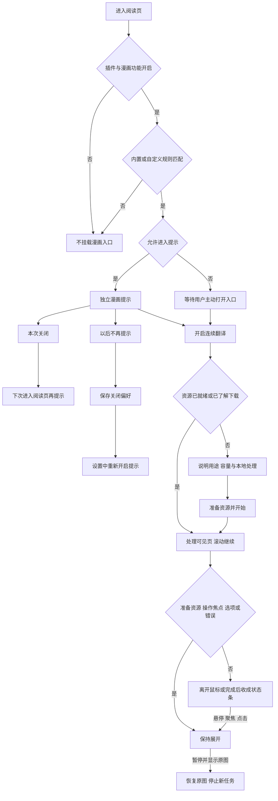
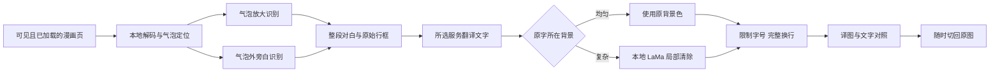
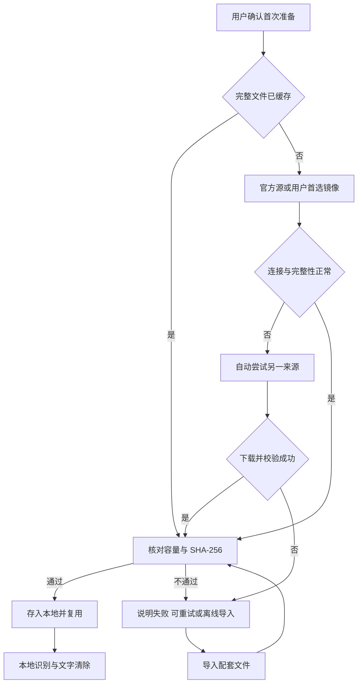

# 漫画翻译质量与阅读体验报告

目标是让漫画可读、入口可发现、等待可理解，关闭与恢复符合用户意愿。本轮继续保留专用漫画识别、整段对白、局部原字清除和有界排版，修复入口被其他开关限制的问题，并重新组织首次下载和设置。验收章节为 [MANGA Plus 1024050](https://mangaplus.shueisha.co.jp/viewer/1024050)。

## 已实现的产品行为

| 用户问题 | 改动 |
| --- | --- |
| 漫画网站没有识别出功能 | 漫画路径独立于普通图片开关；进入已适配阅读页即挂载独立提示，懒加载图片随后自动发现 |
| 关闭悬浮球后没有入口 | 漫画提示独立挂载；本次关闭下次进入仍可发现，“以后不再提示”持久保存，可从设置恢复 |
| 图标意义不明、一大一小 | 采用漫画分镜与对话气泡图形和 FluentRead 品牌色，图形不依赖任何文字，提示和操作文案随界面语言切换；漫画和品牌主体同为 40px，紧凑模式同为 32px，进度圈放在内部，完成勾 19px |
| 等待反馈太淡 | 不透明高对比反馈、16px 状态图形和明确取消；区分资源准备、识别、翻译、文字清除、生成译图，只显示引擎提供的真实百分比 |
| 不理解为何下载 | 首次开始前说明约 30MB 识别资源、复杂画面另需约 197MB 清除资源，下载后复用、图像本地处理与文字服务边界；确认后才准备缺失文件 |
| 面板挡住漫画或突然缩回 | 阅读中收为文字状态条；悬停、聚焦、点击展开。首次确认、模型准备、展开选项、操作焦点和错误期间保持展开；手动收起继续翻译，暂停按钮恢复原图 |
| 设置内容混杂 | 名称统一“图片/漫画翻译”，同一页面直接展示漫画、网页图片与圈选的常用开关，细节与资源按需展开，取消页签切换；资源按用途分两行，下载与导入选项按需展开 |
| 更多网站难扩展 | 内置精确匹配 MANGA Plus；高级用户添加精确域名、阅读路径、图片选择器，支持校验、去重、删除与持久化。手动规则不等同于已验收站点 |

普通图片仍默认关闭。插件总开关、站点停用与漫画开关优先于入口提示。永久关闭自动提示不会改变用户的翻译服务或资源缓存。换章结束旧会话，关闭或离开页面取消未完成任务，不让迟到结果覆盖新页。

## 入口、关闭与收起逻辑

自动收起延迟 900ms，避免鼠标跨过按钮或面板时闪烁；键盘焦点在面板内时不收起。状态条说明“正在翻译”“连续翻译已开启”或“部分页面未完成”，关闭动画偏好和系统减少动态效果均生效。窄屏和短窗口限制面板高度，必要时在面板内滚动。

普通网页的品牌按钮保留贴边收回、悬停展开；漫画阅读页让品牌与漫画按钮完整显示，保证两者同尺寸且完成状态可见。漫画状态面板位于译图和悬浮按钮之上，译图不会遮住取消、原图或选项操作。

## 图像质量与开源选型

质量问题来自整条处理链：错误识别或碎片分组会损坏语义，擦除范围过大会破坏画面，字号没有边界会遮住画面。当前方案使用气泡定位与独立放大识别，按气泡保留整段对白和原始行框，再做局部清除与完整换行。气泡外文字仍单独识别，原图和文字对照始终可用。

| 项目 | 用途与选择 |
| --- | --- |
| [PaddleOCR](https://github.com/PaddlePaddle/PaddleOCR) / [ppu-paddle-ocr](https://github.com/PT-Perkasa-Pilar-Utama/ppu-paddle-ocr) | 当前采用固定模型与已锁定的浏览器 SDK；本地识别，适配现有 TypeScript、Canvas 和 ONNX WASM |
| [LaMa](https://github.com/advimman/lama) / [漫画动态 ONNX](https://huggingface.co/ogkalu/lama-manga-onnx-dynamic) | 当前采用；复杂背景只处理有界字形蒙版，蒙版之外保持原图 |
| [manga-image-translator](https://github.com/zyddnys/manga-image-translator) | 参考其检测、识别、擦字、翻译、排版的完整链路，按 FluentRead 架构独立实现 |
| [manga-translator-ui](https://github.com/hgmzhn/manga-translator-ui) | 参考可视化处理阶段与阅读编辑流程；其桌面应用不是浏览器扩展可直接嵌入的依赖 |
| [manga-ocr](https://github.com/kha-white/manga-ocr) | 日文专项候选，当前英文实页验收没有切换到这一日文模型 |

许可证、固定模型版本和授权说明见现有漫画资源通知及[底层实现报告](./manga-continuous-translation-20261003)。没有复制参考项目的非零碎源码，也没有添加跨仓库运行依赖。借鉴成熟产品的可发现入口和状态反馈，但布局、字号、品牌色和漫画分镜气泡图形使用 FluentRead 自身风格。

## 下载与地区适应

识别模型三文件共 31,114,838 字节，清除模型 206,291,843 字节。清除模型仅在复杂背景需要时下载；模型和字典均固定版本、容量和 SHA-256。识别和图像清除在浏览器本地运行，文本交给选定服务。

默认官方 Hugging Face 优先，失败或长时间无数据后尝试 `hf-mirror.net`。也可选择镜像优先，或取得四个配套文件后离线导入。取消与部分失败保留已完成并校验的文件；未完成的单个文件会重新下载，不宣称支持单文件断点续传。清理只移除漫画资源，保留普通语言包、服务配置和来源偏好。

实际验证覆盖本机网络、官方源被阻断后备用源下载，以及四文件导入后同时阻断两个来源仍运行识别和清除。多来源与离线导入用于适应中国、美国及其他地区的网络条件；没有逐国、逐运营商实测，因此不作“全球任意时刻都能联网下载”的承诺。

## 性能与验证边界

性能对照使用同一设备、同一章节前五页、相同已校验模型、生产扩展和确定性文本翻译传输。模型来源在处理期间均被阻断，排除下载速度影响；读到第三页后停顿 65 秒，再测第四页。新版将空闲会话释放从 30 秒延至 3 分钟，减少正常阅读停顿后的重新初始化。气泡只在专门裁剪中识别，整页识别保留气泡外旁白，避免同一对白重复推理；短暂让出主线程仍允许取消。

同机对照的五页原图 SHA-256 完全相同，两个模型来源都被阻断，期间没有模型下载请求。各页包括进入视口、识别、确定性文本传输和生成译图的等待时间如下；第 1、2 页分别可能包含识别/清除引擎首次初始化，均不含文件下载。

| 页面 | 原版 | 新版 | 说明 |
| --- | ---: | ---: | --- |
| 1 | 10.054 秒 | 10.422 秒 | 首次识别引擎初始化 |
| 2 | 9.722 秒 | 9.901 秒 | 可能包含首次清除引擎初始化 |
| 3 | 8.597 秒 | 9.504 秒 | 连续阅读 |
| 4 | 13.211 秒 | 8.765 秒 | 停读 65 秒后继续，减少 33.7% |
| 5 | 6.305 秒 | 6.145 秒 | 连续阅读 |

主要收益是正常阅读停顿后不再频繁初始化，快速连续翻页没有稳定的显著加速；当前设备逐页仍需约 6–11 秒。保留推理会话更久会延长内存占用，空闲三分钟释放；离开页面仍停止旧任务。一次章节对照不能证明跨设备或所有语种的 SOTA，设备性能、复杂画面和所选翻译服务仍可能增加等待。细小边注、艺术字体、人名和背景纹理差异仍需核对，当前内置站点只对 MANGA Plus 作支持声明。

## 验收记录

验证使用第二屏正常可见的隔离 Edge，始终检查测试进程没有抢占用户前台，结束移除自己的临时 profile。实际站点、确定性文本传输、在线翻译、手动网站规则夹具与跨浏览器构建分别记录，不把构建通过视为 Firefox 实际运行。

证据总目录：工作区 `artifacts/manga-reader-ux-20261003/`。首次探索阶段的失败与性能样本保留供排查；交付结论只使用最终通过记录。本轮按变更运行受影响专项，未运行全量回归。

| 范围 | 结果与证据 |
| --- | --- |
| 受影响单元、功能和回归 | 27 文件、728 项通过，包含配置持久化、调度取消、挂载卸载、识别清除、设置结构和油猴兼容层；日志 `/private/tmp/fluentread-manga-ux-integrated-affected-final.log` |
| 漫画严格覆盖 | 11 文件、296 项通过；14 个核心模块 statements / branches / functions / lines 均 100%，包含入口、网站规则、会话、识别、资源、气泡、修补、排版、控制和进度；日志 `/private/tmp/fluentread-manga-ux-coverage-complete-final.log`。Vue 组装和其他旧模块不在这一结论内 |
| 入口、设置与国际化浏览器专项 | `entry-integrated-confirmed/` 13 项通过；真实章节识别、普通图片关闭、悬浮球关闭、首次下载前零缓存、两种关闭偏好、设置恢复、自定义规则、320×550 深色布局、七种界面语言主要操作、普通页贴边收回、总开关卸载 |
| 最终集成生产构建的受控阅读器 | `fixture-integrated-final/` 17 项通过；真实 PaddleOCR、确定性文本传输、取消恢复、自动继续、动态换图、换章、强宿主样式隔离、未识别保留原图、清理和离线导入，模型请求 0 |
| 真实章节与在线文字服务 | `live-verified-final/` 17 项通过；本地 PaddleOCR / LaMa 与在线 Google，前五页自动继续、原图切换、完成勾、面板层级与自动收起；模型请求 0，翻译措辞仍需核对 |
| 同图性能对照 | `benchmark-baseline-final/` 与 `benchmark-verified-final/`；五页原图哈希一致，确定性文本传输，65 秒阅读停顿，结果见上表 |
| 下载来源失效与备用源 | 前置同一模型实现的 `artifacts/manga-quality-20261003/integrated-live/`；Offscreen 官方源被 CDP 阻断后四文件从备用源下载并校验。本轮最终受控测试另外验证两个来源同时被阻断时离线导入、识别和修补可用 |
| 类型与发布出口构建 | `pnpm compile`、Chrome MV3、Firefox MV2、userscript 构建及 verifier 均通过。漫画本地模型链路用于扩展，油猴入口保持不可用能力的明确兼容行为；没有声称 Firefox 实机或油猴具备漫画本地推理 |
| 文档构建与链接 | `pnpm docs:build`、`pnpm docs:check` 均通过，检查 75 页面、3782 链接、718 锚点和 171 图片 |
| 测试清单审计 | `pnpm test:audit` 通过，登记 446 文件、5722 项；这是清单审计，不是全量用例执行 |

最终扩展构建来自 `3dfe0189ee05249d096d77c35e87d7130e2aa4c1`，固定副本为 `build-integrated-final/`，已集成主分支 `f1ed7a7c74629573b4941e81a0d18d11dc9c6667`。在线质量与性能验收后，识别和修补实现未变；最终再检查共同入口、悬浮停靠、设置和受控运行。后续提交仅完善验收脚本与本文记录。

架构专项 22 项中 19 项通过、3 项失败。相同 3 项已在上述主分支的独立只读快照复现：content runtime 超过历史 277 行上限（主分支 282 行，本轮 281 行）、三个旧脚本缺验证归属、十个既有模块未登记严格覆盖。未提高上限或忽略断言。日志分别为 `/private/tmp/fluentread-manga-ux-architecture-current-final.log` 与 `/private/tmp/fluentread-manga-ux-architecture-main-final.log`。

主要对白已经能在气泡内完整阅读，用户截图中的彩色旁白被合为整句，字号没有覆盖整片画面。真实 Google 对话中人名、口吃、口语与措辞仍不够自然，部分艺术拟声词保留原文，引用编号仍有误识别；彩色修补留有局部纹理差异。译图完成与文本请求成功均不代表专业人工汉化质量。

界面图形使用同一个 SVG 分镜与气泡符号，不嵌入中文或英文字母；文字标签、提示和主要操作跟随界面语言。七种界面语言的主要操作已验收，新增长说明当前以完整英文回退覆盖非中文语言，不声称所有长说明都已有各语种的人工本地化。
