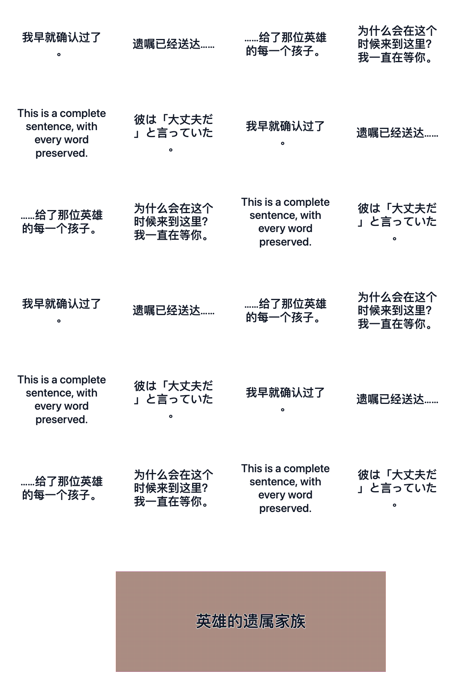
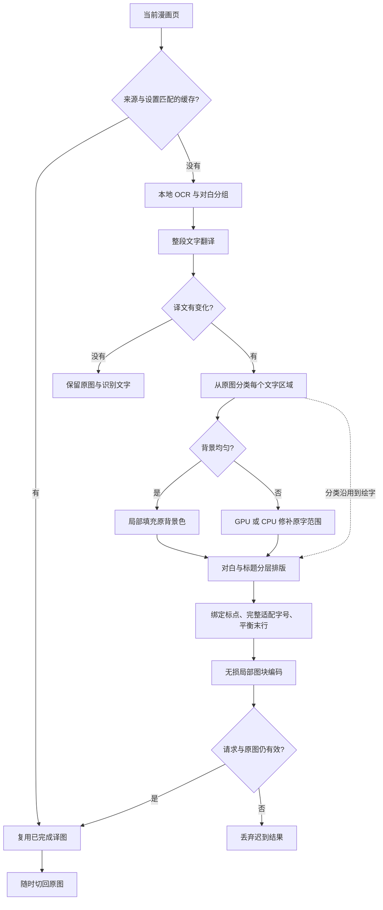
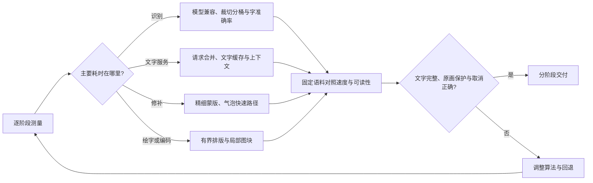

# 漫画文字渲染、覆盖质量与性能方案

这次判断是：应优先改善排版层次、气泡中的换行和原字修补精度；不能把等待时间全部归因于绘字。当前实现已有 GPU、局部 PNG 和章节缓存。在同机生产扩展中，绘字与编码是毫秒级，OCR 和复杂背景修补仍占主要时间。用户给出的效果图有清晰的对白与标题层次，但静态截图不能证明沉浸式翻译的内部算法或真实处理时间。

本次隔离分支基于主分支 `b0583747e309ee69e7876cac636f17bc4fd64173` 并包含来源 PR [#809](https://github.com/FluentRead/FluentRead/pull/809)，保留其普通图片轻量 UI、漫画切换和设置组织。来源 PR 不自动关闭或合并。本轮新增改动只针对漫画排版、原图背景分类与验证记录。

## 已落地的改动

| 问题 | 改动 | 边界 |
| --- | --- | --- |
| 所有文字都沿用普通图片的 500 字重 | 漫画对白使用 600 字重；复杂背景上的原始大字采用 800 字重和白色描边 | 不改变普通图片、圈选文字或悬浮 UI |
| 标题被全页统一字号上限压成小字 | 依据原始字高识别大字，允许保留标题层次；对白仍有统一上限 | 属于保守的几何判断，不是语义标题识别；竖排不因长框误判成标题 |
| 句号、引号可能出现在行首或行末孤立 | 闭标点与前字、开标点与后字绑定；长词必须拆分时按字素处理 | 保留完整译文、英文单词、混排空格和显式换行，不使用 Canvas 横向压缩 |
| 气泡最后一行只剩一两个字 | 末行明显过短时平衡行宽，保持原字号与行数 | 不扩张到气泡边缘或画面之外 |
| 修补后的平滑背景又被判断成均匀背景，重新铺底 | 清字与绘字共享原图的背景分类；复杂区修补后直接绘字 | 不根据模型生成像素重新选择铺底方式；未修补的独立调用仍保留可读底板 |
| 拟合字号时反复度量同一文字 | 本次绘制中按字体、字重、字号和文字复用准确宽度 | 最多 8,192 项、键名合计 131,072 字符；键字符串约 256 KiB，Map 与数值开销另计；画完即释放，不增加章节缓存 |

字体优先采用系统字体，缺字时回退到 Noto/CJK 字体族；没有新增字体下载或依赖。不同系统的实际字体仍可能不同。如果后续要求跨系统完全一致，应另做字体许可、各语种字库与下载体积的取舍，而不是给所有用户直接增加完整 CJK 字体包。

以下是可控文字区域的排版对照，并非真实 OCR 或语义翻译结果：

| 原排版 | 本轮排版 |
| --- | --- |
|  |  |

## 性能测量与容易误读的地方

测量环境为同机 Chrome 154、第二屏正常后台窗口、临时 profile。通过设置导入四个本地资源并核对 SHA-256，阻断模型下载。生产流水线使用用户提供的 [MANGA Plus 章节 1028732](https://mangaplus.shueisha.co.jp/viewer/1028732) 已加载的两张原图；受控阅读器确保各轮输入一致。真实 PaddleOCR、LaMa、局部编码、消息与合成均运行；对照阶段的 Google 文字传输返回固定测试译文，不能证明语义翻译质量。

最初的点击到轮询结束时间包含入口展开、原图获取、OCR、模型初始化及轮询误差，不能直接拿它减去另一个时钟基点的进度通知。新增记录使用同一个墙钟：Offscreen 的渲染通知、PNG FileReader 完成、宿主图片 opacity 切换与下一帧分别记时。追加诊断样本的暖运行中，渲染通知到译图接管约 **79 毫秒**；首轮约 **183 毫秒**，首轮同时有构建进程，不能用作稳定冷启动比较。

同一诊断中，两次用于取消检查的 `setTimeout(0)` 合计暖运行约 0.2 毫秒，首轮约 3.4 毫秒。本次没有测到其限速，保留现有检查。Chrome 的后台定时器可能受限速，但这只是需要测量的候选原因，不能用文档代替本次根因证据。[Chrome 定时器说明](https://developer.chrome.com/blog/timer-throttling-in-chrome-88/)

既有版本三轮基线的暖运行推理总和：第一张约 4.55 秒 OCR、0.25 秒修补；第二张约 3.12 秒 OCR、2.70 秒修补。第一张四个 PNG 图块编码合计约 8–9 毫秒；第二张九个图块约 30–38 毫秒。推理总和不含裁切、会话加载和 IPC，不能直接等同整页等待。

字体专项直接执行实际源模块束，在真实 Canvas 上绘制 24 个对白块及一个复杂背景标题，一次首轮、30 次暖运行；六段对白轮换，因此测量包含可复用文字，不能外推所有页面。最终版本加入标点绑定、末行平衡与临时缓存预算后，度量次数 **2,056→368**，暖运行中位数 **10.8→10.0 毫秒**，p95 为 14.0→11.3 毫秒。这是小样本、本机测量，时间差不应外推；度量次数减少不等于整页翻译同幅度提速。

最终生产构建的六轮处理，OCR 文字批次均与同输入基线一致。第一张暖运行渲染通知到下一帧接管为 **74/100 毫秒**，第二张为 **333/211 毫秒**；PNG 编码仍为毫秒级。点击到轮询结束的暖运行分别为 7.95/8.41 秒、12.53/13.94 秒，与基线存在运行波动，没有证据认定本轮明显提高整页处理速度。真实两张样本由于字体层次与平衡换行增加了部分度量次数，缓存并不保证每一页都会更快。

另用真实 Google 文字服务处理第一张两轮，并人工查看最终译图：对白已替换为中文、原气泡轮廓保留。仍能看到原字残留、较保守的正文大小，以及部分艺术标题未进入 OCR 结果。因而本次只能证明排版改动可运行，不能声称已经追平用户给出的竞品效果；标题漏检、原字残留与气泡可用空间应作为后续标注语料的明确样例。真实服务样本与固定文字测速分开记录；重复轮保留既有文字缓存，不能视为每轮重新请求 Google。

## 后续优化顺序

| 优先级 | 方案 | 验收方式 |
| --- | --- | --- |
| 1 | 制作对白、竖排、低清、复杂标题的标注语料；分开衡量字准确率、读序、原字残留和人物/边框损伤 | 固定输入、真实译文、人工核对；覆盖中文、日文、英文及长译文，不用固定测试文字证明质量 |
| 2 | 在现有行框内精修字形蒙版，保留描边，减少整行矩形擦除；均匀气泡继续走快速填色 | 检查蒙版外像素不变；标题原字残留、图案损伤与耗时同时评估。复杂纹理里不能仅凭颜色阈值擦字 |
| 3 | 以气泡实际可用空间排版，保留内边距，必要时允许对白使用不同可用行宽 | 文本不越界、不吞字、气泡边缘完整；先做可靠的封闭气泡，开放框与复杂背景保守回退 |
| 4 | 对 OCR 裁切按尺寸分桶，评估批大小与模型后端支持 | 对比识别准确率和 p50/p95；现有硬件 GPU 路径仍可能混合 WASM，不能只凭 provider 名称认定全 GPU |
| 5 | 评估文字翻译与修补的可控重叠；仅在资源已准备、请求已获同意时进行 | 同语言/未变化文字不得被擦除；取消、失败和迟到结果不复活；记录额外内存与无效工作量 |

## 开源参考与采用边界

`manga-image-translator` 的 [渲染入口](https://github.com/zyddnys/manga-image-translator/blob/main/manga_translator/rendering/__init__.py) 和 [字形绘制](https://github.com/zyddnys/manga-image-translator/blob/main/manga_translator/rendering/text_render.py) 分别处理字号/区域适配与字形描边，可用于设计对照。它采用 Python、OpenCV、FreeType 等能力，不能作为浏览器扩展的直接轻量依赖；其仓库标示 GPL-3.0。本轮只阅读设计，TypeScript 独立实现，没有复制第三方代码或修改参考仓库。[项目说明与许可](https://github.com/zyddnys/manga-image-translator)

GPU 诊断继续参考 [ONNX 官方性能诊断](https://onnxruntime.ai/docs/tutorials/web/performance-diagnosis.html)。现有 GPU 优化已有独立报告，本轮不以沿用 GPU 配置声称新的 GPU 提速。

| 开源方向 | 值得研究的能力 | FluentRead 的接入判断 |
| --- | --- | --- |
| [manga-translator-ui](https://github.com/hgmzhn/manga-translator-ui) | 气泡形状适配、字体/描边控制、手工蒙版核对；仓库标示 GPL-3.0 | 借鉴“自动排版加可核对结果”的设计；它是桌面完整工具，不直接引入其 UI、Python 或语义分词依赖 |
| [manga-ocr](https://github.com/kha-white/manga-ocr) | 针对日文漫画的横竖排、振假名、多行气泡识别；仓库标示 Apache-2.0 | 作为日文质量对照候选；其 Python/Transformer 模型不能直接替换当前浏览器模型，需要另验证导出、运行算子、资源大小与权重许可 |
| [comic-text-detector](https://github.com/dmMaze/comic-text-detector) | 同时提供文字框、行与字形分割，适合研究精细擦字；仓库标示 GPL-3.0 | 先验证蒙版质量与浏览器运行成本；代码许可与模型权重条件分别确认。本轮没有导入它的代码或权重 |

这些是候选和设计参考，尚未在 FluentRead 上完成速度与质量对照，因此不把仓库介绍视为更准确或更快的证明。

## 验证记录

- 排版、原图背景分类、修补和 Offscreen 生命周期：83 个针对性用例，四个改动模块 statements/branches/functions/lines 均 100%。
- 普通图片绘制、局部补丁、编码、合成、流程及两项架构组：905 个用例通过。
- TypeScript/Vue 编译与测试审计通过；审计检查归类，不代表执行所有用例。
- Chrome/Firefox 构建均 107.44 MB；userscript 构建及校验通过，产物 1,905,804 字节。没有新增模型、字体或运行时依赖。
- 生产浏览器：两张样本各三轮真实模型处理通过；一张样本两轮真实 Google 文字翻译通过；最终 ASCII 句号绑定补充后另做两轮生产冒烟，通过且已清理 profile；字体 Canvas 对照分别 31 次绘制。浏览器报告无页面/扩展错误，临时 profile 均已清理。
- 中文和英文使用指南同步更新；文档构建与链接校验通过。
- 浏览器使用 `macos-background-cdp`、`launchservices-no-foreground`、`background-visible-no-focus`，`browserFrontmost=false`，结束删除自身临时 profile；没有访问用户日常浏览器。

[可重复核对的摘要](../reports/manga-typesetting-20261004/summary.json)保留各轮时钟、测试范围与后台窗口证明；本机完整证据位于 `/Users/thinkstu/Desktop/copy/artifacts/manga-typesetting-20261004/`。这不是沉浸式翻译的同机测速，不是跨设备、各国网络或所有漫画网站的全面验收；本轮也没有更换 OCR/修补模型或证明顶尖语义翻译质量。
