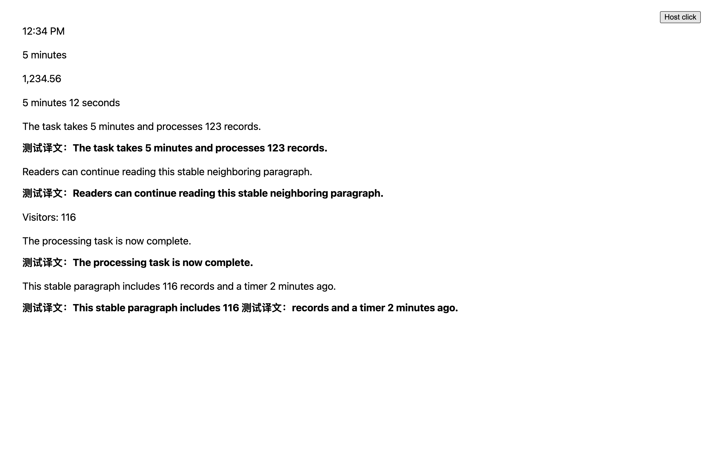
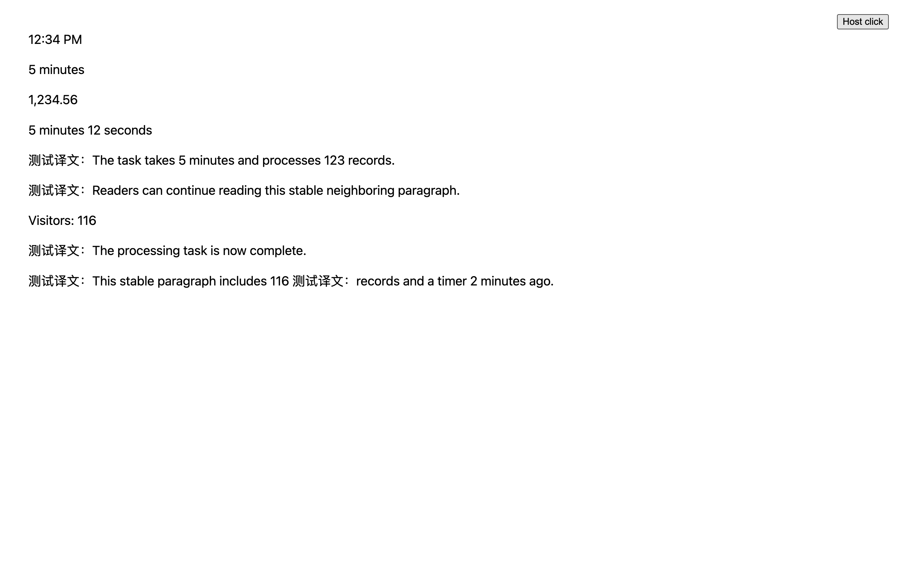

# 时间与动态来源翻译稳定性

2026-10-03。页面计数、倒计时和状态文字持续更新时，原先会反复取消当前译文并开启新的请求。本次在 FluentRead 的共享候选与请求入口收敛这些变化，避免原文、加载状态与译文来回切换。

- 独立日期、时钟、秒/分钟等时长、纯数值，以及 `<time>` / `role="timer"` 展示保持原文。候选发现、来源提取与文本槽使用同一规则。正常句子中的数字和时间仍可翻译；嵌套的数值作为本地骨架保留，不单独请求服务。
- 已观察的来源变化后等待 1.8 秒安静窗口；重复发现相同文本不会重置窗口。全文翻译只重新调度仍在阅读范围内的最新候选。
- 4 秒内连续仅数字变化的短标签识别为计数并保持原文。此判定限于 120 字符、至多四个空白分隔词、至多 32 个字母且不含句末标点的展示；含数字的完整句子仅防抖，不永久禁译。标签语义变化后解除限制。
- 恢复原文、停止会话时取消延迟重扫。悬浮翻译采用相同来源判定；没有全文会话时，内容稳定后再次触发悬浮即可。

针对性验证共 **15 个测试文件、616 个用例通过**，没有运行全量回归。`liveData.ts`、`sourceStability.ts`、`sourceStabilityGate.ts`、`text.ts` 和 `dom.ts` 的 statements / branches / functions / lines 均为 **100%**。类型检查、测试归类审计、Chrome / Firefox / 油猴构建、油猴 verifier、文档构建通过。测试使用主检出中既有的依赖，不构成干净安装验证。

额外架构检查中，源码文件头检查 **729 个用例通过**。模块边界与验证归属检查的四个失败已在主检出复现：文档入口的服务层 import、content 应用运行文件超过既有行数上限、品牌校验脚本未登记归属，以及八个已有模块未登记严格覆盖率。本次没有新增这些失败；全文运行文件净减少 7 行，并满足自身的行数上限。详见 [架构检查](./architecture.txt) 和 [主检出对照](./baseline-architecture.txt)。

真实浏览器使用生产 Chrome MV3 产物和临时 Edge profile，`launchMode=macos-background-cdp`、`focusPolicy=launchservices-no-foreground`、`windowPlacement.mode=background-visible-no-focus`、`browserFrontmost=false`。窗口位于第二屏，操作通过 CDP，不使用用户日常配置。

本地确定性 Microsoft 翻译夹具验证了双语的全部模式、仅译文的视口模式以及悬浮模式：

- 每 250 毫秒更新计数与状态文字，同时交替修改原 Text 和替换 Text 节点；连续 4.2 秒变化期间新增请求条目为 **0**。
- 稳定后只翻译最新内容一次；计数继续保持原文，换成新的正文后恢复翻译。
- 相邻段落的译文工件身份保持不变；原文中的嵌套数值持续更新，无嵌套译文工件，宿主按钮仍能点击。
- 恢复后原文与最新宿主内容一致，等待 2.5 秒没有迟到译文；再次翻译只有一份译文。悬浮切换计数为 **[1, 0, 1]**，相邻段落和时长展示没有译文。

浏览器没有页面异常。夹具响应带有“测试译文”前缀；这是 DOM、请求及生命周期证据，不代表外部服务翻译质量、Firefox 运行时或商店已发布版本。没有借鉴或修改参考仓库。

可复现脚本：`scripts/testing/run-changing-source-test.cjs`。传入 `--extension-dir .output/chrome-mv3`、`--playwright-root <工作区 Node 包目录>` 和 `--artifacts-dir <证据目录>`。运行前先构建待测扩展。

[浏览器报告](./report.json) · [针对性测试](./tests.txt) · [覆盖率](./coverage.txt) · [测试审计](./audit.txt)

