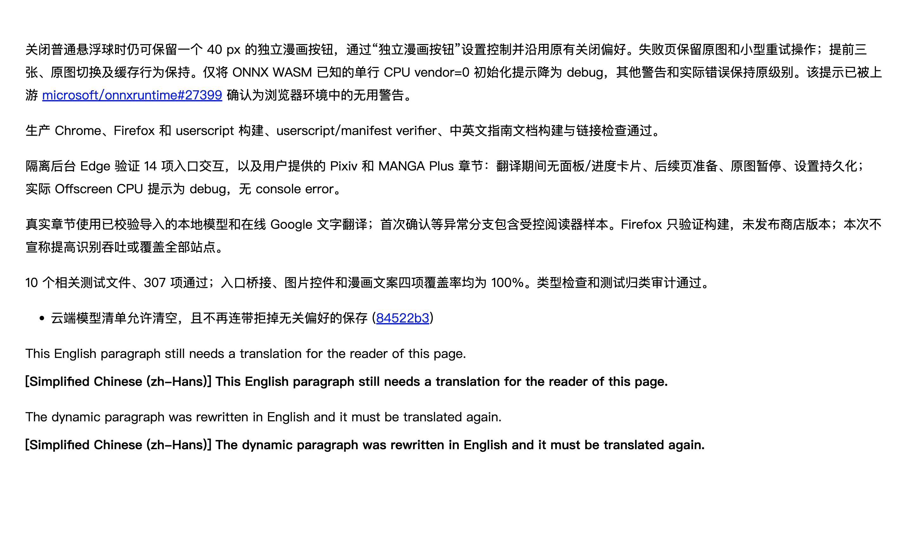

# 中文技术段落重复翻译修复（2026-10-04）

目标为简体中文时，用户在 [PR #779](https://github.com/FluentRead/FluentRead/pull/779) 的中文说明中仍看到中文译文。按截图保存的 5 段原文，在修复前有 4 段不能跳过同语言请求，修复后 5 段全部跳过。#779 是本问题的复现页面，修复改动集中在共享语言判断和请求入口。最终分支已同步到包含 #779 的 `main` 提交 `1c9faa26`。

## 根因与改动

原判断将任意未识别的 Latin 词视为外语正文。`debug`、`userscript`、`console error`、句首的 `Firefox`、顿号枚举和 `MANGA Plus` 都可能使中文说明被判成混合语言。`40 px`、`vendor=0`、`microsoft/onnxruntime#27399` 的结构也没有完整遮蔽。增加几个名称只能修复当时的样例，新术语仍会触发相同问题。

`technicalTokens.ts` 只在识别副本中遮蔽带单位数值、数值/布尔参数赋值、带编号仓库引用和带数字的路径，送给供应商的原文、链接及 DOM 不变。`identify.ts` 用中文技术角色（构建、模式、浏览器、日志级别等）判断有限长度的嵌入术语，支持枚举和名称变体；连续标签按一个名称计权，顿号中的不同名称仍分别计权，保留正文数量门槛。没有增加浏览器或产品名称名单。

明确要求翻译的词、引号中的词、外语功能词、外语句子、其他文字、简繁冲突、粤语标记及未知汉字仍不能被这些规则掩盖。识别不读取页面 `lang`，也不以目标语言或排除语言为缓存键。

共享 `translateTextBatch` 此前没有执行单条请求的预检。现在它只发送需要翻译的片段，校验实际响应长度并按原索引回填；全跳过时不进入请求队列。取消、失败重试和 `skipLanguageDetection: true` 的强制请求都有协作测试。

## 对比其他实现

| 实现与资料范围 | 可确认的做法 | 对本次修复的意义 |
| --- | --- | --- |
| 陪读本地检出 `e3cbe2b`，`utils/host/translate/target-language-skip.ts` | 逐段使用本地 `franc`，不少于 50 个字符才比较目标语言，在插入译文节点前跳过；此路径不调用 LLM | 参考逐段、请求前判断的设计；没有复制代码，也没有修改参考仓库 |
| KISS 本地源码 `libs/detect.js`、`libs/translator.js` | 自动源语言时检测整个节点；可选远程/内置检测，回退到浏览器检测；采用可靠结果或中文结果，再比较目标与排除语言 | 跨端检测能力不同，不能把浏览器 API 直接接入 FluentRead 的同步核心 |
| 沉浸式翻译[官方更新记录](https://immersivetranslate.com/en/docs/CHANGELOG/) | 公开同源/目标语言提示、语言排除和检测优化记录 | 当前逐段算法没有足够的公开源码可核对，不能据此声称它对这份截图必然正确 |

另对这 5 段运行了 FluentRead 已安装的真实 `franc-min`：4 段返回 `cmn`，构建清单段落却返回 `nld`。这不是陪读完整 `franc` 或其他产品的运行结果；它说明直接信任统计首位也有风险。本次保留现有统计识别与反证测试，只修正中文技术语境和遗漏的请求入口。[检测记录](./chinese-technical-paragraphs-20261004/detection-comparison.json)

## 验证

- 新增中文专项 439 项：5 段截图原文、普通/制表符/不换行空格/换行形式、21 种单位、参数与引用、13 段繁体说明、100 个真实外语插入组合及歧义/引文边界；目标语言与排除语言逐项比较。共享客户端和全文槽另增加批次过滤、强制请求、重试、取消及索引回填用例。
- 同步最新 `main` 后，15 个相关文件、2,571 项通过：语言核心与三个历史语料集、同目标入口、客户端性能/异常、文档 API、模块边界和源码头检查。没有运行全量回归。
- `identify.ts` 与 `technicalTokens.ts` 的 statements / branches / functions / lines 均为 100%。类型检查、测试归类审计、Chrome / Firefox / userscript 生产构建及 userscript / manifest verifier 通过。
- 额外运行的 `verificationOwnership.test.ts` 有 2 项失败；在同一基础提交 `1d6e36bd` 的未修改 `main` 上也出现完全相同的失败：3 个脚本尚无验证归属、18 个其他模块未纳入严格覆盖率。没有将这些基线缺口归因于本次改动或绕过检查。
- 隔离后台 Edge 中，5 段截图原文和提交链接均零译文、零请求；相邻英文悬浮 `[1,0,1,0]`、全文 `[1,0,1]`，原标题和链接保持，动态中文改成英文后重新翻译，恢复原文及切换到英文目标通过；目标为日语并排除中文时仍零中文请求。console error 为 0。[浏览器证据](./chinese-technical-paragraphs-20261004/browser-summary.json)

浏览器为生产 Chrome MV3 产物加载到临时 Edge profile，`launchMode=macos-background-cdp`、`focusPolicy=launchservices-no-foreground`、`windowPlacement.mode=background-visible-no-focus`，窗口位于第二显示器，`browserFrontmost=false`。只使用 CDP 键鼠操作，没有连接用户日常 profile。测试页面和响应来自本地确定性夹具，证明语言判断、请求及恢复链路，不证明外部服务质量；Firefox 和 userscript 只验证构建，未发布商店版本。



## 重跑专项

```bash
pnpm exec vitest run tests/chineseTechnicalParagraphs.test.ts tests/sameTargetLanguageClient.test.ts tests/sameTargetLanguageSlots.test.ts

node scripts/testing/run-chinese-translation-test.cjs --multilingual-same-target \
  --same-target-language zh-Hans --technical-chinese \
  --extension-dir .output/chrome-mv3 --playwright-root <Node包目录> \
  --focus-safe-helper <focus-safe-browser.cjs路径> --artifacts-dir <证据目录>
```

同步最新主分支后的 DOM 与截图留在本机 `/private/tmp/fluentread-chinese-technical-20261004-integrated/`，初次复现证据位于 `/private/tmp/fluentread-chinese-technical-20261004/`，命令日志位于 `/private/tmp/fluentread-language-*.log`。
