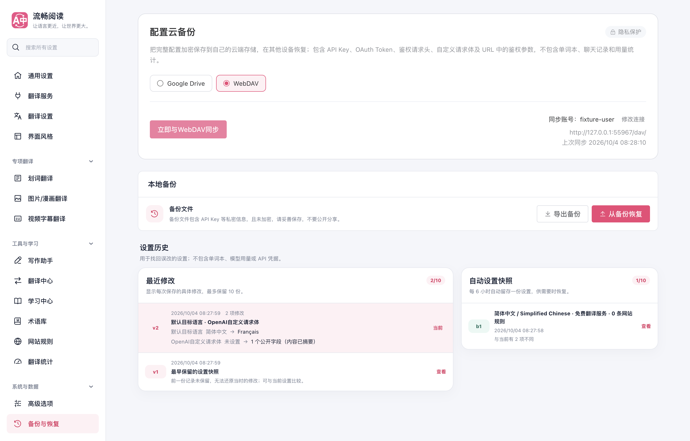
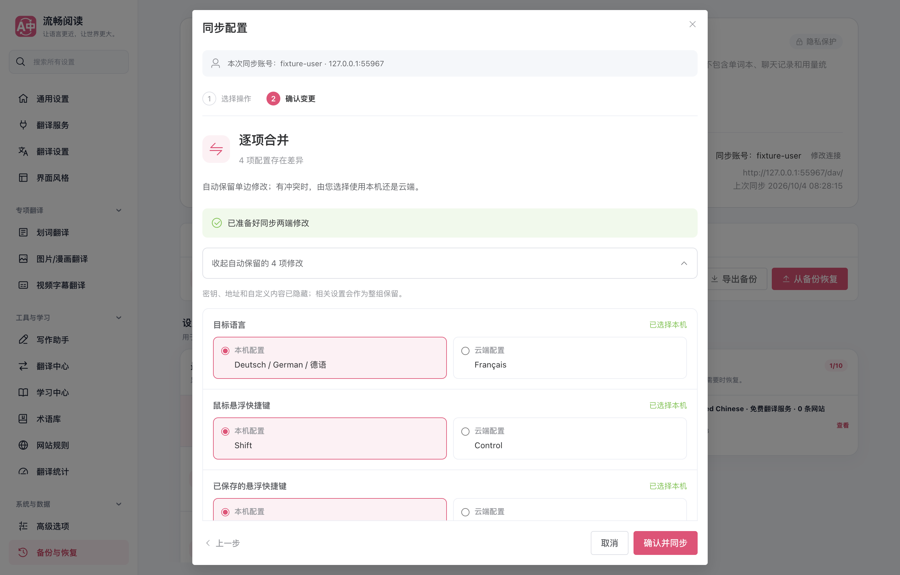
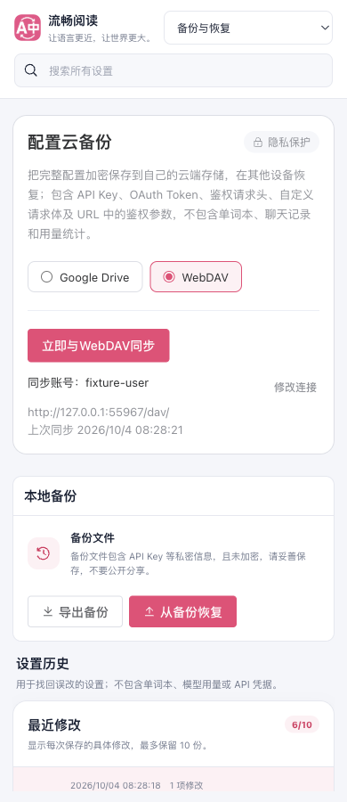
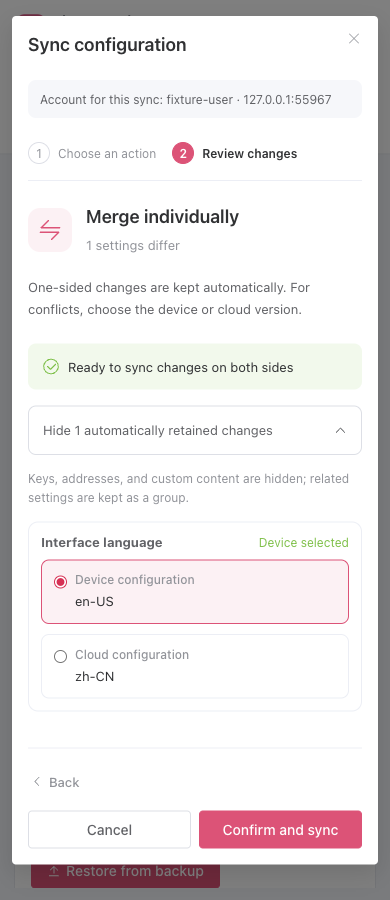

# 配置云备份专项审查与验证

日期：2026-10-04。最终生产扩展运行代码：`1c2a8dc6bfbfd44ce769d30a73324489b3247b15`；语言资源源提交：`195074f3c2b797424b436e241bb43e153ab0dc9e`。之后补充验证记录并整合主分支的官网改动，云备份运行代码不变；官网整合后重新通过文档构建和链接检查。

本轮审查范围为 Google Drive 与 WebDAV 的配置云备份链路：可信消息入口、连接与授权、加密及大小限制、读取与版本识别、预览所有权与过期、差异和三方合并、确认写入、回读验证、本机应用与回滚、成功记录、会话清理、账号展示与 i18n。完成了这个范围内的源码审查、可复现问题修复及针对性验证；这不是不存在任何未知缺陷的保证。

## 修复结果

| 触发条件 | 原行为 | 现在的行为与证据 |
| --- | --- | --- |
| WebDAV 使用局部或默认 XML 命名空间、空格、CDATA 或数字字符引用 | 合法的 `DAV:getetag` 无法识别，已有备份不能再次保存 | 使用有界的标准 XML 解析器；仅接受请求目标的成功属性，不跟随返回的 href。单元、真实本机 HTTP 与生产扩展重复保存验证通过 |
| Google Drive 的已有文件缺少强 ETag | 会退回无条件 PATCH，无法阻止并发覆盖 | 拒绝覆盖并明确提示可以恢复；不会发起无条件覆盖请求 |
| Google Drive 上传响应成功，实际文件内容或身份无法核对 | 直接认定已保存 | 回读固定备份文件，核对文件身份及完整密文后才确认成功 |
| 两台设备同时首次创建 Google Drive 同名文件 | 可能留下歧义备份 | 发现重复时仅尝试使用原 ETag 条件删除本次新建文件；不删除已有或其他设备的文件。条件删除失败仍返回原冲突 |
| 同步成功后，授权缓存清理失败 | 把成功结果误报为失败；清理异常也会掩盖原读取错误 | 成功记录保留，独立显示清理待重试提示；后续状态读取重试清理。业务失败保留原错误 |
| 另一设置页修改 WebDAV 连接 | 预览使用新账号，按钮右侧仍显示旧账号 | 状态与预览时刷新不含密码的连接摘要；摘要必须与预览的连接版本一致，否则取消预览。真实生产扩展跨页验证通过 |

保持账号、地址与该连接的同步时间统一显示在按钮右侧，窄屏显示在下方；按钮上方不重复显示。新增提示覆盖中文、英文、日文、韩文、法文、俄文和西班牙文。连接密码只保存在本机，表单不会回显。

## 审查与验证矩阵

| 环节 | 主要验证 |
| --- | --- |
| 可信入口与隔离 | 非可信入口拒绝；通用配置代理不能读取连接密码和加密事务；两个提供方互不干扰 |
| 连接与授权 | 地址、用户名与 HTTP 明确确认；只读测试；测试后保存；账号变化；Google 授权范围、失败与令牌清理 |
| 密文与限制 | 完整配置及凭据往返；格式、口令、损坏、大小和预览持久化；单词本、聊天记录与用量不参与同步 |
| 读写协议 | 首次缺少目录的 404/409、MKCOL、GET/PROPFIND、强弱 ETag、条件 PUT/PATCH、412、拒绝重定向、超时与流式上限、回读内容不一致 |
| 预览生命周期 | 取消不写云端；页面重载与关闭释放自己的预览；另一页不能替换预览；失效、worker 恢复及确认前本机/云端变化 |
| 应用与合并 | 上传、下载、三方合并、未解决冲突、配置一致不重复写、验证完整配置、本机应用失败回滚与成功时间 |
| 展示与本地化 | 差异默认展开，凭据隐藏；跨页面账号一致；右侧记录唯一；七语言、390px、深色主题、控制台错误 |

验证结果：

- 云备份专项：13 文件、80 用例通过，15 个相关模块 statements、branches、functions、lines 均为 100%。[测试输出](./cloud-backup-tests.txt) · [覆盖率](./coverage-summary.json)
- 配置差异、快照、预览模型、i18n、设置架构：5 文件、152 用例通过。账号摘要修改后重新验证其中的 i18n 和设置架构，89 用例通过。[完整专项](./diff-ui-i18n-tests.txt) · [最终界面复核](./final-account-ui-tests.txt)
- 中文文件职责注释及供应商边界：775 项通过；测试唯一归类审计通过。[架构专项](./source-boundaries-tests.txt) · [测试审计](./test-audit.txt)
- 生产 Chrome MV3 扩展加载到隔离可见 Edge，通过真实 fetch 请求本机 WebDAV HTTP 夹具：80 项断言通过，页面错误为 0，10 张截图人工复核通过。[逐项结果](./browser-report.json)
- 类型检查、Chrome MV3、Firefox MV2、manifest、userscript 构建与验证通过。最终 userscript 为 1,894,553 字节。[类型检查](./compile.txt) · [Chrome](./chrome.txt) · [Firefox](./firefox.txt) · [userscript 验证](./userscript-verify.txt)
- 文档构建与链接检查通过；整合最新官网后为 75 页、3754 个链接、718 个锚点、112 张图片。
- 内容脚本模块行数检查有既有失败：`src/app/content/runtime.ts` 为 281 行，债务上限为 277。本轮未修改该模块或上限；独立检出旧基线 `5ed16bc6c081587622c86563b4a75fc452c697fb` 后复现相同失败，13 项中其余 12 项通过。[基线证据](./baseline-architecture.txt)

浏览器采用 `launchMode=macos-background-cdp`、`focusPolicy=launchservices-no-foreground`；正常可见窗口完整位于第二块显示器，`browserFrontmost=false`。没有连接日常浏览器 profile；本次临时 profile 和浏览器已由脚本关闭清理。

## 验证边界与实际账号复测

未使用真实坚果云或 Google 账号执行本轮联网读写。Google API、OAuth 异常与并发创建使用受控响应验证；WebDAV 使用真实本机 HTTP 服务，覆盖合法 XML 变体及严格条件写入。这些结果不能证明当前线上服务一定返回强 ETag 或接受条件写入。Firefox 本轮验证构建与清单，没有实际 Firefox 账号操作。没有运行无关产品的全量回归，也没有发布扩展商店版本。

完全没有强 ETag 的服务器只能恢复已有备份，不能安全覆盖。Drive 文件名没有原子唯一约束；首次创建竞态的条件撤回可能失败，届时会保留冲突提示，需要重新读取或清理重复数据，不会降级为无条件删除。保存后的网络或校验失败也不表示云端一定未写入，应重新读取后确认。

实际账号复测：加载新构建，首次保存后修改一项普通设置，再次同步应显示具体差异；确认后再点同步应提示配置一致。用另一台设备或临时扩展配置恢复并核对普通设置及凭据。再验证取消、换账号、预览期间在另一设备修改后的冲突提示。不要在公开截图或 HAR 中暴露应用密码、令牌及鉴权请求头。

复现自动验证：

```sh
pnpm test:cloud-backup --coverage
pnpm build
node scripts/testing/run-webdav-backup-ui-test.cjs --extension-dir .output/chrome-mv3 --artifacts-dir /private/tmp/fluentread-cloud-audit-ui --playwright-root <Playwright 包目录> --focus-safe-helper <focus-safe-browser.cjs 路径>
```





