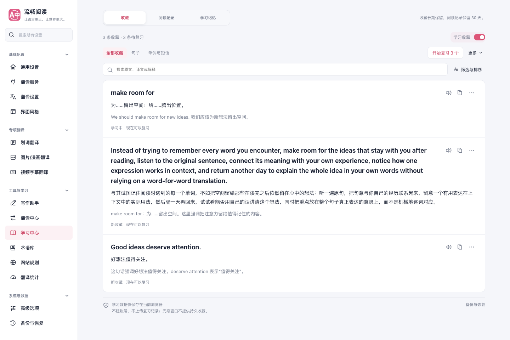
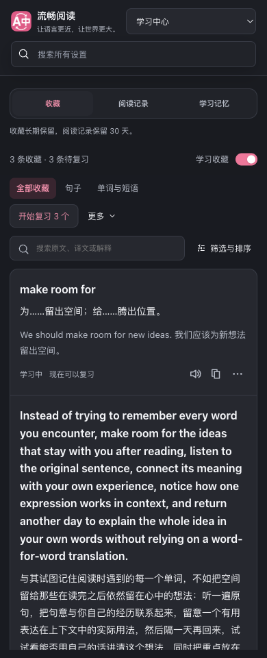

# 收藏页内容与操作层级调整

日期：2026-10-04。改动保留在 `codex/sentence-listening-20261004` 的独立工作树，接续句子听读收藏功能。本次沿用 FluentRead 的组件、配置补丁、收藏和朗读协议，未借鉴或修改参考仓库。

## 调整

- 顶部由大开关卡、统计区和多组按钮，合并成简短数量信息、收藏开关、类型、搜索和复习入口。筛选与排序按需展开，文件操作、刷新、最近收藏和清空集中在顶部“更多”。
- 每条收藏按原文、译文、独立解释排列，移除固定 190px 的状态操作栏。新句子的译文完整显示，旧 AI 收藏参考仍使用摘要，并可进入详情查看全文。
- 保留播放和快捷复制；有译文默认复制双语，无译文复制原文。点击原文进入听读与解释，更多菜单提供单独复制原文、编辑解释、掌握状态、收藏信息及删除。
- 窄屏把动作放到卡片底部，让长原文与译文使用整行宽度。来源、上下文和收藏次数按需查看；编辑器在主动编辑时才挂载。
- 局部覆盖设置页通用折叠标题样式，避免轻量菜单被撑大、出现重复箭头；没有更改其他设置分区的通用样式。

## 视觉证据

[调整前](../sentence-listening-20261004/saved-sentences.png) · [调整后单条收藏](./saved-sentences.png)

[820px 截图](./collection-layout-820.png) 与 [浏览器报告](./report.json) 保留在同目录。

## 验证

真实 Microsoft Edge 加载生产 Chrome MV3 扩展，通过临时 profile 在第二屏可见后台窗口中运行。`launchMode` 为 `macos-background-cdp`，`focusPolicy` 为 `launchservices-no-foreground`，测试前后前台应用一致。结束后关闭测试浏览器并移除临时 profile。

浏览器专项的 14 项检查通过，页面错误为 0，覆盖：

- 高亮收藏、朗读/停止、原文与双语剪贴板、手写和按需生成的解释保存、JSON 导出导入、无效文件与恢复原文。
- 更多菜单的键盘打开与 Escape 关闭、主动挂载解释编辑器和取消编辑。
- 掌握与重新学习、状态筛选、删除确认与撤销。
- 紧凑收藏开关的实际持久化、关闭后重开仍保留收藏。
- 1440、820、390px 布局、139 字句子译文完整显示、无横向溢出，以及暗色截图。窄屏另断言原文占用整行内容宽度。

列表中首条内容距收藏区域顶部：桌面及 820px 为 137 CSS px，390px 为 175.5 CSS px。译文宽度分别为 1034/1078、526/570、332/360，约占收藏行的 96%、92%、92%；测量包括卡片左右内边距。

类型检查、4 个相关生命周期/架构/源码头套件（792 项）、测试分类审计、Chrome MV3 与 Firefox MV2 生产构建、[manifest 检查](./manifests.json)和文档构建通过。本次没有运行全量回归。

翻译和模型响应来自本地确定性夹具；语音桩检查准确文字与播放/停止生命周期，未验证音质。Firefox 完成构建及 manifest 检查，未执行 Firefox 运行时 UI 测试。截图中的收藏均为测试资料，不包含用户数据。

复现使用 `scripts/testing/run-sentence-listening-test.cjs`，在原专项参数后增加 `--collection-layout`。界面调整保留全部既有数据操作和持久化协议，没有数据迁移。
