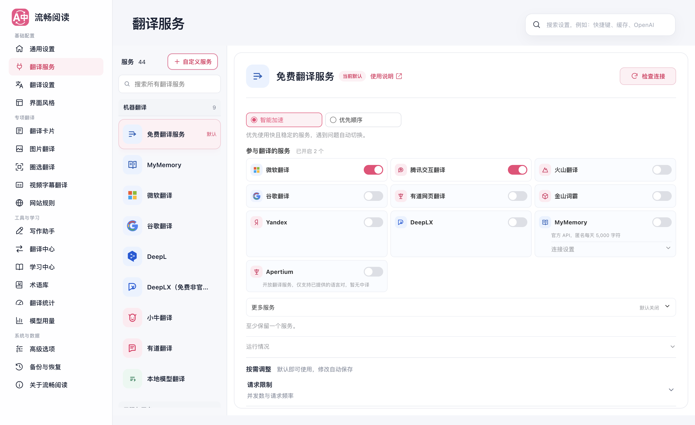

# 免费翻译：智能加速与简化设置

2026-09-30，基于 `25cb9134`，实现位于 `codex/free-translation-routing`。

免费翻译需要尽早提供有效译文，并把不同服务的短暂故障留在调度内部处理。此次同时调整调度算法、客户端重试与用户界面，保持既有服务启停、顺序、邮箱和等待上限配置。

## 用户体验

- 默认“智能加速”：只说明“优先使用快且稳定的服务，遇到问题自动切换”。
- 服务卡片保留名称与开关，仅在需要时提示“暂时不可用”“恢复中”。不要求用户理解权重或冷却算法。
- 百分比移入默认折叠的“运行情况”，保留合计 100% 的分流参考与刷新说明；“实验候选”改称“更多服务”。
- 保留“优先顺序”模式和排序操作，模式 ID 仍是原有的 `balanced` / `sequential`，不重置配置。七种界面语言同步更新，userscript 文案与语言资源同步。



[窄屏](./settings-narrow.png) · [窄屏深色](./settings-narrow-dark.png) · [展开运行情况](./settings-diagnostics.png)

## 调度改变

1. 单条、批量与视频的免费翻译不再套用全局默认三次重试；每段文本每条免费线路至多尝试一次。普通独立服务的重试配置不变。
2. 按近期成功率、峰值平滑耗时与当前在途负载分配请求。移除固定首选与强制避开上一家服务的限制，避免两家服务退化为轮流调用。亚秒级速度差异也参与选择。
3. 慢请求允许一条不同服务的延迟备用。冷启动 1.5 秒，随近期耗时在 0.8–2 秒间调整。首个有效结果获胜，另一条取消；取消不会记成服务故障。顺序模式不竞争。
4. 并发保持三条逻辑任务，整个调度实例最多额外一条竞争请求；初始一次竞争额度，此后每五次成功补充一次，最多积存一次，每段最多竞争一次。继续遵守每家服务并发、间隔、冷却与 Retry-After。
5. 排队、批量、换线与竞争共用最多 20 秒预算，上层只能缩短它。健康状态异步串行保存，不让磁盘等待阻塞译文或换线。
6. 保留原文回显、明显错语种、空响应校验；无效结果不能以“快”为由展示或缓存。文本特定错误仍不暂停整个服务。

设计借鉴 [Linkerd 的延迟感知分配](https://linkerd.io/2-edge/features/load-balancing/) 和 [gRPC 的延迟备用及节流](https://grpc.io/docs/guides/request-hedging/)，在 FluentRead 原有边界内独立实现。只读分析 read-frog 的请求/批量队列与 kiss-translator 的适配流程，没有复制非零碎代码、修改参考项目或添加跨仓库依赖。

## 验证

- 19 个相关测试文件，1,085 个用例通过，其中包含 666 个源文件注释架构检查；这不是全量回归。
- `freeFallback.ts`、`freeRoutingPolicy.ts`、`free-translation.ts`、`freeWeights.ts` 的 144 个定向测试：语句、分支、函数、行覆盖率均为 100%，以 100% 门槛执行。
- `pnpm test:audit`、`pnpm compile`、Chrome/Firefox/userscript 构建、userscript verifier、文档构建通过。没有升级依赖；验证临时复用了主检出已安装的依赖，不是全新安装验证。
- 生产 Edge 受控专项：[完整报告](./browser-report.json)。临时 profile，第二屏正常窗口，`macos-background-cdp` / `launchservices-no-foreground`，前台应用保持不变。
- 真实 Control 手势“翻译—恢复—再次翻译”计数 `[1, 0, 1]`，相邻段落不翻译，重复翻译命中缓存。竞争失败方被取消；所有可用线路失败后观察 7.5 秒，没有重跑整个服务池。
- “运行情况”默认折叠，普通界面无百分比。切换模式后立即关闭设置页，再打开仍保持；390px 浅色/深色均无横向溢出。生产浏览器没有未处理的页面异常。

同一组“首个服务一直挂起、备用服务 100ms 返回”的受控响应：

| 模式 | 从操作到首个译文 |
| --- | ---: |
| 优先顺序，等待首路 5 秒超时 | 5,178 ms |
| 智能加速，延迟备用竞争 | 1,730 ms |

本轮等待减少约 **67%**。这是算法与 UI 链路的故障模拟对比，不是实际供应商延迟分布，也不是所有地区的性能承诺。

运行受控专项：

```sh
node scripts/testing/run-free-routing-browser-test.cjs \
  --extension-dir .output/chrome-mv3 \
  --playwright-root <工作区依赖工具返回的 Node 包目录> \
  --focus-safe-helper <浏览器测试技能>/scripts/focus-safe-browser.cjs \
  --artifacts-dir /private/tmp/fluentread-free-routing-browser
```

加 `--live` 使用真实默认免费服务池，在本地合成英文段落上进行单段翻译/恢复/再次翻译（页面受控，供应商响应为真实网络）。外部服务可用性单独记录，不混入上述模拟计时。Firefox 与 userscript 本轮验证了构建，未进行真实运行时操作。

最初外站验证遇到 example.com 动态多语言段落重叠，测试目标被其他段落遮挡，[该次报告](./example-site-blocked.json) 保留为站点边界。随后使用固定的本地测试段落单独检查真实供应商，不把该站点验证计为通过。

真实免费服务池复核通过：[报告](./live-provider-report.json) · [实际译文](./live-translate-restore-retranslate.png)。固定合成英文段落在约 599ms 后出现中文译文，切换计数 `[1, 0, 1]`，相邻段落保持不变。该次请求没有模拟供应商响应，也没有发送用户网页或凭据；它仅证明本次默认服务池能完成翻译，不证明每个供应商均可用或所有语言/网络环境的速度。
