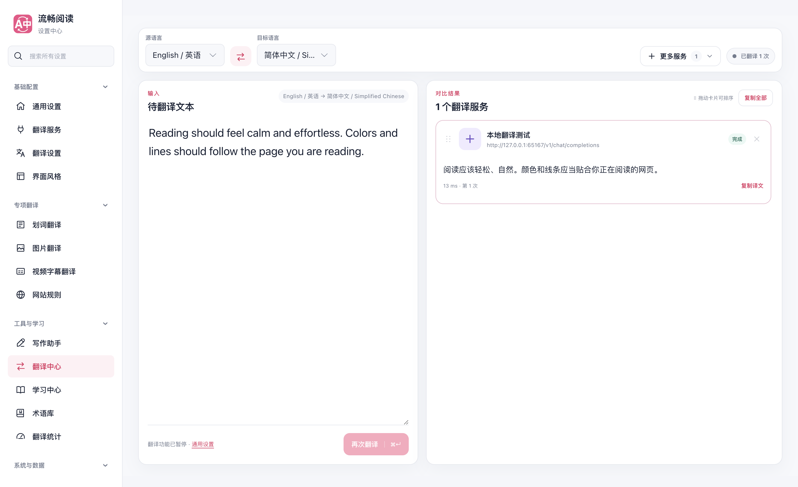
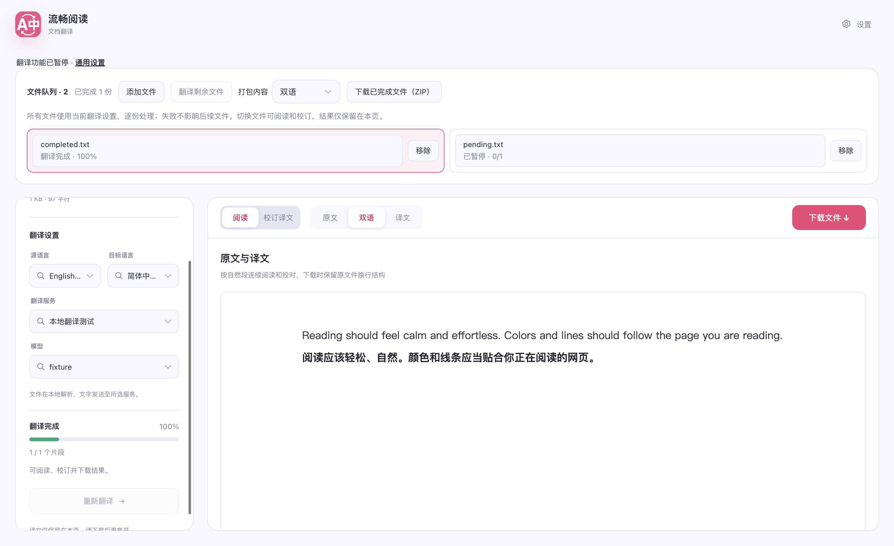
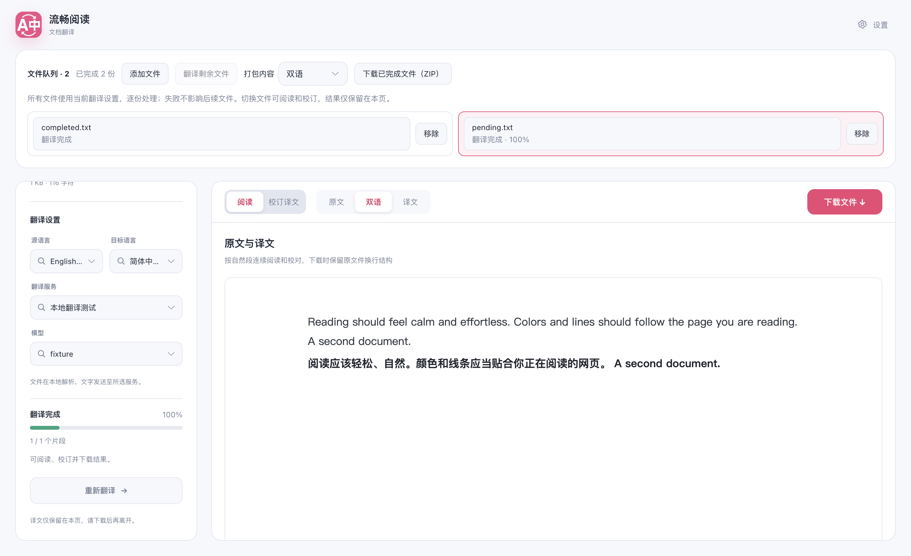

# 全局翻译开关联动核对

## 复现与修复

关闭总开关后，原生产包仍能由后台翻译入口向本地提供商发出一次请求（见 baseline-report.json）。文档与翻译中心也未完整处理全局停用。

共享翻译入口现等待配置水合，关闭时拒绝缓存/provider 请求并返回不可重试的停用状态；同时取消在途请求、阻止迟到结果交付。调用者的独立取消、预算、可信配置快照及同代次请求去重仍保留。重新开启使用新的请求代次，不自行重启旧任务。

文档与翻译中心显示暂停提示，禁用开始/重试/快捷键，并取消运行中的任务。已完成结果保留，文档仍可校订、导出。后台停用响应早于配置广播时，文档也会进入可继续的暂停状态，不误报为片段翻译失败。

## 验证

- 5 个受影响测试文件，共 260 用例通过。
- 新的 availability 模块 8 用例及文档编排模块 28 用例：statements / branches / functions / lines 均为 100%。
- compile、Chrome / Firefox / userscript 构建、userscript verifier、test:audit、docs:build 通过。
- 生产 Chrome MV3 产物，在隔离 Edge 临时 profile 的第二屏后台窗口中验证；`macos-background-cdp`、`launchservices-no-foreground`、`browserFrontmost: false`。
- 关闭后后台新请求不访问服务；在途请求的真实本地 HTTP transport 被取消，停用结果不可重试。
- 翻译中心输入/已完成结果保留，文档完成文件可导出，待处理文件显示已暂停，重新启用后手动继续成功。
- 真实通用设置开关联动网页翻译—恢复—再翻译；YouTube/X 离线 DOM 中的生产字幕入口在关闭与刷新后移除，再开启可恢复，独立字幕偏好保留。
- 本轮本地提供商共 9 次请求，页面未处理异常/控制台错误为 0。

范围：本地可控服务与离线站点 DOM；不据此声称登录态 YouTube/X、真实付费服务或 Firefox 运行时验证通过。浏览器结束后临时 profile 与实例已清理，用户日常浏览器未被替换。

## 截图

