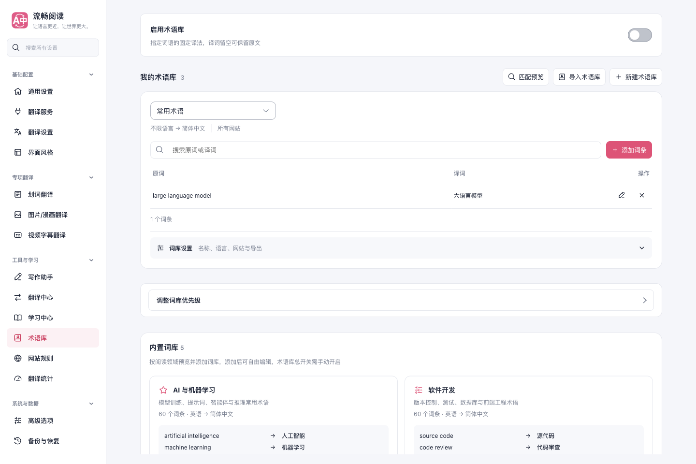
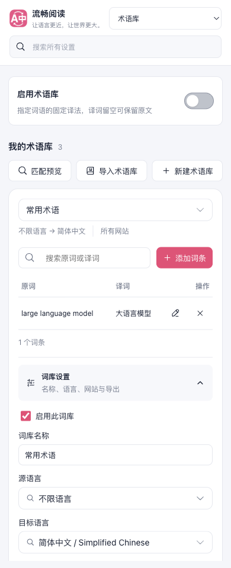

# 术语库管理界面验证（2026-10-05）

页面移除“更多”，在顶部直接展示导入、新建和有词条时的匹配预览。当前词库卡片内显示名称或切换框、语言与网站范围，并始终保留词库设置入口；多词库优先级排序独立显示在卡片下方。

设置展开只由 Vue 状态控制，通过按钮的 `aria-expanded` 和 `aria-controls` 表达状态，不再把原生 `details.toggle` 事件回写到控制展开的状态。导入或匹配预览打开和关闭后，当前词库设置状态保持不变；新建词库直接展开名称编辑，切换词库保留各自的词条草稿。

## 验证范围

- 正式 `.output/chrome-mv3` 产物，在全新临时 Edge profile 中运行 `scripts/run-glossary-test.cjs --suite ui`。
- 使用 `macos-background-cdp`、`launchservices-no-foreground` 与第二屏 `background-visible-no-focus` 窗口；`browserFrontmost=false`。
- 重复展开和收起、Enter/Space、导入与预览弹窗：每次采样 12 帧，展开状态未反转，卡片宽高变化不超过 1 CSS 像素。
- 新建、改名、保存词条、切换草稿、调整优先级、导入、真实 CSV 导出和取消删除均通过。重载与修改后立即关闭仍保存成功。
- 1440、1024、820、390px 的文档与术语库横向溢出均为 0；窄屏展开设置、深色主题和英文布局通过。控制台错误为 0。
- 48 个术语库组件/配置测试通过；源文件说明检查、测试审计、TypeScript/Vue 检查、Chrome/Firefox 构建和文档构建通过。

开发产物也完成上述交互用例，但控制台记录了 25 条 Vite `504 (Outdated Optimize Dep)` 错误，因此开发热更新运行未计为通过。正式产物的相同专项通过且控制台错误为 0；交付依据为正式包。

本轮只验证术语库管理界面，没有运行全链路翻译矩阵或 Firefox 实机测试，也不评价外部翻译服务。未借用参考仓库代码或设计。

浏览器指标与逐帧采样摘要见 [report.json](./report.json)。

## 桌面布局

## 窄屏设置

