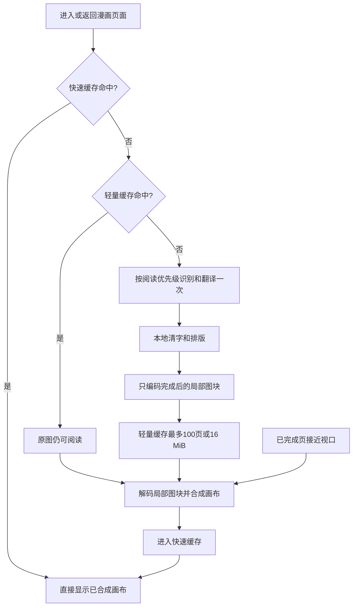
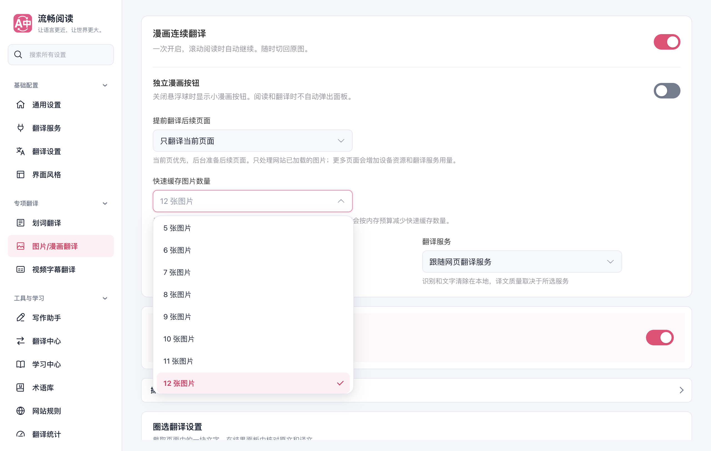
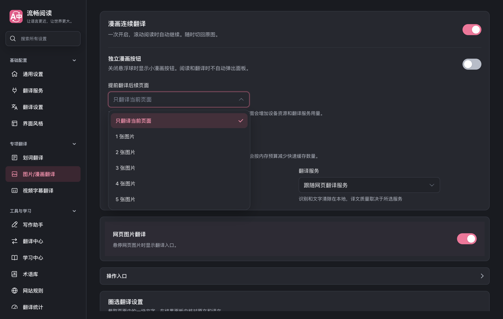
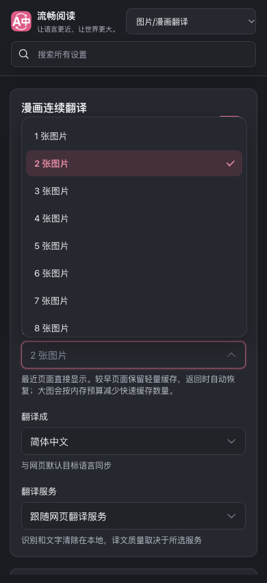

# 漫画两层缓存与统一下拉菜单

本次在 PR #788 的漫画 GPU 管线基础上实现两层阅读缓存。默认快速保留 12 张图片，可设置为 1–24 张；较早页面保存已完成的局部图块和文字坐标，接近视口时预合成，返回页面直接显示 Canvas。设置中的提前翻译、缓存容量、语言和翻译服务使用 FluentRead 现有 `UiSelect`，支持键盘、主题和窄屏。

## 阅读时如何工作

提前翻译与提前合成分别控制：默认预译后续 3 张，范围仍是 0–5 张；轻量缓存可保留更多已完成页，不扩大模型或付费翻译请求窗口。合成队列独立于 OCR 队列，每次只解码一个图块，不会因另一页正在推理而阻塞已完成页的恢复。

## 缓存内容及代价

| 层 | 保存内容 | 数量/预算 | 命中后的处理 |
| --- | --- | --- | --- |
| 快速层 | 整页已合成 Canvas，旧版整图响应保持兼容 | 默认 12，可选 1–24；每个容量单位 200 万像素 | 挂载已有画布，滚动只调整显示几何 |
| 轻量层 | 原文/译文、区域坐标、处理尺寸、压缩的最终局部图块 | 100 页或 16 MiB，先达到哪个就淘汰最久未使用的记录 | 在原图上绘制完成图块；不重做 OCR、翻译或清字 |
| 无文字页 | 零位图完成标记 | 同样受条目上限约束 | 保留原图，避免重复识别 |

Canvas 必须保存已经解码的像素。784×1145 的页面有 897,680 个像素，RGBA 每像素 4 字节，单张约 3.42 MiB；12 张同尺寸结果约 41.1 MiB。默认快速层的总预算是 2400 万像素，原始像素约 91.6 MiB；这个预算防止超长图片仅按“张数”占用过量内存。超过预算时实际快速缓存张数会减少，原图与正在显示的页面仍保持可读。

这些数字是缓存画布的像素数据，不等于扩展进程总内存。宿主原图、临时识别数据、GPU/模型和浏览器管理开销另计。轻量层的 16 MiB 按压缩二进制加 UTF-8 序列化元数据计算，JS 对象有额外管理开销，但最多 100 条。传输中的 base64 会立即转换为二进制；历史层不持有整页画布、解码位图、DOM 节点或完整译图 PNG。

同一次阅读会话内保存，换章、禁用缓存和卸载时释放。尚未加入跨会话磁盘缓存。图像节点、来源或重载版本变化会失效；节点被阅读器完全销毁并重建时，按新图处理，优先保证不会把旧结果套到新像素上。

## 实际样张结果

使用同样的两张 784×1145 漫画样张、真实本地识别与修补模型，以及确定性的文字翻译传输。四轮结果都与此前完整 PNG 译图逐像素相同。

| 样张 | 最终图块数 | 图块 PNG 二进制 | 原整页 PNG | 单张解码像素 |
| --- | ---: | ---: | ---: | ---: |
| 复杂背景页 | 1 | 164,960 B，约 161 KiB | 1,395,457 B | 3,590,720 B |
| 文字较多页 | 10 | 42,693 B，约 42 KiB | 1,000,392 B | 3,590,720 B |

表中图块大小未包括文字元数据。轻量缓存的实际成本取决于文字覆盖范围和背景复杂度，不保证每张只有几十 KB。100 张上述文字页的图块约 4.1 MiB；100 张复杂页约 15.7 MiB，加上元数据后仍按 16 MiB 预算自动淘汰。

测试实际启用了 Apple Metal GPU，四轮都有 GPU 提交（1090、314、566、566 次）。复杂页热运行约 1.99 秒、文字较多页热运行约 5.04 秒。冷启动单独记录，未将这个小样本推广为所有设备或服务的速度保证。正式漫画路径仅编码图块；整页 PNG 只在测试导出比对时生成。

生产扩展返页测试把快速容量改为 2 张，连续处理 3 个相隔较远的页面，再上下及左右往返；总识别/翻译请求始终是 3 次。6 次纵向返回为 7.3–33.8 ms，中位数约 23.0 ms。翻译和恢复期间没有逐图进度弹窗，暂停归还所有宿主原图。

## 菜单与配置验证

浅色、深色、390px 窄屏菜单背景均不透明，选中项使用品牌粉色及清晰勾选，列表有滚动上限。服务空值显式表示“跟随网页翻译服务”，不会显示通用英文占位词。

键盘将默认 12 改为 13，随后选择 2 并立即关闭设置页，重新打开后仍是 2。配置归一化、导入导出、配置差异与同步包含新字段。

## 审查和测试

人工审查覆盖来源身份、配置修订、队列归属、暂停/隐藏/换章/卸载、取消后的迟到结果、画布及 ImageBitmap 释放、宿主样式归还、缓存容量与像素/字节边界。审查中修正了超预算页反复预合成、极小框漏像素、超过 256 图块时密集页面的合并策略，以及空服务值的菜单显示。

- 缓存/合成/阅读器/配置专项：282 个测试通过；4 个模块 statements、branches、functions、lines 均为 100%。两个新模块全部纳入严格覆盖率与测试矩阵。
- Offscreen、客户端消息、修补/排版/编码、配置差异/传输/同步专项：202 个测试通过。
- 类型检查、Chrome MV3 和 Firefox MV2 构建及清单验证通过；用户脚本构建与 verifier 通过，语言资源固定到包含新资源的不可变提交。
- 真实生产 Chrome 的设置和返页 5 项功能测试通过；真实 GPU 样张 4 轮通过。临时 profile，第二屏正常后台窗口，`macos-background-cdp` / `launchservices-no-foreground`；未抢前台，页面及扩展错误均为 0，profile 已清理。
- 测试矩阵审计通过。选定架构审计加相关配置/消息测试为 883 通过、2 项既有失败：3 个旧工具缺验证归属、18 个旧可执行模块缺严格覆盖率归属；本次没有新增遗漏，也未修改审计规则放宽门槛。

完整证据保存在工作区 `artifacts/manga-tiered-cache-20261004/` 下。这里验证了真实 Chrome 与真实本地模型；Firefox 的证据是构建和清单，没有把它描述为 Firefox 实机测试。未运行全量站点矩阵，也没有声称本次改动已解决所有网站或所有翻译服务的内容质量。

任务分支：`codex/manga-tiered-cache-20261004`。任务工作树：`/Users/thinkstu/Desktop/copy/FluentRead-manga-tiered-cache-20261004`。来源 PR #788 和用户主检出目录保持原状，已在任务分支合入最新 `origin/main` 的官网变更。
