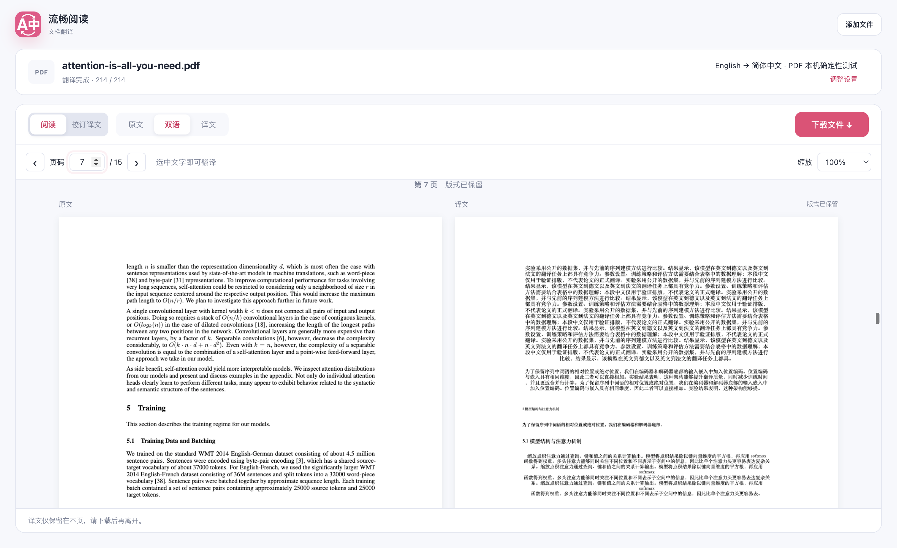
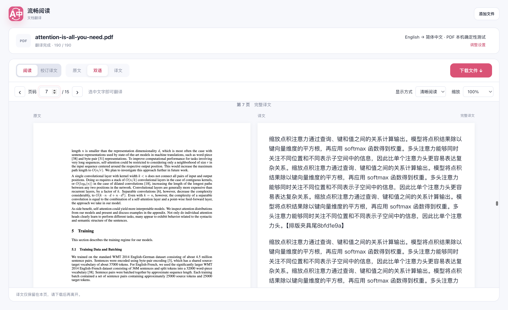
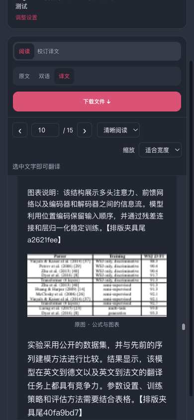
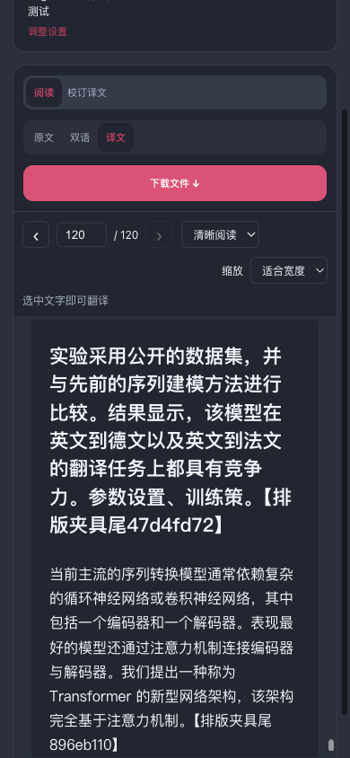
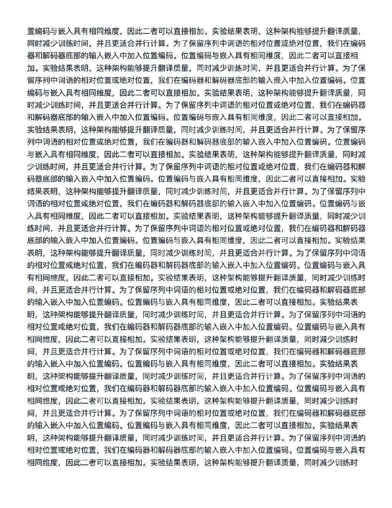
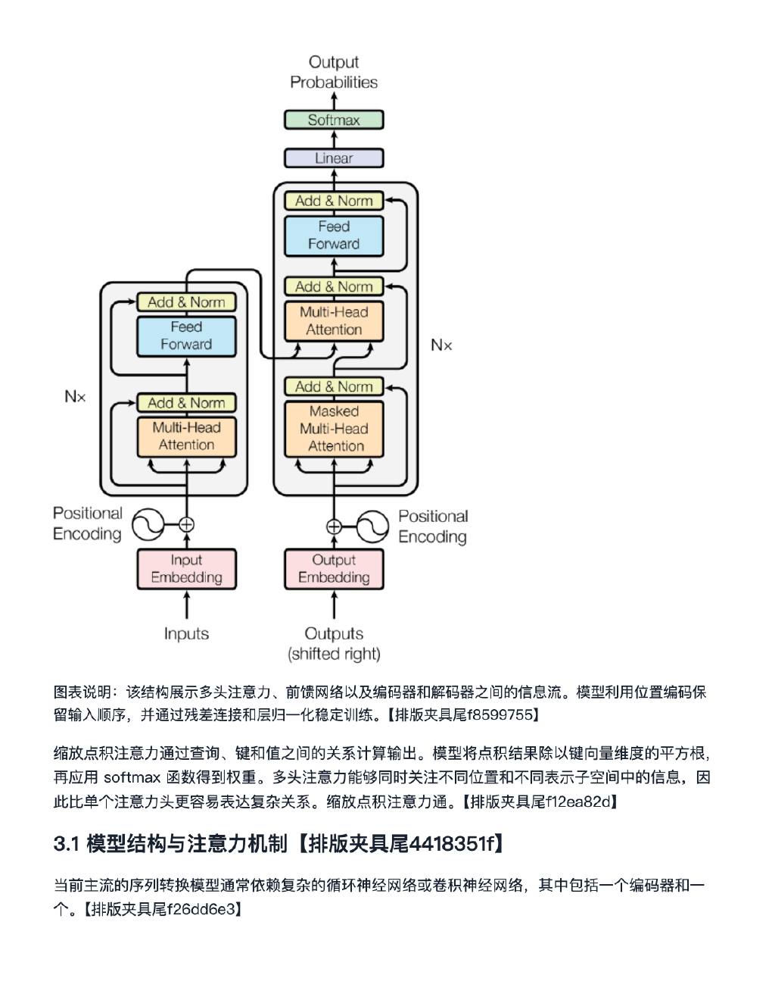
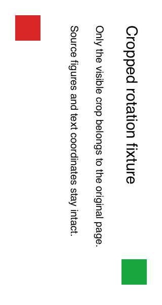

# PDF 可读排版验证记录 · 2026-10-09

本次改动把 PDF 译文默认改为完整、可选择的段落阅读流，并让阅读器和下载共用同一份文字与原图区域计划。原页仍供对照阅读，不覆盖导入文件。相关回归、生产构建及本轮要求的浏览器检查已完成；120 页末页切换保持页码 120，长译文完整续排。旋转裁剪原页存在有限的边缘渲染差异，具体边界见下文。

本目录独立于上一轮 `pdf-selection-20261009`，不覆盖其划词证据。只保存报告、测试日志和 8 张选图；不提交完整原论文或导出的译文 PDF。代码位于 FluentRead，没有修改或依赖参考仓库。

## 实现与阅读方式

| 内容 | 当前行为 |
| --- | --- |
| 清晰阅读 | 正文基准 16px、1.7 倍行距；图注 14.4px；作者、邮箱与页脚保留源文，基准 13px。缩放按比例放大，段落自然增高，不截断或缩小长译文。 |
| 原版面 | 位置预览仅替换能在至少 8.5pt 下、每行实际宽高均完整放入原框的文字，不水平压缩字形；保护区域、零宽区域和放不下的段落保留源文。预览下方始终附完整 HTML 译文。 |
| 公式、表格和插图 | 依据原字形与绘图操作识别区域，使用原页像素裁剪，保留图内文字、数学符号和矢量图的外观；图注单独排版。阅读流裁剪恢复正常朝向，原页保留 PDF 的展示旋转。 |
| 清晰译文下载 | 正文固定 12pt、19.2pt 行距，图注 11.5pt，作者与页脚 11pt，章节 16pt。完整段落自动续页，超高图像分段续页。 |
| 双语下载 | 每个原稿页保留原页的内容流、字体与矢量内容，后接该页完整译文续页。选择原版面时额外加入位置预览。没有译文变化的原稿页直接保留。 |

解析器按基线关联上下标，按分栏和通栏分隔组织顺序，并保留逐行、逐字形几何。共享 `pdfReadingPlan.ts` 为文字与原图提供稳定的页、片段和区域标识；`pdfTextLayout.ts` 消费完整文字分页。旧的整块遮盖优先改用原字形区域遮盖，并修正 `sans-serif` 被误判为衬线字体的问题。

阅读器最多保留 5 页、并发渲染 2 页。每页源画布与所有裁剪画布合计不超过 250 万像素，边长不超过 8192px；五页画布像素合计不超过 1250 万。极细区域的至少 1px 分配也计入预算。流式译文更新 HTML，不反复绘制原页；段落标识与视口偏移用于保持阅读位置。取消、换文件、缩放、离屏和卸载会释放画布并拒绝迟到结果。

导出逐页编码并嵌入图像，及时释放像素，保留取消与重试；该预算限制的是 Canvas 像素，并非整个浏览器进程内存。PDF.js、原文件、段落 DOM 与最终 PDF 的资源仍会占用内存。

## 本地检查记录

| 检查 | 结果与证据 |
| --- | --- |
| 相关回归与架构检查 | CropBox 与窄字框修复后，27 个套件、1286 项通过；随后末页锚点修复后，重新执行 12 个相关套件、1018 项通过：[前批检查](./final2-affected-tests.txt)、[最新检查](./final3-reader-boundaries.txt)。两批存在重叠，不相加。 |
| 严格覆盖率 | 最新 5 个套件、62 项通过；`pdfLayoutAnalysis.ts`、`pdfReadingPlan.ts`、`pdfTextLayout.ts`、`pdfReader.ts` 的语句、分支、函数、行均为 100%：[覆盖率日志](./final3-coverage.txt)。这一结论仅适用于所列四个模块。 |
| 阅读器专项 | 最新 40 项通过，包含完整长译文、稳定阅读顺序、同页段落锚点、缩放、旋转裁剪、250 个极细原图区域的总预算及资源释放，以及 120 页模式切换：[专项日志](./mode-anchor-after.txt)、[两模块覆盖率 JSON](./reader-coverage-summary.json)。 |
| 纯公式原页 | 文档入口 16 项通过，其中公式文本 PDF 能进入原文阅读，不创建翻译请求；解析器同时验证零待译片段与原字节不变：[入口日志](./final-formula-parent-test.txt)、[解析测试所在日志](./final3-coverage.txt)。 |
| 本地化与边界 | 最终本地化 57 项通过；此前本地化、模块边界和源码头共 914 项通过：[最终本地化](./final-i18n.txt)、[边界日志](./architecture-i18n-reader.txt)。 |
| 旋转与裁剪原页 | 7 项通过，覆盖 0°/90°/180°/270°、非零 CropBox/MediaBox、部分相交和空相交回退，原字节保持不变：[独立日志](./crop-rotation-regression.txt)。 |
| 编译与生产构建 | 末页锚点修复后的 TypeScript 编译、Chrome MV3、Firefox MV2 构建均退出 0：[编译](./mode-anchor-compile.txt)、[Chrome](./final3-build-chrome.txt)、[Firefox](./final3-build-firefox.txt)。构建成功不等于浏览器交互通过。 |
| 测试登记 | 审计通过，606 个测试文件、9586 个登记用例均有归属；登记不代表全套执行：[审计日志](./final3-test-audit.txt)。 |
| 文档构建 | 中英文指南的流式预览描述已与代码核对；`pnpm docs:build` 退出 0：[构建日志](./final-docs-build.txt)。 |
| 用户脚本 | 最新构建与体积校验通过，主脚本 1,959,999 字节，原有 1,960,000 字节上限未变：[构建](./final3-build-userscript.txt)、[校验](./final3-verify-userscript.txt)。 |

日志保留 PDF.js 在 Node 测试环境中的字体和 DOM 图形接口警告。真实 PDF 提取测试通过，但这些 Node 测试不能替代生产浏览器的像素验证。

## 生产浏览器与下载证据

使用最终 Chrome MV3 产物、真实 PDF.js 和隔离 Edge，在第二块屏幕可见但不抢前台焦点的临时配置中验证。中文由本地确定性夹具提供。公开摘要省略完整论文文字、完整夹具译文、请求载荷及复制内容：[浏览器摘要](./browser/verification-summary.json)、[裁剪原页独立检查](./browser/cropbox-independent-check.json)。完整原始报告留在本地临时目录。

| 检查 | 观察与断言 |
| --- | --- |
| 论文完整性 | 15 页全部检查，独立校订清单 190 项；正文、图注与尾标记按顺序完整显示，作者和页脚保留源文。1 倍、2 倍、4 倍长中文夹具均覆盖全部 15 页。 |
| 阅读与校订 | 原生鼠标选择及受信任复制事件取得完整 HTML 译文，不写入用户剪贴板；流式更新和人工校订保留源画布与 TextLayer 节点，暂停后的迟到进度被拒绝。缩放保持同一段落；原版面预览附完整 HTML 续文。 |
| 图表与公式 | 解析器识别 20 个保护区域；阅读计划含 21 个原图裁剪项，其像素逐项等于对应源页裁剪。导出实际绘制 22 次原图区域，计数包含分页续图；这三个数字分别属于解析、阅读计划和导出绘制。 |
| 实际下载 | 最终 1 倍译文 PDF 为 31 页，双语为 46 页（15 原页＋31 译页）；168 个中文条目的完整内容和顺序均匹配，下载内的译页 RGB 哈希逐页等于排版画布。双语原页的可选文字与字形坐标完整保留。2 倍、4 倍译文分别为 43、66 页；这些扩展验证使用的导出核心与最终源码哈希相同。 |
| 120 页模式切换 | 720/720 完成；多次跳页、缩放及 390px 窄屏检查通过。末页双语→译文→双语均保持 120；切换原文、原版面、清晰阅读也保持 120。 |
| 窄屏与暗色 | 最终第 10 页与第 120 页有可见正文；390px 视口中的阅读列宽 320px，正文 16px、行高 27.2px，计算背景为 `rgb(32, 38, 50)`、文字为 `rgb(243, 245, 250)`。 |
| 取消与重试 | 编码时取消后没有下载、迟到 UI 写入被拒绝；重试生成完整 31 页译文，逐页像素哈希匹配。 |
| 资源与隔离 | 采样峰值为 5 个驻留页壳、5 个源画布、5 个 TextLayer、19 个画布合计 12,487,110 像素；统计包含脱离 DOM 的在途画布。前台焦点违规和页面控制台错误均为 0，测试浏览器已全部关闭。 |

最终一次导入到首个可选择页的观测耗时：论文 1017ms、120 页夹具 360ms、裁剪夹具 220ms；1 倍译文、双语导出分别为 10,746ms、13,198ms。这些是单次本地夹具观测，资源数字只描述画布分配，不作为 CPU、FPS 或浏览器进程内存排名。

本轮曾有 120 页节流夹具在 506/720 时超时，该次运行不计为通过；部分早期所谓暗色截图实际为浅色背景，最终选图以计算样式与可见正文重新验证。后续在 720/720 完成后发现窄屏双语切换译文时页码从 120 跳到 71。原因是总高度缩短后浏览器先限制滚动位置，旧布局锚点随后才读取；单元回归在修复前重现 120 跳到 67。修复在 DOM 更新前捕获旧页，并与页码计数器使用相同可见点。单元与最终真实浏览器已验证上述模式双向切换：[失败重现](./mode-anchor-before.txt)、[修复验证](./mode-anchor-after.txt)。摘要保留这些历史失败，没有把早期报告改写为通过。

最终浏览器原始报告的 `ok:false` 保留：失败项是旋转 CropBox 原页与下载原页的 PNG 字节完全相等。对实际下载另做只读独立检查，显示尺寸均为 160×300pt；5 个可见文字项一致，裁剪外文字不存在，最大显示矩阵误差为 `9.18e-16`。Poppler 144dpi 的 320×600 图像中，555/192,000 像素不同（0.289%），平均通道绝对误差 0.22565，全部差异在原文字或矩形边缘的 1px 邻域，红绿角标各 2500 像素且边界完全一致。独立边界检查通过；这不等于像素完全一致。差异与两种旋转表示的抗锯齿行为相符，但具体原因仍是推断。

可重复脚本：[run-pdf-selection-test.cjs](../../../scripts/run-pdf-selection-test.cjs)。需要现有仓库依赖、Playwright、Edge 和 Poppler；使用指定论文文件与新的临时浏览器配置。以下命令重跑最终论文、末页模式和裁剪检查，省略 `--paper-layout-followup` 可执行扩展矩阵，将它替换为 `--paper-layout-cancel-only` 可单独验证取消与重试：

```sh
pnpm test:pdf-selection \
  --extension-dir .output/chrome-mv3 \
  --playwright-root "$PLAYWRIGHT_ROOT" \
  --arxiv-pdf /path/to/arxiv-v7.pdf \
  --artifacts-dir /private/tmp/fluentread-pdf-layout-recheck \
  --paper-layout-only --paper-layout-followup
```

## 选图

下列中文为排版夹具，不是对应论文段落的语义译文。导出长文和图文选图来自较早的已通过下载检查，其四个导出模块指纹与最终构建一致；其他新图来自最终模式锚点修复后的产物。完整 PDF 不入库。

| 旧版第 7 页正文，100% 双语 | 最终第 7 页正文，100% 双语清晰阅读 |
| --- | --- |
|  |  |

| 最终第 10 页，390px 暗色译文 | 最终第 120 页，390px 暗色译文 |
| --- | --- |
|  |  |

| 4 倍长正文译文 PDF，第 2 页独立渲染 | 1 倍图文译文 PDF，第 5 页独立渲染 |
| --- | --- |
|  |  |

| 旋转 CropBox 原文件，Poppler 144dpi | 实际双语下载原页，Poppler 144dpi |
| --- | --- |
|  |  |

## 来源与构建标识

Node `v20.11.1`、pnpm `9.12.1`；工作树基于 `193c973352b851cd148d7b66f7ef773215b94143`。完整 SHA-256 与采集范围见 [provenance.json](./provenance.json)、[生产变更集合](./source-production-sha256.txt)、[Chrome 全输出文件清单](./chrome-output-sha256.txt)。现有生产与构建哈希采集于末页模式锚点修复后的最终 Chrome 构建。生产变更集合仅包含相对基准提交新增或修改的 `src` 文件与用户脚本资源配置，不表示整个仓库的哈希。

论文来源：Vaswani 等，[*Attention Is All You Need*，arXiv:1706.03762](https://arxiv.org/abs/1706.03762)。本地输入为 15 页 v7，页上版本日期 2023-08-02；输入字节 SHA-256 为 `bdfaa68d8984f0dc02beaca527b76f207d99b666d31d1da728ee0728182df697`。最终浏览器导出的文件、选图和可重复脚本哈希已写入摘要与构建标识；只留哈希，不保存 PDF 二进制文件。用户脚本语言资源 URL 固定到上述本地提交；本地构建和资源校验通过不代表该提交已上传，或 CDN 已能访问这些资源。

## 证据边界与已知限制

- 单元测试使用人工几何数据、程序生成的 PDF，以及受控长中文译文，验证顺序、完整性、分页和生命周期。实际论文夹具的中文段落带唯一尾标记，并包含加长版本，用于追踪排版与下载的完整性。它不是论文的语义译文；这些测试不证明在线翻译服务的语义、术语或准确率，也不证明所有 PDF 都能正确识别。
- 分栏、公式、表格与插图识别采用几何和文本启发式；特殊排版仍需对照原页。作者、邮箱、页脚、受保护表格和图内标签保留源文。未完成或清空的译文以原文显示。纯扫描 PDF 没有 OCR 支持；带可提取数学文字的公式页可单独阅读。
- 阅读器中的 HTML 译文能选择、复制；原页使用 PDF.js TextLayer。下载的译文页及原版面预览是 PNG 图像嵌入 PDF，没有新增可选择的中文文字层，不能依靠它直接复制或搜索译文。请在阅读器复制中文。双语原页保留内容流，不代表输出文件与源字节相同，也不宣称复制原文件的交互注释等页面功能。
- 原版面是位置对照；完整内容以其下方译文和下载续页为准。原图裁剪仍是像素图，放大后的清晰度受画布预算与原页渲染分辨率限制。
- 原浏览器与构建证据采集于本地提交 `2ec514f5c` 阶段，当时尚未上传分支或创建 PR。用户授权合并后的主线集成检查见[合并前验证](./merge-validation/README.md)。本报告不将构建、测试夹具或旧证据扩大解释为扩展发布或真实服务证明。

相关使用说明：[中文指南](../../guide/document-translation.md)、[英文指南](../../en/guide/document-translation.md)。
