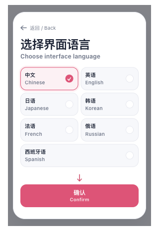

# Popup 首启性能与稳定性验证

2026-10-03。对照基线为 `f568dc058206dd571bd1eb0220c3912b91d8c21b`，已包含此前的语言卡片排版与首帧高度修复；本报告只计算之后的启动性能改动。

## 改动

HTML 外壳通过无框架脚本提前唤醒后台，让后台初始化与界面脚本加载并行。后台只返回引导是否完成的布尔提示，用于预取候选模块；实际挂载仍等待配置 store 新读的配置，不缓存或复用提示中的配置快照，也不增加配置写入。

未完成引导时挂载独立欢迎页，不创建或解析完整主菜单。引导直接使用十条共享中英文文案，不请求完整英文目录；选择的语言资源在确认时准备。保存成功即开始加载菜单，与现有成功反馈并行；模块加载失败提供重试，已保存的语言在重开后恢复。

保留原有首屏图标注册位置，避免拆包把共享控件代码推迟到菜单加载阶段。完整六种语言资源的键值与基线一致，不改资源快照或版本。没有借鉴或修改参考仓库。

## 相邻前后对照

使用生产 Chrome MV3 包，在同一台 macOS 机器连续运行基线与改动包。每个包使用独立临时 Edge profile，欢迎页和确认后的普通菜单各打开七次；每阶段首次打开前通过 CDP 确认后台停止，其余六次取通常定义的中位数（偶数样本取中间两值平均）。测量时没有并行运行本任务的构建或测试。

时间从 Popup 文档导航开始计算。DOM 就绪表示配置已生效的 `.popup-shell` 挂载；下一帧为其后的 `requestAnimationFrame`，不是屏幕像素呈现或工具栏点击到显示的总时长。脚本字节按 CDP 实际解析的本地 JS 文件计算，为未压缩大小。

| 指标 | 基线 | 改动后 |
| --- | ---: | ---: |
| 欢迎页，冷后台 DOM 就绪 | 247.1 ms | 202.5 ms |
| 欢迎页，冷后台下一帧 | 315.7 ms | 264.0 ms |
| 欢迎页，重复打开 DOM 中位数 | 81.7 ms | 69.8 ms |
| 欢迎页，重复打开下一帧中位数 | 88.8 ms | 72.9 ms |
| 欢迎页，解析 JS | 1,034,940 B | 838,031 B |
| 欢迎页，文档元素数 | 172 | 53 |
| 普通菜单，冷后台 DOM 就绪 | 186.9 ms | 187.0 ms |
| 普通菜单，冷后台下一帧 | 188.5 ms | 188.7 ms |
| 普通菜单，重复打开 DOM 中位数 | 75.9 ms | 82.3 ms |
| 普通菜单，重复打开下一帧中位数 | 80.1 ms | 83.5 ms |

欢迎页下一帧约缩短 16%（冷后台）和 18%（重复打开），解析脚本减少约 19%。普通菜单没有计作性能收益：本轮重复打开下一帧增加 3.4 ms，冷后台相差 0.2 ms。冷后台每阶段只有一次样本，重复样本也较少，不能据此推广到所有设备或宣称普通菜单提速。

运行方式为 `macos-background-cdp`，焦点策略为 `launchservices-no-foreground`，第二屏正常大小可见窗口，`browserFrontmost=false`。性能数据不含配置值、凭据或用户内容。[基线采样](./before.json)与[改动后采样](./after.json)保留逐次数据；统计中位数由原始样本重新计算，未修改原始时间。

## 验证

- 首启布局：配置读取延迟 1.2 秒，等待页到欢迎页始终为 460 px，无纯文字品牌闪现、卡片缩放或晚到的英文；280/320/360/400 px 与深色界面，七种语言名称完整，末项占满一行。
- 语言与失败恢复：选择西班牙语、返回后保留选择、确认与重开持久化；故意中断一次菜单模块请求后重试成功。
- 提示过期：反转欢迎页与普通菜单的启动提示，两种状态最终仍按新读配置显示正确页面。
- 普通菜单：深色/自动主题与 Emoji 皮肤、非默认排列、功能可见性均在首个可见菜单帧生效；配置读取失败可以进入有限时间内的回退界面。
- 保存退出：无修改关闭不写配置；冻结首个保存回执后连续修改并关闭，通过批次交接保存最终语言，重开显示一致。
- TypeScript/Vue 检查、143 项直接影响范围测试、33 项设置界面结构测试、测试归类审计通过；Chrome、Firefox、userscript 构建及 userscript verifier 通过；文档构建通过。Chrome/Firefox 外壳与预唤醒资产已核对，Chrome 权限未改变。

模块边界套件中的历史文件行数检查仍失败：`src/app/content/runtime.ts` 为 282 行，已有上限为 277；已在未修改基线复现，本任务未改变该文件。其余模块边界与源文件头检查通过。启动测试夹具原来仍列出已移除的 video/area 快捷入口，已对齐当前五个入口后重跑通过。

仅运行受影响范围，没有执行全量回归。Firefox 为构建证据；未验证真实 Firefox 工具栏、在线翻译服务、用户日常 profile 或商店安装包。所有浏览器测试均隔离，未改变用户浏览器配置。

