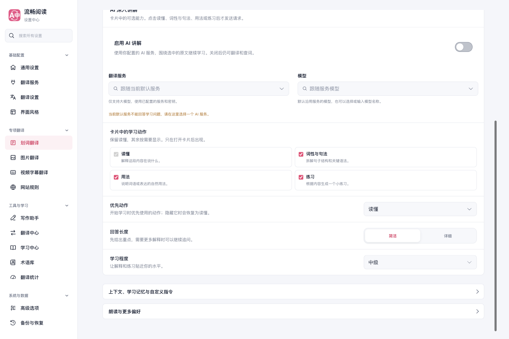
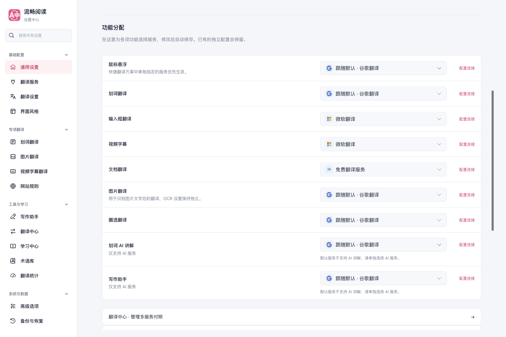
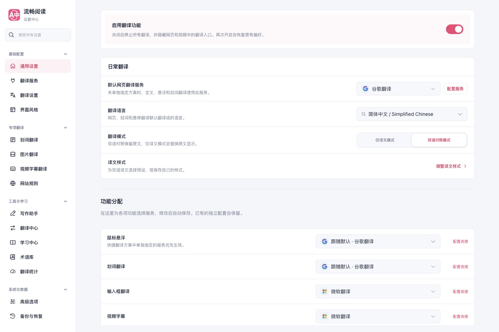

# Popup 提供商与设置层级调整

日期：2026-09-30。基于 `ed67b2a9` 的后续本地修改，尚未发布。

## 调整后的行为

- Popup 用一行提供商图标汇总默认服务、各功能服务和已启用快捷翻译方案中的独立服务。同一提供商不重复占位，超过四项显示数量。点击整行打开本地抽屉，按功能选择服务，自动保存；支持继承默认、独立选择、服务名称和模型关键词搜索。AI 精翻放到抽屉底部。
- 翻译服务页只呈现服务目录、模型与连接配置，使用完整页面空间。功能分配位于通用设置的日常翻译下方，搜索可直达；默认服务沿用上方日常翻译中的选择，不重复显示。取消将整个服务目录套入大型弹窗的做法，编辑连接不会更改默认服务。窄屏保留目录选择入口。
- 通用设置首位显示全局翻译开关，沿用现有 `config.on` 与停用生命周期，不改写各功能偏好。Popup 不加入总开关。
- 服务、模型、学习动作及回答偏好直接可见。高级上下文和朗读设置使用 44px 的中性折叠行、右侧箭头和键盘展开；移除大面积粉色底与左侧三角。
- 图片与圈选仍共用一个 Popup 抽屉，保留各自开关。浅色、深色和三种界面皮肤沿用现有配置。

只参考了 read-frog 的“提供商摘要 → 按功能选择”交互，使用 FluentRead 的 Vue 组件和既有配置映射独立实现；没有修改参考仓库或添加跨仓库依赖。

## 实际界面

[深色英文 Popup](./popup-dark-en.png) · [窄屏服务配置](./service-workspace-mobile.png)

## 验证

生产 Chrome 构建在隔离 Edge 临时 profile 中运行，使用 focus-safe helper，第二屏正常可见窗口，不抢前台焦点。报告记录 `macos-background-cdp`、`launchservices-no-foreground`、`background-visible-no-focus`；未连接日常浏览器。

- 10 个服务字段可见并支持选择；独立分配、继承默认、修改后立即重开、模型关键词搜索、AI 服务过滤和跨页面同步通过。关闭的选择器不挂载选项 DOM。
- 默认、简约、紧凑皮肤及深色英文界面无横向溢出；390px 服务页通过检查。服务配置直接显示，没有大弹窗遮罩和功能分配列表，配置另一服务不会改写默认服务。功能分配可从搜索定位到通用设置，配置连接跳转也已验证。
- 使用生产 content scripts 加载离线 YouTube/X DOM 夹具：全局关闭后视频翻译按钮与挂载 UI 被移除，刷新后仍不出现；重新开启后恢复，字幕功能偏好保持不变。这是浏览器夹具证据，不代表登录态真实视频站点或在线翻译服务验证。
- 常用学习字段直接显示；两项高级折叠行均为 44px、白色底、无左侧默认 marker，可使用 Enter 展开和收起。
- 七次 Popup 打开均为 340×360px；上轮同类实测为 340×438px，本轮减少 78px。首帧中位数 56.7ms，关闭后台 worker 后第一次 214.6ms；记录中没有长任务、隐藏选项或控制台错误。计时仅描述本机样本，不作普遍提速承诺。初始脚本总量 1,008,249 bytes，提供商表单按需加载。

相关命令与结果：

| 检查 | 结果 |
| --- | --- |
| `pnpm compile` | 通过 |
| Popup、功能服务、设置导航、内容生命周期及视频绑定相关的 8 个测试文件 | 145 项通过，2 项已在未修改基线上复现的失败，见下文 |
| 功能分配移到通用设置后的 UI、导航三份测试复核 | 75 项通过 |
| userscript 语言资源、Vite 配置及完整设置 3 个文件 | 18 项通过 |
| 导航模块限定覆盖率 | 24 项测试通过，四维均 100% |
| `pnpm test:audit` | 通过，408 个文件、5,256 个用例完成归类审计；不表示运行了全量测试 |
| Chrome / Firefox / userscript 构建及 userscript verifier | 通过 |
| `pnpm docs:build` | 通过 |
| 浏览器 `run-popup-performance-test.cjs --cold-worker --verify-ui --verify-providers` | 通过，详见 [report.json](./report.json) |

`tests/contentFeatureMounting.test.ts` 中两项 Harness 独立挂载用例在本分支与未修改的 `ed67b2a9` 上同样失败：一项收到非 Promise 的挂载返回值，另一项预期的 UI 创建调用不存在。此次没有修改该内容挂载实现，也没有放宽断言或将失败计为通过。[本分支日志](./affected-tests.txt)与[基线复现日志](./baseline-mount-tests.txt)保留供复核。

Firefox 仅完成构建，未宣称 Firefox 运行时验证。userscript 的五个语言数据文件已生成并固定到本地资源提交；未推送，未验证远程 CDN。依赖复用现有安装，不代表全新安装验证。
