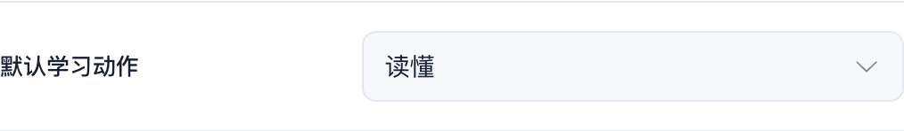
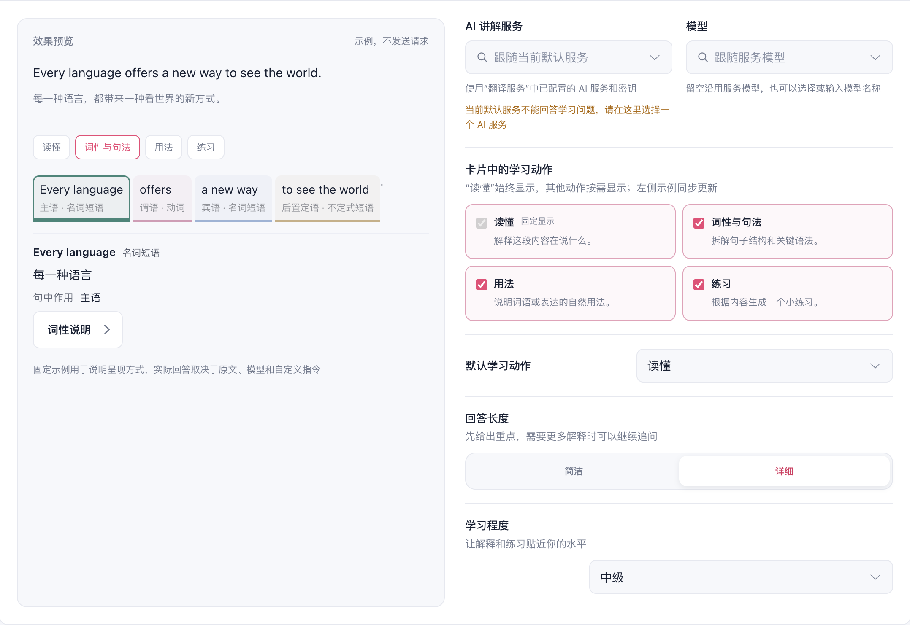
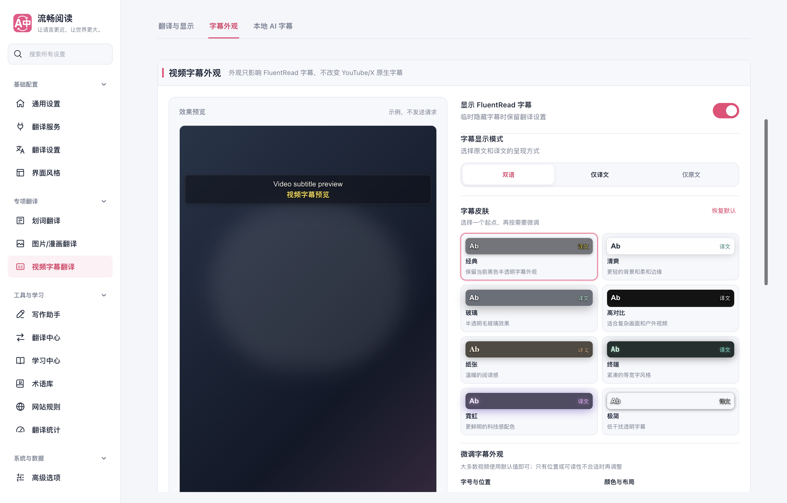
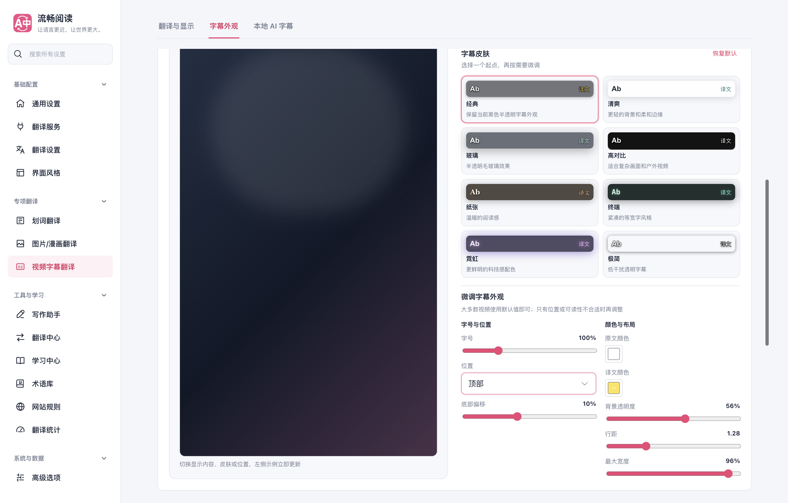

# 预览等高与默认动作布局修正

后续将字幕改为紧凑的 16:9 预览卡片并在滚动时保持可见，见 [当前字幕预览](./subtitle-preview.md)。下方保留默认动作与等高布局的阶段性验证记录。

删除“默认学习动作”下方的说明，标签和下拉框改为同行且垂直居中。共享预览布局在桌面使用等宽等高的两列，字幕画面填满左侧预览区；AI 讲解切换学习动作或回答长度后，两侧高度仍保持一致。850 像素及以下继续上下排列，每个区域按自身内容决定高度。

本轮验证源码为 `63cf3a7b`。Chrome MV3 生产构建、类型检查、文档构建、测试审计、界面本地化扫描单项和补丁检查通过。生产 Edge 专项 6 个场景通过，覆盖默认动作说明移除与同行布局、动作回退、AI 动作与回答长度、字幕画面伸展、三类设置页的 1440/1024/820/390 像素布局，以及深色英文界面。控制台错误为 0。

| 1440 像素宽度下的区域 | 左侧预览高度 | 右侧设置高度 |
| --- | ---: | ---: |
| AI 深入讲解 | 698.78 px | 698.78 px |
| 视频字幕外观 | 982.19 px | 982.19 px |

测试使用第二屏上正常可见、未成为前台的隔离 Edge 窗口，临时浏览器和 profile 已清理。逐项布局数据见 [等高专项报告](./equal-height-browser-report.json)。本轮是布局专项，未重复完整媒体翻译套件，也未进行真实 Firefox UI 或供应商调用验证。此前的功能验证及既有国际化失败见 [初次验证](./validation.md)。

深色英文截图：[AI 讲解](./ai-dark-english.png)、[字幕](./video-dark-english.png)。窄屏截图：[划词](./selection-mobile.png)、[字幕](./video-mobile.png)。
