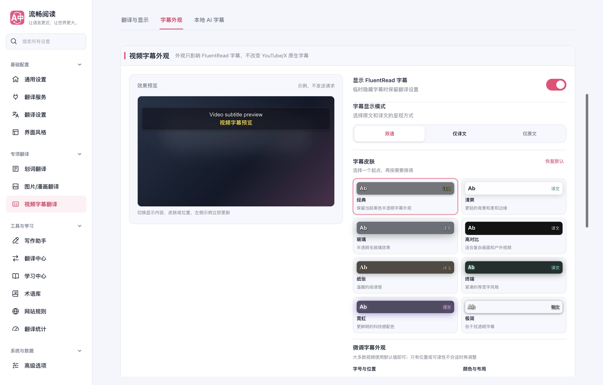
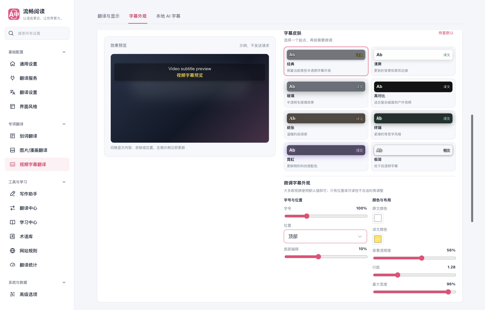
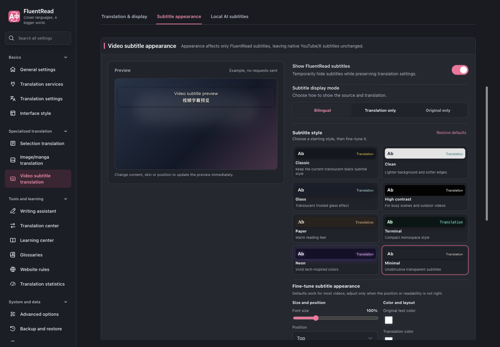

# 当前字幕预览布局

左侧采用紧凑的 16:9 视频预览卡片，在当前模块内随设置滚动保持可见。左右工作区保持等宽等高；预览卡片按内容决定高度。窄屏先显示预览，再显示设置，并恢复普通滚动。默认学习动作的同行布局与 AI 讲解的等高预览继续保留。

生产验证源码为 `e5a87643`，已同步主分支 `f7f00e03` 并保留字幕页删除使用说明的改动。类型检查、Chrome MV3 生产构建、设置 UI 架构的 33 项测试、文档构建和补丁检查通过。生产 Edge 设置专项 7 个场景通过，覆盖默认动作、AI 等高布局、16:9 画面、滚动定位、字幕显示模式/八种皮肤/三个位置，以及 1440/1024/820/390 像素、深色和英文界面。控制台错误为 0。

1440 像素下，视频画面为 469 × 263.81 CSS 像素，完整预览卡片高 356.06 像素。滚动至右侧底部设置后，整个视频画面仍位于设置工作区的可见范围内。逐项数据见 [浏览器报告](./subtitle-preview-browser-report.json)。

浏览器使用第二屏的正常可见临时 Edge 窗口，记录 `launchMode=macos-background-cdp`、`focusPolicy=launchservices-no-foreground`、`windowPlacement.mode=background-visible-no-focus`、`browserFrontmost=false`；本次浏览器与临时 profile 已清理。未运行全量回归、真实 Firefox UI 或供应商调用验证。

窄屏截图见 [字幕预览与设置](./video-landscape-mobile.png)。
