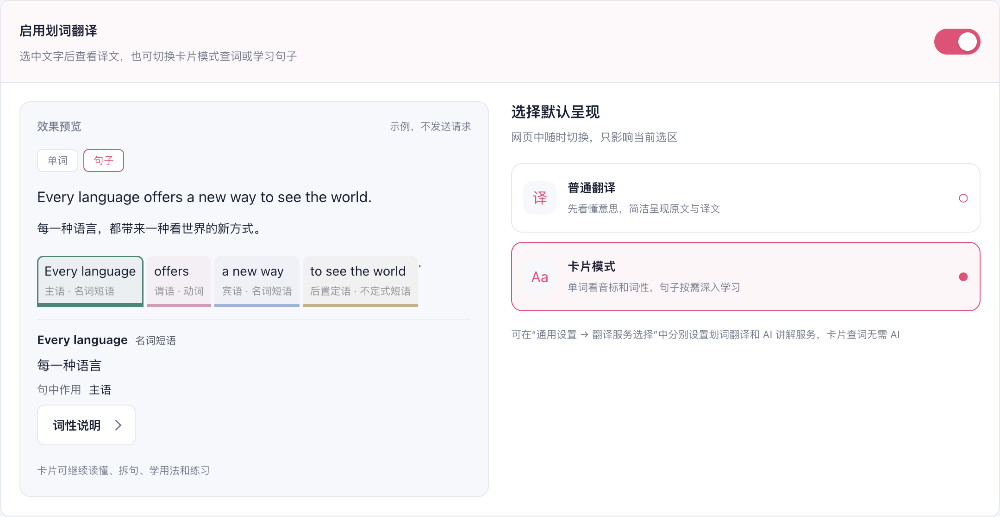
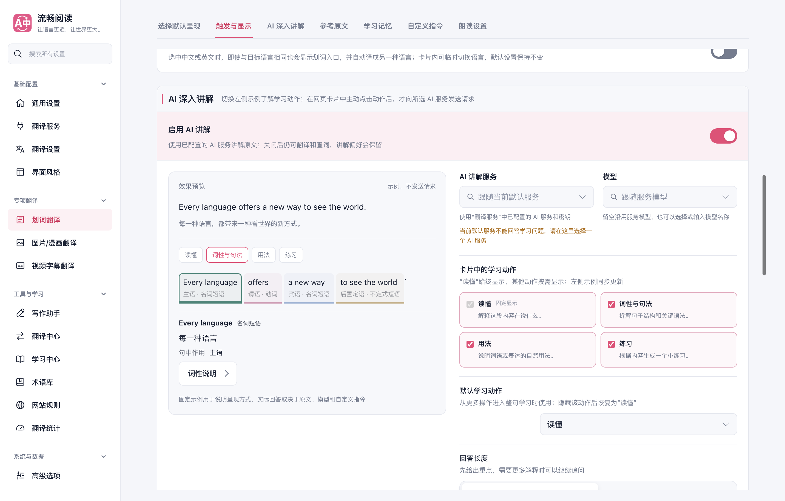
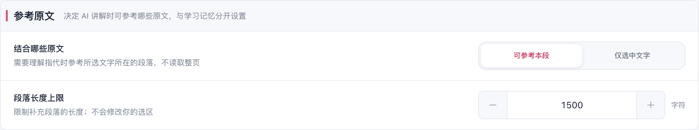
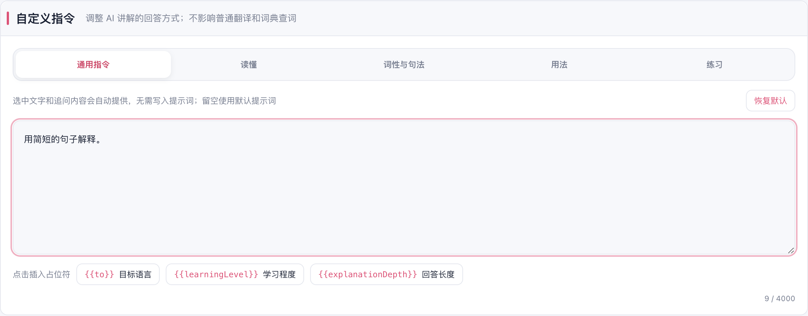
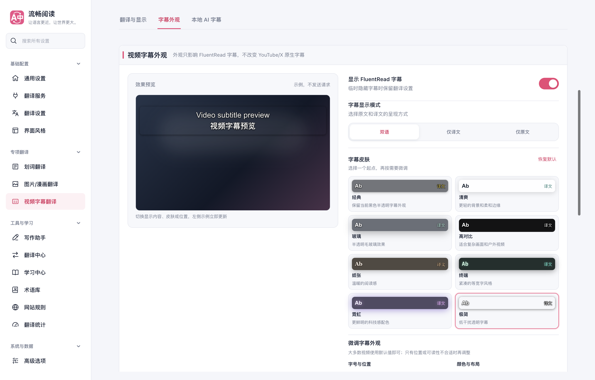

# 划词与媒体翻译设置界面验证

2026-10-05，统一划词呈现、AI 讲解、图片/漫画和视频字幕的设置布局：桌面左侧展示效果，右侧选择偏好；850 像素及以下先显示预览，再显示设置。预览使用固定示例，不发送翻译、OCR 或 AI 请求。

划词开关下补充分隔线。AI 讲解使用实际回答渲染组件展示读懂、词性与句法、用法和练习；隐藏默认学习动作后回到“读懂”。参考原文、学习记忆、自定义指令与朗读各有独立分区，指令编辑器直接可见，选择“仅选中文字”时隐藏段落长度上限。

图片与漫画保留独立开关，直接展示圈选、入口与缓存、识别资源和支持网站。字幕预览即时响应显示内容、八种皮肤、字号和位置，隐藏字幕时有明确反馈。新增文案覆盖七种界面语言，中英文使用指南同步更新。实现沿用 FluentRead 的 Vue 架构与现有配置保存方式，没有使用或修改参考仓库。

| 验证范围 | 结果 |
| --- | --- |
| 设置 UI 架构、Harness 配置、国际化 | 3 个文件，113 通过，2 个既有失败，详见下方 |
| 类型检查 | `pnpm compile` 通过 |
| 生产构建 | Chrome MV3、Firefox MV2 通过 |
| 文档构建 | `pnpm docs:build` 通过 |
| 测试审计与补丁检查 | `pnpm test:audit`、`git diff --check` 通过 |
| 更新的 UI runner | 4 个脚本语法检查通过；没有执行其完整媒体翻译套件 |
| 生产 Edge 设置专项 | 14 个场景通过，控制台错误 0 |
| 响应式 | 三类设置页的 1440、1024、820、390 像素布局通过，无文档横向溢出 |
| 外观和语言 | 深色主题、英文界面截图复核通过 |
| 关闭与重开 | 指令、漫画提前翻译页数、字幕外观保存成功，连续字号修改保留最终值 |

单元测试命令：

```sh
pnpm test tests/settingsUiArchitecture.test.ts tests/configHarness.test.ts tests/i18n.test.ts
```

剩余失败均为国际化目录中的过期原文检查：运行期反馈包含“Lingva 翻译请求失败”“旧版 gtx 接口”“谷歌翻译仅支持单条文本”；人工校正包含“常用候选”“可能受访问验证、公共实例稳定性或语言范围影响；启用后会参与当前策略”“实验候选服务”“项已启用”“邮箱已配置”。在修改前的 `2a72544c` 独立基线中复现相同两项失败；该基线另有一项缓存说明缺少翻译，本次新增文案已补齐，界面扫描通过。

最终 Chrome 生产设置专项对应源码 `b5ae4599`，基于 `f3a3940e`。浏览器使用独立临时 Edge profile，正常可见窗口放在第二块屏幕，记录 `launchMode=macos-background-cdp`、`focusPolicy=launchservices-no-foreground`、`windowPlacement.mode=background-visible-no-focus`、`browserFrontmost=false`。测试浏览器与临时 profile 已清理。逐项断言与布局数据见 [浏览器报告](./browser-report.json)。

Firefox 仅完成生产构建；未进行真实 Firefox UI 验证、popup 跨上下文同步验证、真实供应商调用或模型下载，也未运行全量回归。图片/漫画示例用于说明原图与译图的对照方式，不能作为真实 OCR 和修复效果证据。

## 界面截图













窄屏截图：[划词](./settings-selection-390.png)、[图片](./settings-image-translation-390.png)、[字幕](./settings-video-390.png)。其他示例：[深色字幕](./settings-video-dark.png)、[英文划词](./settings-selection-english.png)。
