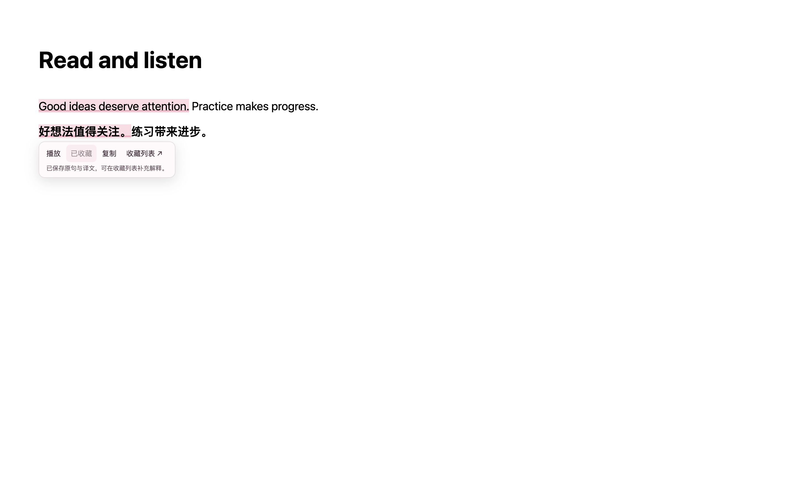
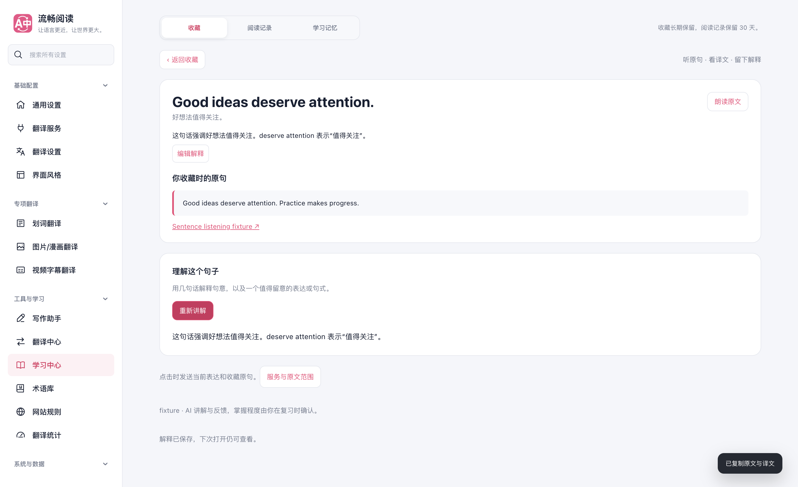
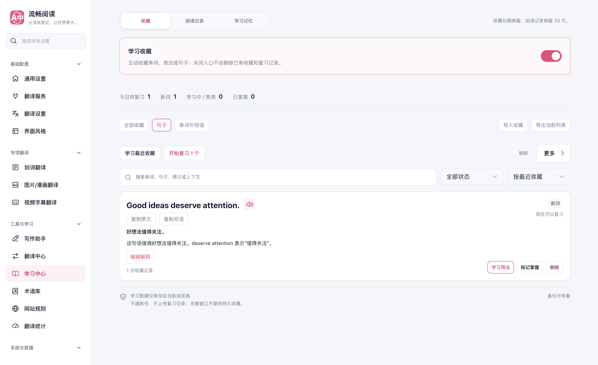

# 句子听读与收藏验证

日期：2026-10-04。任务分支：`codex/sentence-listening-20261004`，基础提交：`5ed16bc6`。代码、截图与专项脚本保留在独立 worktree；本次没有推送、创建 PR 或合并主分支，也没有修改参考项目。

## 使用路径

开启双语逐句高亮，停在已翻译段落的原句或译文上，通过句子旁的工具条直接播放、收藏、复制或打开收藏列表。收藏保留原句、对应译文和可用来源。未开启收藏时，主动点击收藏会先开启入口；无痕窗口不保存。

学习中心的收藏页增加句子筛选，默认按最近收藏排列，每条可播放/停止、复制原文或复制双语。简短解释可手写，也可按需生成后明确保存；解释独立于译文，编辑解释不清空当前阅读内容。JSON 导出当前筛选结果，导入合并已有收藏；旧文件不能覆盖新解释或恢复已清空的解释。Anki 导出增加 Explanation 列。

## 浏览器证据

生产 Chrome MV3 扩展在临时 Microsoft Edge profile 中验证。采用 `macos-background-cdp`、`launchservices-no-foreground`，窗口位于第二块屏幕且正常可见，没有连接日常浏览器 profile；前台应用在测试前后保持一致，结束后关闭测试浏览器并移除临时 profile。

[浏览器报告](./report.json) 的 `ok` 为 `true`，9 项流程检查通过，页面错误为 0：

1. 从译文侧高亮播放对应的英文原句，并停止浏览器语音回退。
2. 原句及对应译文直接收藏，自动开启收藏；宿主原文 DOM 和几何尺寸保持一致。
3. 句子列表筛选、手写解释、关闭再打开后的持久保存。
4. 实际剪贴板中的原文复制和双语复制。
5. 列表朗读失败后回退到浏览器语音，停止时释放播放所有权。
6. 按需简短讲解、明确保存解释，原译文保持独立；保存后保留当前讲解。
7. 下载实际 JSON，清空测试收藏后通过文件输入重新导入，保留句子身份、原文、译文、解释和复习数据。
8. 无效 JSON 给出可重试反馈，已有收藏保持完整。
9. 鼠标离开和恢复原文时工具条消失；390px 页面无横向溢出。








实际导出文件为 [exported-collection.json](./exported-collection.json)，其中仅有确定性测试句子，不包含用户数据或网页来源。

## 定向检查

本次没有运行全量回归。

| 范围 | 结果 |
| --- | --- |
| 收藏仓库、解释合并、后台协议、高亮订阅、工具条挂载、内容脚本生命周期 | 7 个套件、116 项通过 |
| 阅读/收藏生命周期、朗读协议与后台、Harness、架构边界和源码头注释 | 10 个套件、921 项通过；与上一行存在重叠，不相加 |
| 句子讲解组件：编辑解释不取消生成、保存不清空讲解、切换原文/停止/失败/卸载的旧响应隔离 | 2 项通过 |
| `pnpm compile` | 通过 |
| Chrome MV3 与 Firefox MV2 生产构建 | 通过 |
| 扩展 manifest verifier | 通过 |
| `pnpm test:audit` | 通过，450 个文件、5765 项登记用例 |
| `pnpm docs:build` | 通过 |

[定向覆盖率摘要](./coverage-summary.json) 中以下 6 个模块的 statements、branches、functions、lines 均为 100%：

- `src/app/content/learningFeatures.ts`
- `src/features/full-page-translation/content/sentenceHighlight.ts`
- `src/features/vocabulary/content.ts`
- `src/features/vocabulary/learningModel.ts`
- `src/features/vocabulary/repository.ts`
- `src/features/vocabulary/background/handler.ts`

## 用户脚本基线与验证边界

原始 `pnpm build:userscript` 在编译源码前遇到既有语言资源错误：`Userscript language data missing or stale: ja-JP.66c7dcb80c951ce7.json`。本次没有修改 locale 源码或资源发布引用。临时执行 `pnpm generate:userscript-languages` 补齐 5 个资源后，用户脚本构建和 `node scripts/verify-userscript-build.mjs` 均通过；随后只移除了本次临时生成的文件，保留原有资源。这个结果说明共享代码可兼容构建，不能表述为原始基线的用户脚本发布检查全部通过。

浏览器测试使用本地确定性翻译与 SSE 解释响应，朗读使用实际后台错误路由及受控浏览器语音桩，验证准确原文和播放/停止生命周期，未验证真人音质或在线模型质量。Firefox 完成构建与 manifest 检查，未进行 Firefox 运行时测试。

高亮工具条当前用于桌面扩展的顶层网页，用户脚本和嵌入式页面可继续使用已有学习卡收藏。新数据字段均为可选，旧收藏和旧导出继续可导入。

## 复现

先构建生产扩展，再通过专项脚本测试；参数中的路径根据本机安装调整：

```sh
pnpm build
node scripts/testing/run-sentence-listening-test.cjs \
  --extension-dir .output/chrome-mv3 \
  --playwright-root /path/to/node_modules \
  --focus-safe-helper /path/to/focus-safe-browser.cjs \
  --artifacts-dir /private/tmp/fluentread-sentence-listening
```

脚本创建自己的临时 profile，断言后台启动没有抢占前台焦点，在 `finally` 中保存结果并清理测试资源。
