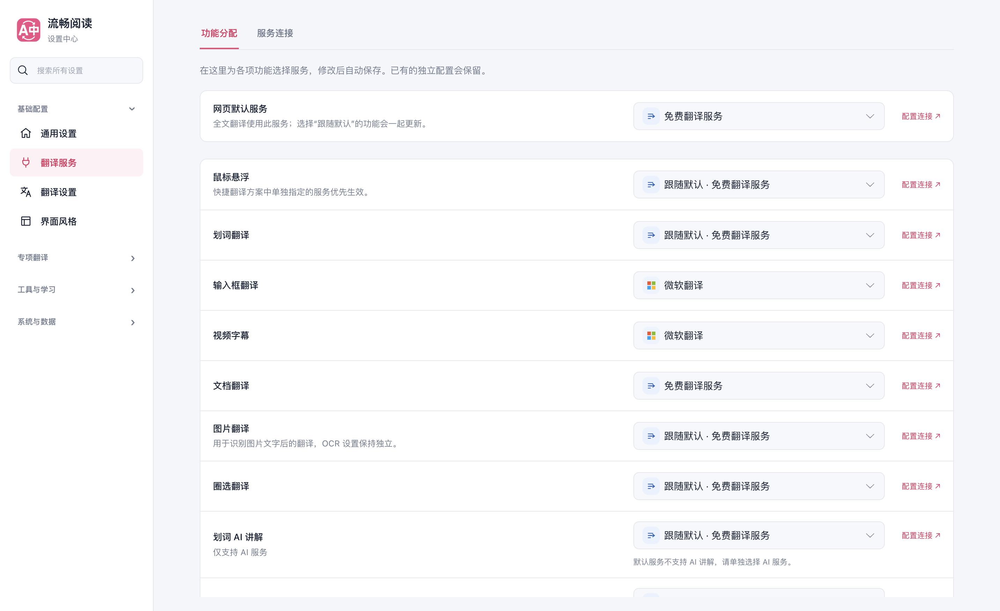
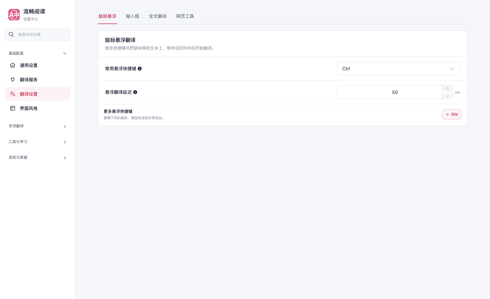
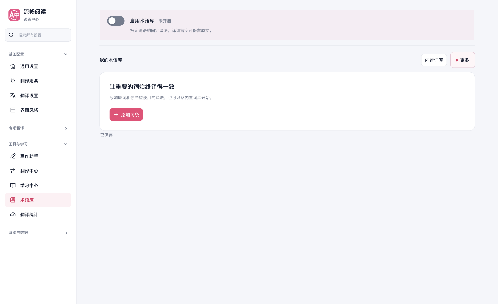
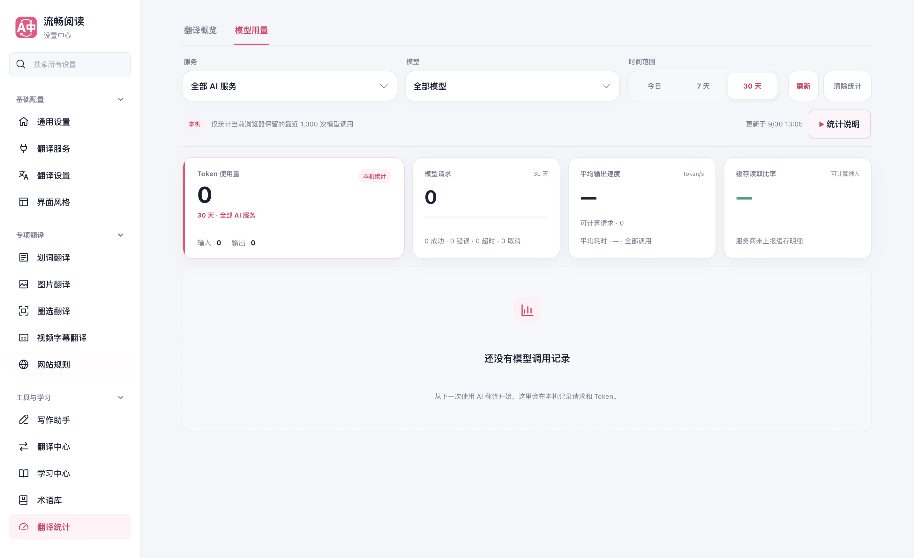

# 设置中心整理与验证记录

日期：2026-09-30。基线：`e1f7bd14`。实现分支：`codex/settings-center-hierarchy-20260930`。

## 用户可见变化

- 全部设置页移除与侧栏重复的分类、标题、说明三行页头，保留无障碍标题；页内分类直接承接内容。统一间距、控件尺寸与边框，增强二级折叠栏的背景、边框和展开提示。
- 翻译服务分成「功能分配」「服务配置」两个分类。默认服务集中设置，悬浮、划词、输入框、字幕、文档、图片、圈选、伴读、写作可独立选择服务；允许继承默认的功能显示实际生效服务。保留已有独立配置，伴读和写作只展示兼容的 AI 服务。弹窗增加「按功能选择服务」入口。
- 主功能开关放到标题旁，整张启用卡可点击并支持键盘。普通开关扩大点击区域，加强状态对比，设置项文字区域也可触发对应开关。
- 「模型用量」合并到「翻译统计」中，与「翻译概览」并列为页内分类，侧栏只保留一个入口。旧模型用量链接仍能打开对应分类；两个分类保留各自统计与清除行为，隐藏分类停止轮询。
- 桌面侧栏保持分类导航，窄屏使用页面选择器；搜索、跨分类跳转、配置自动保存和关闭后恢复继续可用。

借鉴 Read Frog 的「按功能分配服务」信息组织方式，使用 FluentRead 原有 Vue/WXT 配置和服务体系独立实现。参考仓库未修改，未添加跨仓库依赖。

## 实际界面

以下为整合最新主分支后，隔离 Edge 浏览器加载生产扩展的原始截图，使用独立测试配置。

[窄屏服务分配](./settings-center-20260930/mobile-feature-services.png) · [弹窗入口](./settings-center-20260930/popup-shortcut.png) · [深色开关](./settings-center-20260930/dark-master-switch.png)

## 首轮验证结果

| 范围 | 结果 |
| --- | --- |
| 实际浏览器 | 17 个设置页面、25 个页内分类、123 项布局检查通过；覆盖桌面、1024/820/390 宽度、深色外观，控制台错误为 0 |
| 实际交互 | 服务分配保存与重开、保持默认服务、AI 服务筛选、旧页面配置同步、主开关点击与空格键、普通开关文字点击、搜索、分类状态、快速关闭保存、跨页同步均通过 |
| 统计与弹窗 | 旧模型用量链接、重载与分类切换通过；400×600 弹窗入口实际打开功能分配页 |
| 定向测试 | 17 个文件运行得到 1300 通过、2 项已有架构检查失败；补充导航用例后，相关 4 个文件 97 项全部通过 |
| 覆盖率 | 服务分配与设置导航两个模块的 29 项测试通过；语句、分支、函数、行均为 100% |
| 类型与构建 | `pnpm compile`、Chrome/Firefox 生产构建、userscript 构建及产物校验、文档构建通过 |
| 测试登记 | 测试分类审计通过；审计登记数不是本次实际运行测试数 |

两项架构失败已在未修改的基线 `e1f7bd14` 上复现：

1. 视频字幕运行时已有 1909 行，超过登记的 1887 行限制；本次未修改该文件。
2. 七个已有分享卡/摘录模块未登记进严格覆盖率边界：`shareCard.ts`、`excerpt.ts` 和分享卡的 `content/runtime.ts`、`core.ts`、`export.ts`、`render.ts`、`themes.ts`。本次新增模块已经登记并通过覆盖率验证。

证据：[浏览器报告](./settings-center-20260930/browser-report.json)、[定向测试](./settings-center-20260930/fr-settings-final-tests.log)、[最终补充测试](./settings-center-20260930/fr-settings-last-tests.log)、[基线复现](./settings-center-20260930/fr-settings-baseline-tests.log)、[覆盖率](./settings-center-20260930/fr-settings-complete-coverage.log)、[分类审计](./settings-center-20260930/fr-settings-complete-audit.log)。

## 合并前整合验证

整合主分支 `c6537141` 的术语库与伴读面板更新，保留双方新增多语言内容并重新生成 userscript 语言资源。最终产品代码与构建配置为 `76ef4011`，此后的变动仅更新验证记录与截图。

- 20 个定向测试文件、1431 项测试全部通过，覆盖设置、服务路由、术语库、伴读与源文件职责注释。
- 服务分配与导航模块的 29 项覆盖率测试通过，语句、分支、函数和行四维均为 100%。
- 类型检查、Chrome/Firefox/userscript 生产构建、userscript 产物校验和测试分类审计通过。
- 生产浏览器再次通过全部 17 页、25 个分类和 123 项布局检查；服务分配、整卡开关、旧统计链接、弹窗跳转、重开保存、快速关闭和跨页同步全部通过，控制台错误为 0。
- 截图与浏览器报告已替换为整合后的结果；已复核全部 99 张截图。首轮两个已复现的基线架构问题未在本次范围内修改。

整合证据：[测试日志](./settings-center-20260930/fr-settings-merge-tests.log)、[覆盖率](./settings-center-20260930/fr-settings-merge-coverage.log)、[分类审计](./settings-center-20260930/fr-settings-merge-audit.log)、[userscript 产物校验](./settings-center-20260930/fr-settings-merge-userscript-verify.log)。

## 复现入口与边界

浏览器脚本为 `scripts/testing/run-settings-center-navigation-test.cjs`，接收 `--extension-dir`、`--playwright-root`、`--focus-safe-helper` 和 `--artifacts-dir`。本次使用第二块屏幕的独立临时配置，窗口可见但未抢占前台焦点。测试结束关闭测试浏览器并清理临时配置。

此次验证不包含真实付费服务请求、Firefox 实际运行、真实移动设备或应用商店发布。服务路由由定向测试验证；浏览器验证配置选择和持久化。构建使用本机已有依赖，不构成全新安装证明。Userscript 语言资源已生成并绑定包含完整资源的提交，未验证远程 CDN 加载。

改动在独立 worktree 中开发并通过正式 PR 交付，实际合并状态以 GitHub 记录为准。用户日常使用的扩展未被替换。
