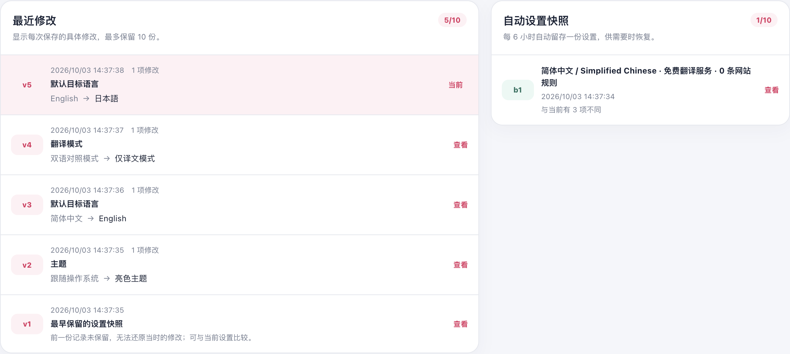
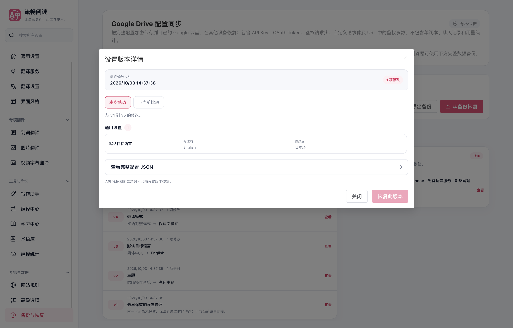
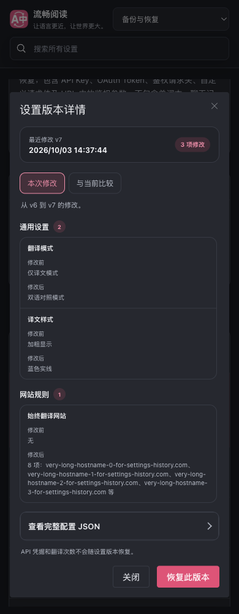

# 设置历史可读性验证

日期：2026-10-03。基础提交：`4e90ea40`。任务分支：`codex/settings-history-clarity-20261003`。

原列表仅重复展示目标语言、翻译服务和网站规则数量，无法辨认实际修改；原详情只比较当前配置，最新记录会显示零差异。现在最近修改按实际相邻快照展示字段、旧值、新值与秒级时间，详情默认展示本次修改，并可切换到恢复时与当前设置的差异。自动快照作为辅助区域展示，不再跟随左侧列表拉高。多项修改在列表中预览两项，详情保留全部字段；最早保留的记录明确说明没有前一份可比较快照。

历史存储、恢复与凭据投影沿用原有服务。没有使用参考仓库的实现或设计。

## 验证结果

- 配置历史、配置差异、自动快照、多语言、设置 UI 架构：5 个文件，154/154 用例通过。
- 新时间线模块的 statements、branches、functions、lines 覆盖率均为 100%；仅运行配置历史领域测试并限定覆盖率源文件。
- `pnpm compile`、Chrome MV3 构建、Firefox MV2 构建、`pnpm docs:build`、`pnpm test:audit`、`git diff --check` 通过。
- 源文件中文职责注释检查通过。额外架构检查存在下述 4 项主分支基线失败。
- 最终 Chrome 生产产物在独立临时 Edge profile 中通过 9 项专项：真实 UI 修改后重开、最新版本的原始修改、旧版本与恢复差异、恢复及反向记录、最早记录边界、自动快照、多项修改与凭据排除、桌面与窄屏深色布局、英文界面。
- 页面和后台控制台错误为 0。1440、1024、820、390 像素布局无横向溢出；390 像素详情对话框处于视口内。
- `launchMode=macos-background-cdp`，`focusPolicy=launchservices-no-foreground`，`windowPlacement.mode=background-visible-no-focus`，`browserFrontmost=false`。窗口在第二屏完整可见，测试后关闭本次浏览器实例并删除临时 profile。

浏览器详情与 11 张截图见 [browser-report.json](./browser-report.json)。Firefox 本轮只有构建证据，没有真实 Firefox UI 验证；本次不涉及翻译服务或真实 API 质量验证，也未运行全量回归。

## 既有测试边界

未修改的主分支 `4e90ea40` 复现以下相同架构失败，本任务没有调整相应规则或产品模块：

1. 文档入口包含额外的直接导入，未满足现有 public API 边界断言。
2. `src/app/content/runtime.ts` 为 282 行，超过既有 277 行上限。
3. `scripts/verify-brand-copy.mjs` 缺少验证归属登记。
4. 分享卡片等 8 个已有模块未进入严格覆盖率源文件清单。

配置历史领域测试中另有一条旧断言仍期望视频默认服务为微软翻译；当前默认已为跟随网页服务的空值。主分支同样复现该失败，本任务仅把这条测试期望更新为现有契约，没有更改视频默认行为。

## 页面证据

