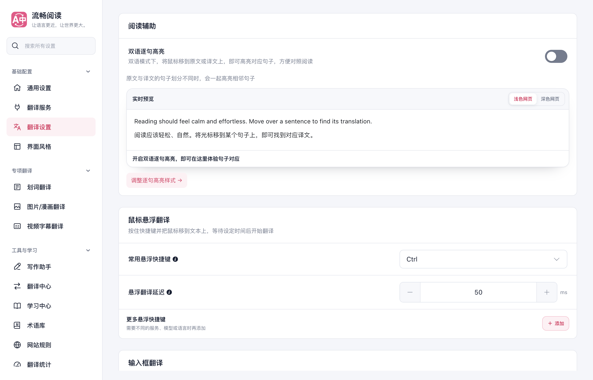
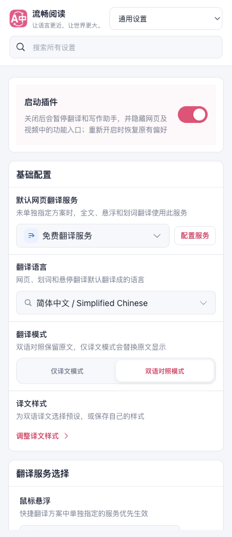
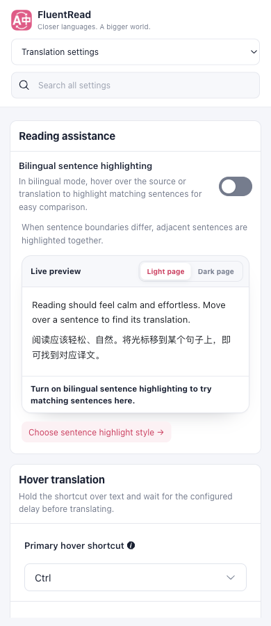
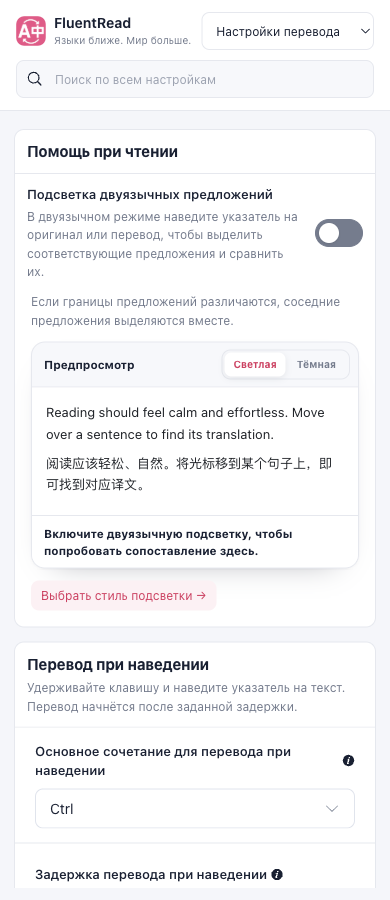
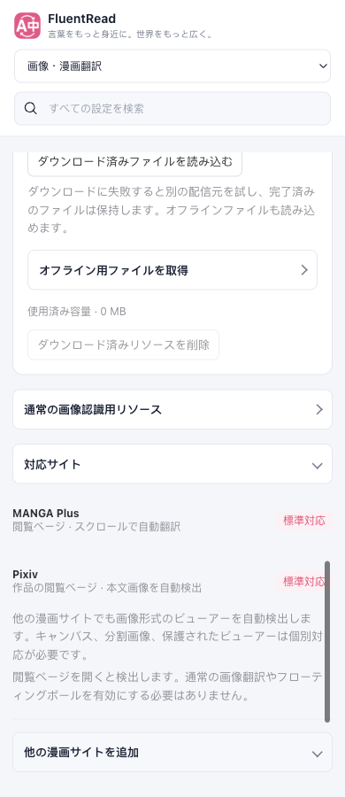

# FluentRead 设置文案国际化优化报告

日期：2026 年 10 月 4 日  
任务分支：`codex/settings-i18n-20261004`  
基线：`origin/main`，`c6ceb445`  
文案与语言资源提交：`74d723065a47332a002f4013cf20cb110baa24ba`

本次审阅覆盖全部 16 个设置分区及相关弹窗、帮助、共享展示注册表，调整了 353 条既有中文稳定资源和 258 条设置源文案，新增 61 个七语资源 key。重点处理长句、说明碎片、含混术语和语言遗漏；确认对话框与示例正文继续使用适合其语境的完整句子。

## 你指出的两段说明

### 插件开关

原文：

> 关闭后停止翻译与写作助手，并隐藏网页和视频中的功能入口。再次启动会恢复原有偏好。

改为：

> 关闭后会暂停翻译和写作助手，并隐藏网页及视频中的功能入口；重新开启时恢复原有偏好

用“关闭／重新开启”对应开关操作，用“暂停”说明暂时停用，通过分号连接关闭与恢复的关联结果。

### 双语逐句高亮

原文：

> 光标移到原文或译文的句子上，即可同步高亮对应句子，帮助理解长文本、定位难句和翻译偏差。译文拆句或合句时按相邻句组对照；仅双语模式生效。

主说明改为：

> 双语模式下，将鼠标移到原文或译文上，即可高亮对应句子，方便对照阅读

在预览上方另行显示：

> 原文与译文的句子划分不同时，会一起高亮相邻句子

生效模式放在开头，操作与结果保持在一条短说明内，拆句、合句的细节单独呈现。主说明与补充说明都提供七种语言的独立译文。

## 审阅范围与统计

| 设置分组 | 覆盖分区 |
| --- | --- |
| 基础配置 | 通用设置、翻译服务、翻译设置、界面风格 |
| 专项翻译 | 划词翻译、图片/漫画翻译、视频字幕翻译 |
| 工具与学习 | 写作助手、翻译中心、学习中心、术语库、网站规则、翻译统计 |
| 系统与数据 | 高级选项、备份与恢复、关于流畅阅读 |

静态审阅范围包含 93 个文件、1,372 条源文案，并筛查 1,382 个相关稳定 key。共享组件和注册表按依赖纳入，因此这些口径有重叠，不能将稳定资源与源文案的改动数相加作为唯一文案数。

| 项目 | 数量与结果 |
| --- | --- |
| 已有稳定资源改写 | 中文 353；英语、日语、韩语各 13；法语、西班牙语各 12；俄语 15 |
| 设置源文案改写表 | 258 条，包含关联 legacy 精确文案更新 |
| 新增稳定 key | 61 个，七种语言均显式提供 |
| 收藏界面漏翻补齐 | 55 条，含 53 条静态文案及 2 条数量模板，补齐六种外语 |
| 图片/漫画设置英文回退修正 | 37 条，在日、韩、法、俄、西语中补齐实际需要的本地译文 |

完整资源前后对照、源文案改写、文件范围和英文回退修正记录见 [文案审计 JSON](./copy-audit.json)。未发现需要调整的名称和说明保留原文。

## 主要优化

- **短说明与生效条件**：操作及结果前置，相关条件用逗号或分号连接，复杂例外另设提示。全文翻译范围、悬浮延迟、本地模型、字幕、网站适配及备份说明都按这一方式整理。
- **准确而易懂的术语**：“语音回退顺序”改为“备用音色顺序”，“退避初始间隔／退避最大间隔”改为“初次重试等待／最长重试等待”，“免费服务权重”改为“免费服务分配比例”。
- **效果说明符合实际**：并发提示明确“增加并发可能加快翻译”，同时说明资源占用与服务限流约束；漫画 OCR 的“读出对白与旁白”改为“识别对白与旁白”，避免被理解为朗读。
- **补齐遗漏的语言资源**：收藏操作、搜索、筛选、解释、导入导出及数量模板提供六语译文；收藏数量按完整短语插入 `{count}`，允许各语言调整语序。图片和漫画设置补齐原先继承英文回退的说明。
- **维护既有国际化路径**：中文源文案改写时同步更新 legacy 词典及人工校正表；新增 key 放在各语言的 `settings-copy` 资源中，随相应语言包加载。占位符、接口字段、API Key、JSON、CSS 及品牌名称保持准确。
- **按语言处理标点**：中文短说明通常省略句末句号，外语完整句子保留各自自然标点。确认问题、风险提醒和阅读示例保留完整句子，没有引入运行时标点替换。
- **兼顾窄屏**：俄语预览主题按钮缩短为“Светлая／Тёмная”，避免 390 px 下裁切，分组仍保留主题语义。

维护约定已写入 [国际化贡献指南](../../contributing/i18n.md)；本次实现未借鉴或修改参考仓库。

## 验证

| 检查 | 结果 |
| --- | --- |
| `pnpm compile` | 通过 |
| 国际化与设置架构测试 | 56 + 33 项通过，见 [日志](./evidence/i18n-and-settings-tests.txt) |
| 收藏组件与生命周期测试 | 8 项通过，见 [日志](./evidence/vocabulary-tests.txt)；其中另有重复执行的国际化测试，不重复计数 |
| 源文件中文职责头检查 | 788 项通过，见 [文件结果](./evidence/source-file-headers.txt) |
| `pnpm test:audit` | 测试分类审计通过，检查 462 个文件、5,898 个用例的元数据；不代表执行全部用例 |
| Chrome 与 Firefox 生产构建 | 均通过，见 [Chrome](./evidence/chrome-build.txt)、[Firefox](./evidence/firefox-build.txt) 日志 |
| 油猴语言资源生成、构建及 verifier | 通过，见 [生成](./evidence/userscript-language-generation.txt)、[构建](./evidence/userscript-build.txt)、[校验](./evidence/userscript-verify.txt) 日志 |
| 文档构建 | 通过，见 [日志](./evidence/docs-build.txt) |
| 七语设置浏览器检查 | 294 个页面状态，发现两处俄语主题标签裁切，修正后对应两页复查通过 |
| 七语漫画展开面板检查 | 42 个状态通过，29 项断言通过，见 [记录](./evidence/browser-manga-recheck.json) |

真实浏览器检查加载 Chrome 生产扩展，在隔离 Edge 临时配置中遍历七种语言、16 个分区及分区分页，分别检查 1,280 px 和 390 px 视口。检查可见文本裁切、页面横向溢出、脚本异常、插件开关说明、逐句高亮说明及语言切换。

初次扫描的 [原始问题记录](./evidence/browser-scan.json) 保留 `ok: false`，记录了两处同一俄语按钮文案的裁切；[修正后复查](./evidence/browser-russian-recheck.json) 为 `ok: true`，两页无裁切、无横向溢出、无脚本异常。这里报告的是相关范围的复查通过。

漫画补充检查遍历七语在两种宽度下的折叠、资源展开及下载设置和网站规则展开状态，不触发模型下载或翻译请求。三项状态 × 两种宽度 × 七种语言，共 42 个状态，无裁切、横向溢出或脚本异常。

启动方式为 `macos-background-cdp`，焦点策略为 `launchservices-no-foreground`，窗口以正常尺寸放在第二屏后台，`browserFrontmost: false`。证据中只移除了用户前台应用名称与进程号；断言、问题及焦点策略保留。检查结束后清理临时浏览器与配置。

## 交付状态与验证边界

改动保存在独立任务工作树，尚未推送、合并或发布。油猴的五份新语言文件已经生成，语言资源引用固定到首次包含这些文件的本地提交；发布油猴版本前，需要将该提交及文件推送到对应资源仓库，才能通过 CDN 获取。

本次完成了文案审阅、资源完整性检查、构建和指定浏览器范围验证；没有使用真实翻译账号、云同步账号或在线语言资源下载验证，也没有执行 Firefox 实机检查。七语文案没有经过外部母语审校。功能验证属于针对性回归，没有执行全量测试套件。
