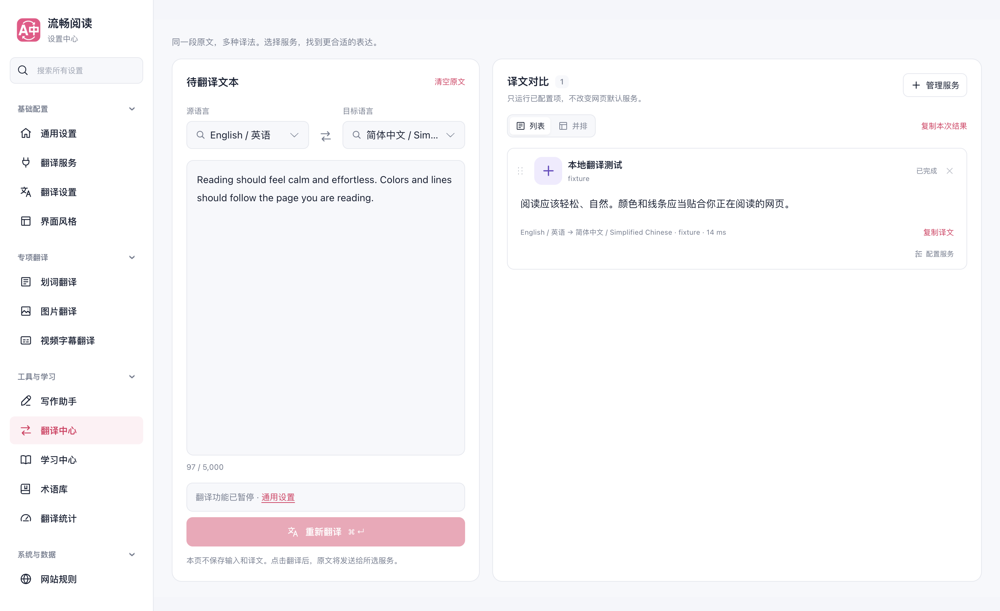
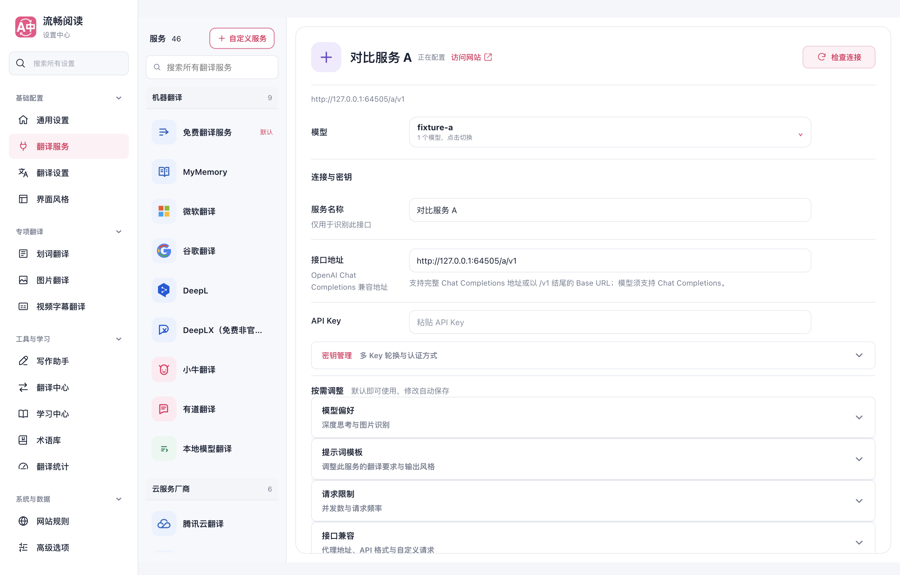

# 设置优化合并前验证

2026-09-30。在 `codex/popup-density-20260930` 中通过 merge commit `896c8d162e32b093696eca8d9bd98d70b71ae06c` 整合主分支 `4fae9a7e`（PR #723 翻译中心、PR #724 网站规则）。

保留新版翻译中心的任务模型、旧结果提示、独立停止、服务顺序和布局保存，并接入全局暂停。总开关关闭时取消所有在途任务，保留输入和已完成结果；后台停用响应先于配置同步到达也按取消处理。重开总开关不自动消耗服务请求。

翻译中心的配置入口打开完整服务工作区，返回后保留输入和结果。功能分配继续位于通用设置。网站规则保留主分支新加入的三个任务视图，统计保留两个视图；其余普通设置连续呈现。合并后的五种脚本语言资源已生成，资源指针固定到包含新文件的整合提交。

## 本轮实际验证

- 9 个相关测试文件、169 项通过：翻译中心组件与会话、设置导航及离页生命周期、UI 架构、网站适配与规则、全局请求停用、文档翻译接口。新增三项覆盖全局暂停的所有启动入口、保留已完成结果、后台取消先到的时序。
- `pnpm compile` 和 `pnpm test:audit` 通过。审计归类了 411 文件、5308 用例，不代表运行全量测试。
- Chrome、Firefox、userscript 和文档构建通过；userscript verifier 通过。依赖复用主检出的现有安装，不是全新依赖安装验证。
- [全局暂停生产浏览器报告](./global-report.json)：9 次本地可控服务请求；全局关闭零新请求、取消 HTTP 请求、文档与翻译中心保留内容、网页恢复原文、离线 YouTube/X 入口关闭并跨刷新保持、重新启用后再次翻译。无控制台错误。
- [翻译中心生产浏览器报告](./center-report.json)：13 项工作流、4 个宽度（1440/1024/820/390）、7 种语言与深色界面；配置工作区往返保留输入和结果、快速关闭持久化、跨页面同步均通过，无控制台错误。
- [设置生产浏览器报告](./settings-report.json)：16 页桌面与 390px 无横向溢出，数字输入可见性、左右加减、键盘、上下限、手工输入和重载保存均通过；学习开关、术语库、内置词库与旧入口兼容通过，无控制台错误。

浏览器均使用临时 Edge profile 和第二屏后台可见窗口，未操作用户日常页面或设置。全局暂停套件断言和报告完成后，其临时浏览器未自动退出，已按精确 PID 和 profile 路径核对并终止；未终止其他浏览器。视频为离线 DOM 夹具，服务为本地 HTTP 夹具，Firefox 仅有构建证据；不宣称已验证真实在线提供商或登录态视频站点。

此前两项内容挂载 Harness 用例在原始基线也失败，详情保留在[提供商记录](../popup-provider-workflow-20260930/README.md)。本轮 169 项所选测试全部通过，没有将这些已知基线失败计为通过。

