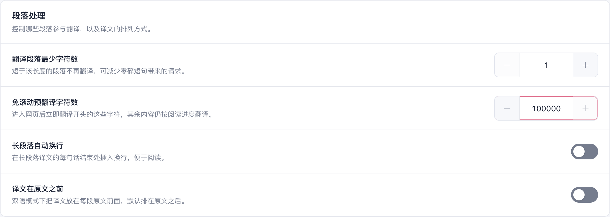

# 设置页面逐页核对与数字控件修复

日期：2026-09-30。继续本会话的设置与 Popup 优化，修改位于独立本地工作树；未推送、合并或替换日常浏览器的扩展。

## 这轮发现并修复的问题

1. 通用输入框样式覆盖 Element Plus 数字控件预留空间，数值与右侧上下箭头重叠。统一改为左减、居中数值、右加；控件高 44px，按钮实际区域 44×42px，文字与按钮各留 6px。保留原有上下限、步长、输入、键盘与保存逻辑。悬浮球、输入框连按间隔、悬浮/划词延迟、阅读上下文和缓存上限使用同样的布局。无加减按钮的请求限制字段继续保留自己的布局。
2. 学习中心仍使用 36×20px 的小开关与随状态变化的标题。复用右侧开关、整卡可点击的公共控件，标题固定为“学习收藏”；原有配置及收藏记录不变。“前往开启”直达划词设置。
3. 七种语言中仍有指向旧 Popup 网页按钮、视频快捷卡或“翻译服务 → 功能分配”的说明。同步改为现有入口：Popup 鼠标悬停面板中的局部翻译，功能分配位于通用设置。

[修复前](./numbers-before.png) · [390px 窄屏](./number-controls-mobile.png) · [深色](./settings-advanced-dark.png) · [输入框连按间隔](./number-input-timing.png)

## 逐页范围

通用设置、翻译服务、翻译设置、界面风格、划词翻译、图片翻译、视频字幕、网站规则、写作助手、翻译中心、学习中心、术语库、翻译统计、高级选项、备份与恢复、关于，共 16 个页面。

- 全新配置下侧栏四组默认展开；普通设置没有页首分类切换，统计保留概览/模型用量。学习中心自身的收藏、阅读记录、学习记忆仍按任务切换。
- 每页桌面与 390px 宽度均无外层或内容区横向溢出。逐页保存实际截图与布局数据，不用 Popup 的结果推断设置页面。
- 数字加减、键盘 ArrowUp、手动六位数输入、上下限禁用以及重载后的持久化通过。表单最大值的文本宽度小于实际输入区域，数值不与按钮相交。
- 学习收藏整卡按钮可使用 Space，重载保留状态；入口链接落在正确设置页。
- 术语库开关右侧对齐、键盘可用；添加词条重载后仍在。内置词库放在编辑器之后，直接可见。
- 旧模型用量、圈选链接落到合并后的对应页面；统计两视图切换通过。
- 深色核对划词、图片、术语库、数字控件和学习收藏。

生产 Chrome MV3 扩展在独立临时 Edge profile、第二屏正常窗口运行，不抢焦点：`macos-background-cdp` / `launchservices-no-foreground` / `browserFrontmost: false`。验证结束关闭该实例并清理临时 profile。没有修改用户日常浏览器配置。

[完整浏览器报告](./report.json) · [可重复脚本](../../../scripts/testing/run-settings-feedback-audit.cjs)

## 代码检查与证据边界

6 个受影响测试文件 55 项通过，包括设置架构、界面配置、语言包、输入框配置及学习中心生命周期；compile、test:audit、Chrome / Firefox / userscript 构建与 userscript verifier 通过。本轮没有运行全量回归，也没有增加运行时依赖或定时任务。语言资源已生成并固定到本地提交，尚未验证远程 CDN。

Firefox 仅有构建证据，390px 是桌面浏览器窄视口，不代表真实移动设备。本记录只验证界面和本地配置；全局关闭的运行行为见[专门记录](../global-translation-toggle-20260930/README.md)。此前两项 Harness 挂载测试在未修改基线上同样失败，仍按[原记录](../popup-provider-workflow-20260930/README.md)保留，不计为通过。

本轮没有修改参考仓库；提供商抽屉先前参考了 read-frog 的交互方式，由 FluentRead 自身 Vue 与配置层实现。

## 页面截图索引

| 页面 | 实际生产界面 |
| --- | --- |
| 通用设置 | [桌面截图](./settings-general-top.png) |
| 翻译服务 | [桌面截图](./settings-services-top.png) |
| 翻译设置 | [桌面截图](./settings-translation-top.png) |
| 界面风格 | [桌面截图](./settings-interface-top.png) |
| 划词翻译 | [桌面截图](./settings-selection-top.png) |
| 图片翻译 | [桌面截图](./settings-image-translation-top.png) |
| 视频字幕翻译 | [桌面截图](./settings-video-top.png) |
| 网站规则 | [桌面截图](./settings-sites-top.png) |
| 写作助手 | [桌面截图](./settings-writing-top.png) |
| 翻译中心 | [桌面截图](./settings-translation-center-top.png) |
| 学习中心 | [桌面截图](./settings-vocabulary-top.png) |
| 术语库 | [桌面截图](./settings-glossary-top.png) |
| 翻译统计 | [桌面截图](./settings-translation-stats-top.png) |
| 高级选项 | [桌面截图](./settings-advanced-top.png) |
| 备份与恢复 | [桌面截图](./settings-data-top.png) |
| 关于流畅阅读 | [桌面截图](./settings-about-top.png) |

本目录保留代表性截图；报告中的原始临时目录还含全部 390px 与深色截图。
