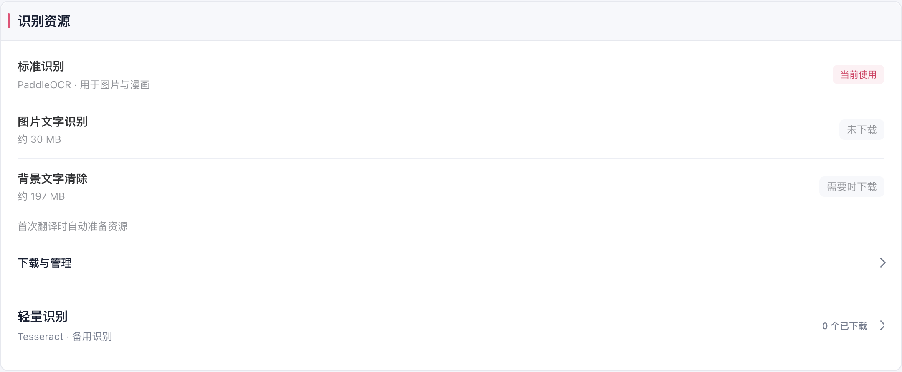
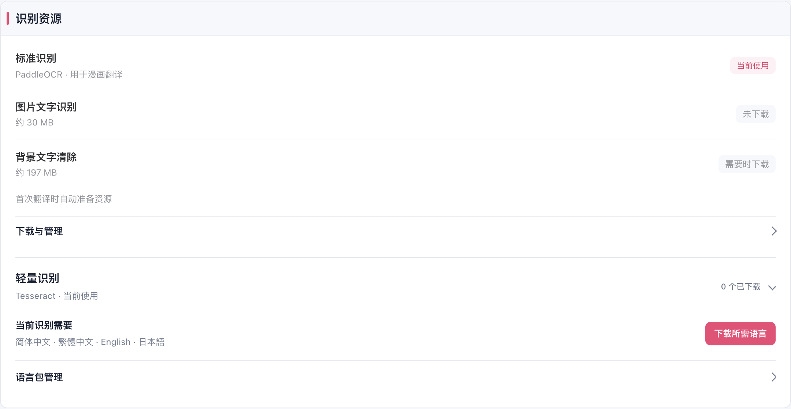
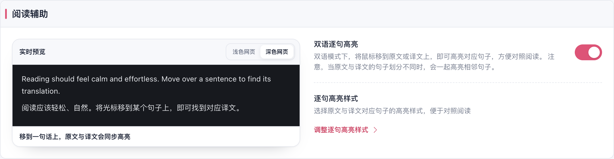
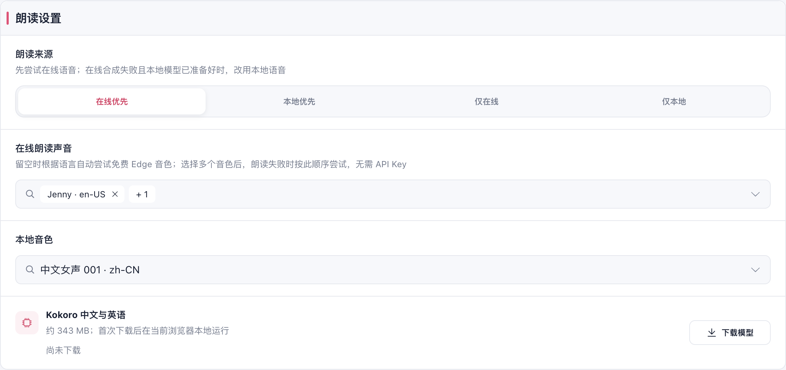

# 设置布局与交互验收（2026-10-06）

阅读辅助采用左侧可交互预览、右侧设置，窄屏依次向下排列。学习程度和回答长度与说明左侧对齐；请求限制上方选择范围和继承方式，下方展示等宽数值，切回自定义保留之前的数值。

在线与本地朗读合并为“朗读设置”，先选来源，再显示适用音色和模型。切换来源保留在线音色顺序及本地音色，移除迁移说明和重复的模型介绍。密钥要求、网站初始偏好、模型来源及其他设置中的原生下拉改为现有公共控件。

图片入口、识别方式归入图片预览右侧，漫画的提前翻译、独立按钮和缓存归入漫画预览右侧。识别资源只有一层外框：当前资源用途和状态直接可见，备用 Tesseract 与语言包列表按需展开；下载来源、导入和清理归入“下载与管理”。进行中的任务或错误自动展开，完成后保持展开供用户查看结果；没有资源时隐藏无效的清理入口。

说明提示离开后延迟 600ms 关闭，允许鼠标进入并选择复制文字，保留键盘聚焦与 Escape。识图检测结果去重，但继续展示失败和取消。删除备份在核验与实际删除请求时转圈，阻止重复提交，完成或失败后恢复；浅深色加载时保持文字可读。

## 验证结果

| 范围 | 结果 |
| --- | --- |
| 设置架构、朗读、识图探测、请求限额 | 4 个文件，71 项通过 |
| 国际化 | 55 项通过；2 项旧词典原文存在性检查失败，与基线 `510683f2` 的失败列表相同 |
| 生产扩展 UI | 8 组交互通过；中文/英文 × 浅色/深色 × 1440/1024/820/390px × 5 个设置页，共 80 组布局通过，无控制台错误 |
| 删除备份 UI | 27 项断言通过；本机 WebDAV HTTP 夹具、延迟核验、失败恢复、深色重试与确认删除、单次 DELETE、本机配置及凭据保留 |
| 类型与构建 | `pnpm compile`、Chrome MV3、Firefox MV2 构建通过 |
| 测试清单与文档 | `pnpm test:audit`、`pnpm docs:build` 通过 |

两个国际化基线失败分别是运行期反馈目录中的 3 条旧原文，以及人工校正目录中的 6 条旧原文已不在源码中。本次新增文案没有新增失败，删除了一条随朗读 UI 合并后不再使用的校正条目。

浏览器使用独立临时 Edge profile，`launchMode=macos-background-cdp`、`focusPolicy=launchservices-no-foreground`，第二屏正常可见窗口，`browserFrontmost=false`。识图检测连接本机图片响应夹具；语言包的任务、失败、重试和移除由本次临时文档的消息夹具验证，未下载真实模型。没有验证 Firefox 实机 UI、实际朗读/识别推理或真实云端供应商。实现未借鉴参考仓库代码。

详细证据：[布局与交互报告](./layout-report.json)、[删除加载报告](./delete-loading-report.json)。复现命令见[测试与回归](../../testing.md#设置布局与控件交互)。

## 界面截图

当前资源与次要管理入口：

阅读与朗读：

其余专项：[学习程度](./learning-level.png)、[请求限制](./request-limits.png)、[识图结果](./vision-single-result.png)、[可选择的提示](./tooltip-selectable.png)、[密钥菜单](./key-policy-menu.png)、[网站偏好菜单](./site-preference-menu.png)、[漫画完整设置](./settings-image-translation-light-1440.png)、[漫画深色窄屏](./settings-image-translation-dark-390.png)、[删除加载状态](./cloud-delete-loading.png)。
