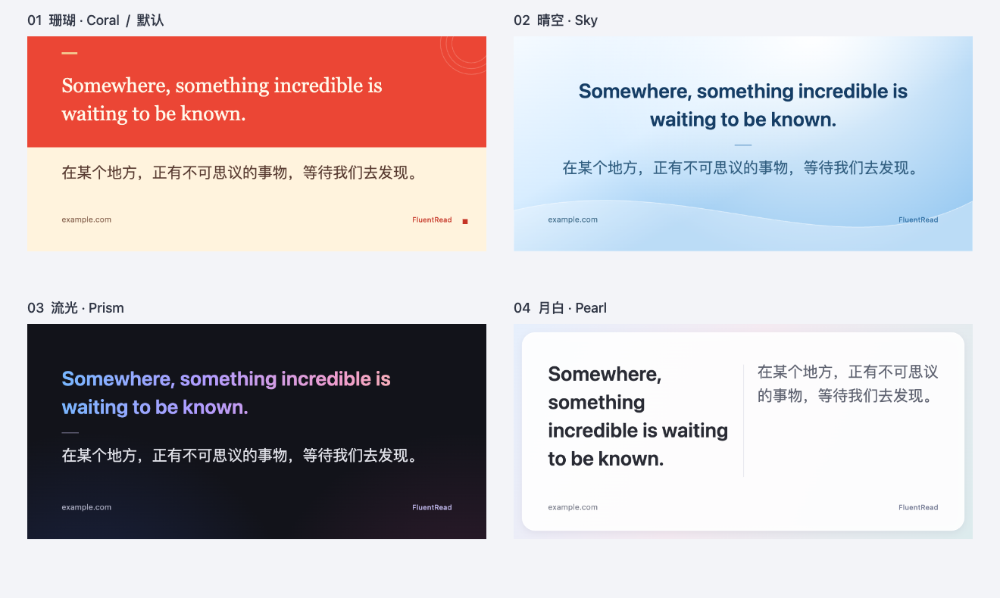

# 双语分享卡片：产品与验证记录

日期：2026-09-30。实现分支：`codex/bilingual-share-card-20260929`，初始基础提交 `87667c5b`，交付前已合入 `main` 的 `f58e4c28` 并重新验证。

## 产品交互

将用户已经读到的原文与译文生成可保存的轻量图片。网页双语译文悬停时出现一个“制作卡片”入口，划词结果底部也提供同一入口。复用本次翻译，不再请求翻译服务。

默认使用 **珊瑚**：红色原文与奶油白译文上下分区，保留已经确认的版式。示例为 **960 × 450、52,051 字节（约 51 KiB）**。其余三套分别是浅蓝居中的 **晴空**、深色彩字的 **流光**、珠光双栏的 **月白**；同一句摘录均为 960 × 450，文件约 210、107、88 KiB。高度随内容适配，方形为可选尺寸。

视觉参考苹果官方 [MacBook Air 天蓝色产品展示](https://www.apple.com/newsroom/2025/03/apple-introduces-the-new-macbook-air-with-the-m4-chip-and-a-sky-blue-color/)的冷色层次，以及 [材质设计说明](https://developer.apple.com/design/human-interface-guidelines/materials)对层次和内容可读性的强调。字体、背景与双语构图在本项目中独立实现，不使用苹果图片、标识、字体文件或其他仓库素材。

工作台默认仅突出图片、四个风格和保存动作。尺寸、字号、双语顺序、来源与署名收在“更多设置”，文字收在“编辑摘录”。切换样式时保留当前预览，期间禁止导出；新图完成后再替换。超长或方形放不下时明确提示，不静默裁切。因错误自动展开的编辑区在纠错时保持展开，关闭卡片后继续阅读。

来源默认只带网站域名，不含路径、查询参数、fragment 或账号。来源可编辑或隐藏，FluentRead 署名可关闭。偏好经过 Config 归一化和后台字段补丁持久化；摘录、作者内容及图片只存在于当前预览，不写入配置。无新依赖、权限、版本变更，不读取或修改参考项目。

## 实际产物



[珊瑚（默认）](./share-card-20260930/coral.png) · [晴空](./share-card-20260930/sky.png) · [流光](./share-card-20260930/prism.png) · [月白](./share-card-20260930/pearl.png)

[桌面工作台](./share-card-20260930/studio-desktop.png) · [390px 窄屏工作台](./share-card-20260930/studio-mobile.png) · [机器验证结果](./share-card-20260930/report.json)

## 实现边界

- `features/share-card` 拥有入口、工作台、Canvas 排版和图片导出。功能启动只注册代理监听，首次使用才挂载封闭 Shadow UI；停用时撤销监听、挂载任务与 Blob URL。
- 全文翻译通过 `readBilingualExcerpt` 提供只读快照，核对译文所有权、完成状态与节点连接，拒绝伪造或已恢复的节点。
- 预览直接使用生成 PNG 的同一画布，不依赖网页允许加载 Blob 图片，也不复制宿主 HTML/CSS。绘制按字素和词边界换行，支持 CJK、emoji 和右到左正文。月白双栏独立换行，以较高的一栏确定高度；切换双语顺序会左右互换。
- PNG 在点击前生成，剪贴板和系统分享在可信手势中直接调用。只在支持文件分享时显示分享动作；复制失败提供保存回退；用户取消系统分享不算错误。
- 全文入口针对双语段落；未注册卡片功能的特殊嵌入式正文不会显示无效的划词按钮。公式等富文本以文字排版，不承诺复原数学视觉布局。

## 验证

针对性测试共 **14 个文件、1,032 个用例**：卡片内容/配置/渲染/生命周期/导出、划词核心、content 生命周期、配置差异、翻译状态、后台配置持久化、本地化/资源加载、模块边界和源码说明。`test:audit` 通过；未运行全量回归。

`pnpm compile`、Chrome MV3 构建、Firefox MV2 构建与 manifest 验证、userscript 构建与 verifier、文档构建通过。由于新增文案，按仓库生成器补充五种语言的内容哈希资源。依赖使用主检出的既有 node_modules 临时链接，因此这些结果不是全新安装验证。

真实浏览器使用生产 Chrome 产物和临时 Edge profile；`launchMode=macos-background-cdp`、`focusPolicy=launchservices-no-foreground`、`windowPlacement.mode=background-visible-no-focus`、`browserFrontmost=false`。窗口位于第二屏，未复用日常浏览器。验证后关闭精确测试实例并移除临时 profile。

浏览器验证范围：

- 真实 Control 段落翻译，读取精确原译文；相邻段落不受影响。
- 网页强制 button 样式与 `img-src 'none'` 条件下，封闭 Shadow UI 和预览正常。
- 珊瑚默认、四个风格、偏好持久化、重新打开保持上次风格。旧主题 ID 映射到对应新主题，保留已有用户选择。
- 实际 PNG 下载与预览数据逐字节相同。
- 双栏方形图片、方形溢出提示、自适应恢复、超长内容阻止导出旧图。新双栏比通栏更早触及最高图片高度，仍按实际容量明确拒绝裁切。
- 390px 窄屏弹窗始终位于视口内。
- 翻译 → 恢复 → 再次翻译计数 `[1, 0, 1]`，无重复译文。
- 真实拖选、划词结果进入卡片，关闭卡片保留划词结果；关闭插件释放工作台。

翻译服务使用隔离 profile 内的 Microsoft 协议固定响应，不是线上 provider 质量验证。窄屏是桌面浏览器模拟，不是手机实机证明。没有向外部对象发送图片，没有覆盖用户系统剪贴板；剪贴板拒绝、系统分享取消及能力回退由适配器测试覆盖。Firefox 与 userscript 本轮验证到构建边界，未进行其真实 UI 或脚本管理器安装验证。

复现浏览器专项：

```sh
node scripts/testing/run-share-card-test.cjs \
  --extension-dir .output/chrome-mv3 \
  --playwright-root <Codex 工作区依赖中的 Node.js 包目录> \
  --focus-safe-helper <fluentread-browser-translation-test 技能目录>/scripts/focus-safe-browser.cjs \
  --artifacts-dir /private/tmp/fluentread-share-card-evidence
```
