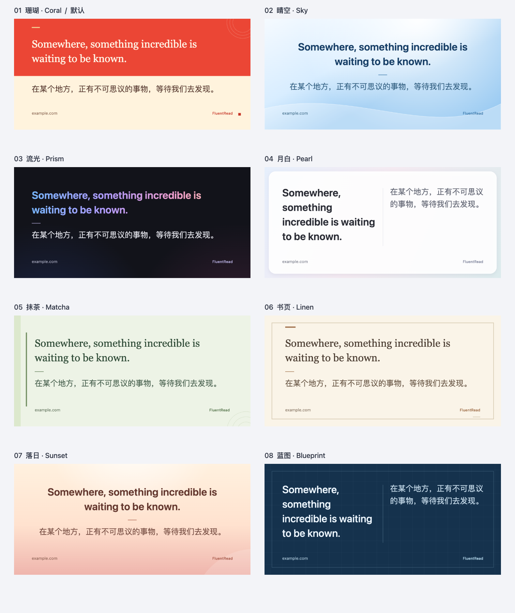

# 制作卡片：统一设置 UI、操作反馈与八套样式

日期：2026-09-30。分支：`codex/share-card-ui-feedback-20260930`；初始基础：`283b393a`，合并交付前已整合最新主分支 `bea6cbc1`。开发位于同级独立 worktree，未修改参考项目；用户随后明确授权通过正式 PR 合并，本文记录合并前的验证。

## 产品变化

- 保留珊瑚、晴空、流光、月白，新增抹茶、书页、落日、蓝图。新增主题分别使用绿调衬线、暖纸边框、暖色居中和深蓝双栏构图；无外部字体、素材、依赖、权限或版本变更。八个缩略图按四列两行展示，默认与旧主题迁移保持兼容，新主题支持配置归一化往返。
- 工作台使用共享视觉规范的粉色品牌、柔和表面、边框与圆角，不再让卡片模板影响按钮色。原生下拉改为可键盘操作的分段按钮，复选框改为保留原生键盘行为的开关，折叠标题使用统一箭头。
- 操作提示在固定底栏以图标、绿色成功和红色错误面板呈现，重复操作重新通知屏幕阅读器。等待复制／分享时显示加载标记、防重入；系统分享取消不误报。保存仅报告已发起下载，不声称文件已落盘；同步保存异常也有失败提示。
- 已复制图片的结果不会因偏好变更或新预览而丢失。关闭、重开或替换摘录时，旧异步结果不能提示、解除新操作的锁或污染新窗口。偏好写入失败也受窗口代次保护。
- 七种界面语言补充主题名称与保存失败文案；五份非英文 userscript 内容哈希资源初始提交为 `997a7ae7`，整合最新主分支后重新生成并提交为 `4bbd7f2228ee806f8cf0054eb58946db2cc259a1`，资源指针同步更新。构建和 verifier 已通过，不视为脚本管理器安装或远程资源服务可用证明。

## 实际效果

[设置区](./share-card-ui-feedback-20260930/studio-settings.png) · [390px 窄屏](./share-card-ui-feedback-20260930/studio-mobile.png) · [复制成功](./share-card-ui-feedback-20260930/copy-success.png) · [复制失败](./share-card-ui-feedback-20260930/copy-error.png) · [保存反馈](./share-card-ui-feedback-20260930/save-success.png) · [浏览器报告](./share-card-ui-feedback-20260930/report.json)

## 验证与边界

针对卡片内容、外观归一化、八主题渲染、导出、运行时和工作台，以及界面文案与语言包，整合最新主分支后共 9 个相关测试文件、115 个用例通过。八主题均覆盖方形、隐藏页脚和超长内容拒绝裁切。工作台覆盖保存异常、重复通知、复制防重入、设置变更、分享成功／失败／取消、窗口切换和偏好写入失败。

整合后的源码中文说明 682 个用例通过，测试归类审计与 `git diff --check` 通过。开发阶段模块边界 12 项通过，另 1 项为基线失败：`src/features/video-subtitle/content/runtime.ts` 的非空行数 1909 超过既有上限 1887；已在未改动的主检出复现相同失败，未抬高门槛或修改字幕文件。不声称全量回归或全仓覆盖率通过。

整合后重跑 `pnpm compile`、Chrome MV3、Firefox MV2、userscript 构建及 userscript／manifest 校验、文档构建，均通过。依赖借用主检出的既有 node_modules 临时链接，不是全新安装证明。manifest 校验首次与 Chrome 构建并行时遇到产物尚未生成，待构建完成后独立重跑通过。

生产 Chrome 产物加载到临时 Edge profile，使用第二屏可见但不抢焦点的窗口：`launchMode=macos-background-cdp`、`focusPolicy=launchservices-no-foreground`、`windowPlacement.mode=background-visible-no-focus`、`browserFrontmost=false`。测试结束只关闭本次实例并删除本次临时 profile。

整合后的真实浏览器专项重跑通过，覆盖八个不同 PNG、逐主题偏好持久化、分段按钮与三个开关、实际 PNG 下载与预览逐字节一致、固定底栏反馈、390px 弹窗视口和无横向溢出、封闭 Shadow DOM、恶意宿主 CSS 和禁止图片加载的 CSP、翻译→恢复→再次翻译、最新划词入口及关闭／停用清理。浏览器错误列表为空。

翻译使用固定协议响应；复制和分享通过可信点击触发隔离扩展上下文的成功、失败与取消接口桩，验证可见反馈但未触碰系统剪贴板或打开系统分享。不是线上翻译质量、系统剪贴板兼容性、手机实机、Firefox UI 或 userscript 安装证明。
