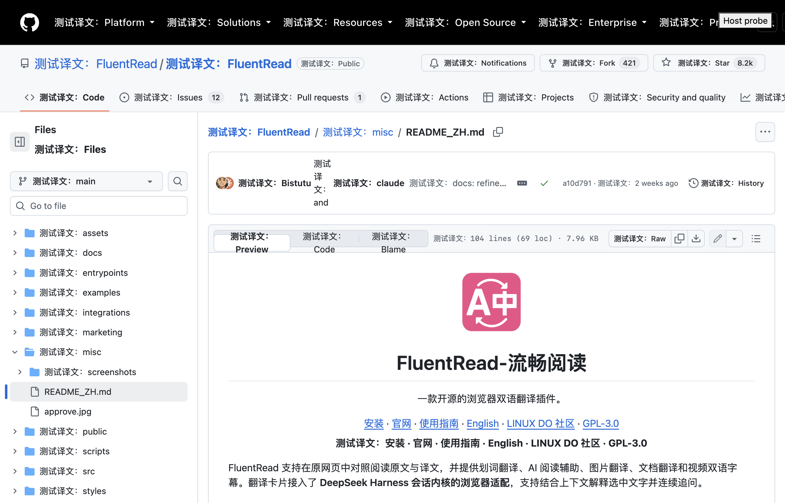

# 全文翻译响应性与中文同语言跳过修复

日期：2026-09-29。基线：`f16e4fe6`。范围是全文翻译、恢复/重译、共享语言识别及 Popup 的针对性检查；没有执行全量回归。

本文记录第一阶段产物 `fb16313f`。针对后续反馈的大型 GitHub compare 页面，继续优化的原因、最终实现、前后测量及全功能入口审查见[第二阶段报告](./compare-report.md)。其中原生边界查询已进一步改进，第一阶段的性能数字不代表第二阶段重新测量结果。

## 结果

在隔离 Edge 中加载生产扩展，使用 1500 个英文段落、一个包含 `FluentRead / AI / DeepSeek Harness` 的中文段落、本地固定微软翻译响应、并发 10、关闭供应商限速、CDP 4 倍 CPU 降速。基线与修复使用同一夹具和操作顺序。

| 指标 | 基线 | 修复后 |
| --- | ---: | ---: |
| 首次翻译耗时 | 70.77 秒 | 64.58 秒 |
| 翻译期间 >50ms 长任务 | 186 | 0 |
| 翻译期间累计阻塞时间（每个长任务超出 50ms 的部分） | 844ms | 0ms |
| 翻译期间 20ms 心跳的 P95 实际间隔 | 152.3ms | 74.1ms |
| 翻译期间最大心跳间隔 | 190.1ms | 114.1ms |
| 翻译期间 layout 次数 | 4503 | 3000 |
| 全文恢复的最长任务 | 576ms | 257ms |
| 中文段落被重复翻译 | 1 次 | 0 次，零供应商请求 |

修复后再次翻译全部 1500 段时，直接复用缓存，没有增加供应商请求；长任务 0 次，心跳 P95 72ms、最大 118.4ms。首次翻译与缓存重译期间分别完成 109、162 次真实 CDP 宿主按钮点击。翻译后滚动阶段长任务 0 次，12 次按钮点击成功。

这些是一次基线和最终产物的受控对照，不是统计学性能保证。未降速的 500 段基线没有重现明显卡顿，因此使用上述压力场景暴露热点。恢复仍会集中引发浏览器布局，CPU profile 中 `getBoundingClientRect` 约占 173ms；本次保留同步恢复和滚动锚点语义，没有宣称大页面恢复已完全无阻塞。

测量数据：[基线](./baseline.json)、[最终产物](./optimized.json)、[真实 GitHub 页面](./github.json)、[Popup](./popup.json)。数值原样保留，仓库副本省略桌面窗口坐标、前台应用名称及进程标识。脚本另外生成 CPU profile 和截图；它们用于诊断，不是供应商响应速度测试。

## 原因与修复

1. 外部翻译边界检查曾在每个候选的祖先上循环遍历全部直接子节点。长文档的 JavaScript 兄弟节点扫描耗时很高。改用浏览器原生类名查询，再核对直属父级；不跨 DOM 写入缓存判断，因此插入、移除、改类和移动后立即生效。
2. 视口补偿先读每个祖先的滚动尺寸，反复强制布局。现在先检查是否允许滚动，只对滚动容器读尺寸；同段 loading 移除与译文写入合并到一次锚点事务。普通候选无需生成合成节点时不执行锚点测量。
3. 缓存和批量响应会在微任务中集中完成。全文派发采用 8ms 时间片，结果提交前通过浏览器任务让出主线程；恢复、取消、请求代次和宿主原文变化仍在让出后复验。
4. 所有权索引、共享观察器及共享裁剪样式释放曾逐段扫描所有其他段落。现在用稳定 WeakRef 键删除当前所有者，确认有一个存活所有者后即停止扫描；最后一个所有者释放时才恢复样式、断开观察器。
5. 中文段落里的未带版本英文名称曾被逐词判成外语正文。识别现在结合汉字上下文判断 1–3 词的少量名称，并保持名称权重上限；小写外语正文、功能词、引述文本和独立句子保留翻译机会。识别仅使用文本，不依赖 GitHub 的 `lang="en"`，不改变原文，也不跳过简繁转换。

全文恢复的遗留产物清理移至既有 `orphanArtifacts.ts`，保持 runtime 不继续增长。检查过程中还补齐了两个既有 Greasy Fork 构建/验证脚本缺失的验证归属登记，未修改这些构建脚本。

## 真实页面与 Popup

使用用户提供的 [中文 README](https://github.com/FluentRead/FluentRead/blob/main/misc/README_ZH.md) 和 [Issues 页面](https://github.com/FluentRead/FluentRead/issues)：

- README 对应中文段落的 `innerHTML` 在翻译、恢复、重译后完全一致；请求记录中没有该段原文。页面上的英文内容仍生成译文。
- 两个页面均完成翻译 → 恢复 → 再次翻译 → 恢复；迟到结果没有重新写入，宿主侧独立按钮探针可通过真实 CDP 点击。探针不是 GitHub 全部原生控件的功能测试。
- 页面脚本异常为 0。全部测试使用临时 profile、可见第二屏窗口、`macos-background-cdp`、`launchservices-no-foreground`，记录的 `browserFrontmost=false`。



Popup 另执行 7 次打开，并强制停止后台 worker 后测冷启动：首帧中位数 56.2ms，冷启动首次首帧 209.9ms；语言搜索、键盘选择、Escape、关闭菜单零隐藏选项、跨页面同步、界面语言往返和重开持久化通过。没有复现 Popup 自身的严重卡顿，保留其现有并行初始化和按需挂载设计，未声称本次降低了 Popup 打开耗时。

## 识别方案选择

只读比较了本地 `read-frog/src/utils/content/language.ts` 的 franc/可选 LLM 检测，以及 `kiss-translator/src/libs/detect.js` 的浏览器检测、置信度和远程回退。FluentRead 已使用 `franc-min`；问题出在混合文字的名称判定，而不是缺少检测库。因此在现有统一识别链路中独立实现上下文规则，保留已有多语言统计和缓存，避免为每段新增远程请求或浏览器消息。未复制参考代码、修改参考项目或增加依赖。

名称判定仍为启发式，不代表可以完美识别任意歧义短语。回归覆盖简繁中文、日文、韩文、其他语言、混合句子、技术标识符和引述文字。

## 验证与复现

- 26 个针对性测试文件、1884 个用例通过，涵盖语言语料、请求跳过、DOM 保护、动态节点、恢复/重译、取消、状态所有权、视口补偿、请求队列、内容生命周期和 Popup。
- `identify.ts`、`dom.ts`、`viewportStability.ts`、`orphanArtifacts.ts` 的 statements / branches / functions / lines 均为 100%。状态和 runtime 另由功能用例覆盖，不把它们计入本次严格覆盖率结果。
- `pnpm test:audit`、`pnpm compile`、Chrome/Firefox 构建、manifest 校验、userscript 构建与 verifier、文档构建及 `git diff --check` 通过。
- 依赖来自已验证的本机安装；隔离工作树补齐锁文件声明的类型依赖，没有修改锁文件。这不是全新安装验证。

```bash
pnpm build
node scripts/testing/run-resource-safe.mjs -- \
  node scripts/testing/run-translation-responsiveness.cjs \
  --paragraphs 1500 --cpu-rate 4 --repeat \
  --artifacts-dir /private/tmp/fluentread-responsiveness

node scripts/testing/run-resource-safe.mjs -- \
  node scripts/testing/run-translation-responsiveness.cjs \
  --github --artifacts-dir /private/tmp/fluentread-responsiveness-github
```

脚本支持 `--extension-dir`、`--playwright-root`、`--focus-safe-helper`、`--browser-path`。比较未修复产物时加 `--allow-chinese-baseline`，仅放宽已知中文重复翻译断言。严格时间阈值不写入 CI，避免机器负载导致不稳定测试。

真实网页测试使用本地固定翻译响应，不证明线上供应商质量、账号额度或网络耗时。Firefox/userscript 通过构建检查，未做实际 Firefox、移动设备或脚本管理器性能测量。本次工作不会自动更新用户已安装的扩展。
