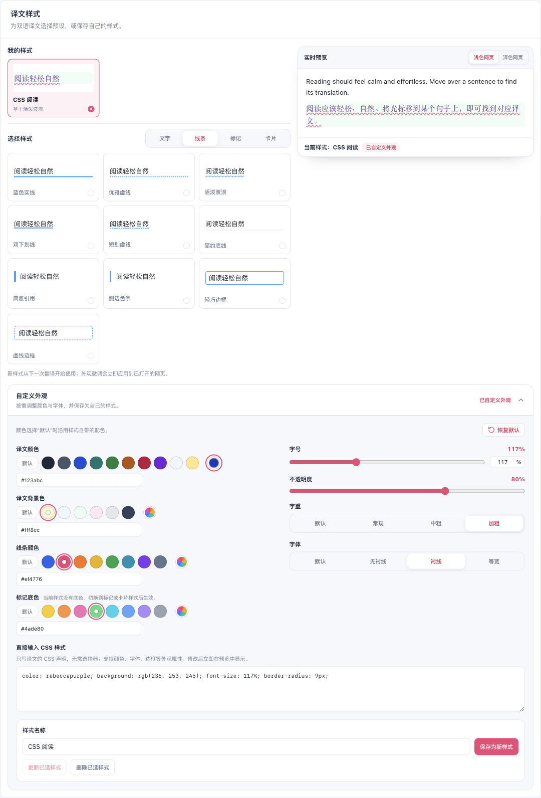

# 译文样式可视选择补齐

日期：2026-09-30。基线：`51b6b42a`。继续处理“在可视卡片上优化，不能退化成下拉框或仅文字选择”的反馈。

## 发现与修复

当前内置预设已经是紧凑可视卡片，但“我的样式”卡片丢失了缩略图，只显示名称和基于哪个预设。隔离浏览器在保存自定义 CSS 样式后复现：卡片缺少真实译文节点，已有验证脚本在读取这个节点时超时。

为每张已保存样式卡片补回独立的外观预览，使用该快照自己的预设、颜色、背景、字体及经过校验的 CSS；当前正在编辑的外观不会覆盖其他快照。卡片沿用单层边框和明确的选中圆点，保持紧凑。“双语逐句高亮”继续留在独立的阅读辅助分组。

[默认内置样式](./presets.png) · [390px 深色界面](./mobile-dark.png)

## 验证

- 49 项定向测试通过：外观数据、实际样式规则、设置架构；类型检查与测试分类审计通过。
- 生产 Chrome 扩展在第二屏、临时 Edge profile、不抢焦点窗口验证通过。报告中的 `browserFrontmost` 为 `false`，控制台错误为零。
- 29 个预设逐个选择、实时预览、保存、颜色名称/RGB/非法输入、精确字号、自定义 CSS、保存样式快照、重新打开后的持久化通过。
- 浅色/深色网页预览、深色设置界面，以及 1024/820/390px 布局通过。保存卡片的颜色、背景和圆角与当前预览的计算样式一致。
- 高亮开关位于阅读辅助分组，通过搜索定位并可联动预览；仅译文模式可切回双语。
- 本地确定性页面和翻译服务验证了真实内容脚本：已有译文随外观修改实时变化，不额外请求翻译；全局关闭可恢复原文并移除外观节点，重新开启恢复外观设置。共两次本地翻译请求。
- Chrome、Firefox、userscript 构建与 userscript verifier 通过。Firefox 仅有构建证据；不宣称外部翻译服务、登录态站点或真实移动设备验证。

截图从真实页面取得。长分组截图先扩大隔离页面的截图视口，避免内部滚动容器裁剪造成大块空白；布局断言仍分别在 1024/820/390px × 900px 视口执行。

复现脚本：`scripts/testing/run-translation-style-ui-test.cjs`。详见[当前浏览器报告](./report.json)与[修复前复现报告](./baseline-report.json)。
