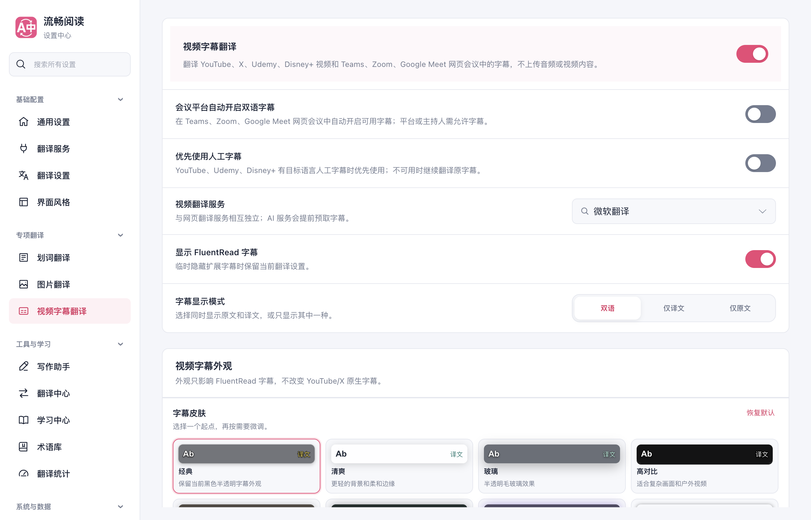
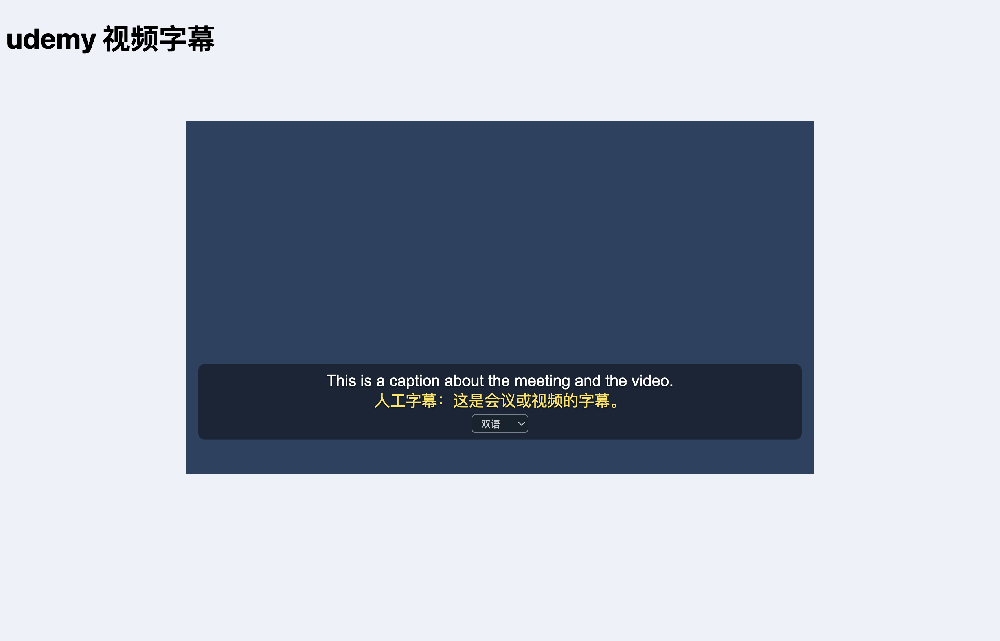
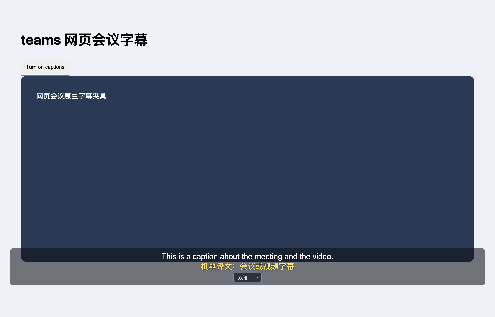

# 视频与会议字幕支持验证（2026-10-02）

本次补齐截图中的两个能力：Teams、Zoom、Google Meet 网页会议自动开启双语字幕；YouTube、Udemy、Disney+ 优先使用可读取的目标语言人工字幕。两个开关位于「视频翻译设置 → 通用」，新配置和旧配置迁移均默认开启，用户明确关闭后保留关闭状态。

## 实现与范围

会议适配器读取平台原生字幕文字，通过现有视频翻译服务显示双语字幕；只操作明确的字幕开启控件，Teams 另支持会议的更多操作及语言菜单。自动操作有次数边界，不反复覆盖用户手动关闭。关闭功能后恢复本功能修改的字幕可见性与轨道模式，取消未完成请求。界面使用独立 Shadow DOM，字幕原文不会被网页翻译再次改写。

YouTube 从当前视频初始化数据选择人工目标轨并读取 timedtext。目标轨与原文轨分别保存，优先使用人工轨的实际时间区间；缺失或读取失败时使用现有翻译服务。字幕下载同样优先人工译文。Udemy 和 Disney+ 读取原生字幕节点及浏览器 TextTrack；目标人工轨不重复绘制，关闭功能后恢复原模式。新增平台复用已有字幕外观、时间偏移、显示模式、缓存和设置保存能力。

参考了 read-frog 的字幕节点识别思路，按 FluentRead 的 TypeScript/WXT 架构独立实现。参考项目未修改，没有引入跨仓库依赖或复制整段实现。

## 验证结果

| 验证范围 | 结果 |
| --- | --- |
| 17 个直接相关测试文件 | 1293 通过，3 项失败均在未修改的基线提交复现；没有运行全量回归 |
| 新增平台规则、YouTube 人工轨、字幕下载三个业务模块 | 32 个测试通过，statements / branches / functions / lines 均 100% |
| 新增平台 DOM 生命周期最终专项 | 15 个测试通过，覆盖晚到结果、关闭恢复、用户手动字幕选择、动态会议、Teams 菜单、多播放器、人工轨空档和全屏 |
| 类型检查、测试归类审计 | 通过；审计统计是登记数量，不能当作全量测试执行数量 |
| Chrome MV3 / Firefox MV2 / userscript 构建 | 通过，扩展 manifest 与 userscript 产物验证通过 |
| 中英文文档构建 | 通过 |
| 生产 Chrome 扩展加载于隔离 Edge | 六个平台受控夹具通过，设置刷新持久化及 YouTube 双语 SRT 下载通过，无 pageerror |

浏览器使用临时 profile，在第二块屏幕正常尺寸窗口后台运行：`launchMode=macos-background-cdp`、`focusPolicy=launchservices-no-foreground`、`windowPlacement.mode=background-visible-no-focus`、`browserFrontmost=false`。未接入日常浏览器或修改用户配置。夹具使用真实视频元素、TextTrack 与 DOM，翻译服务响应由确定性 Microsoft 夹具提供。

六个平台均验证原文及译文显示；Udemy、Disney+、YouTube 验证人工优先开关的「人工 → 机器翻译 → 人工」切换。五个新增平台验证隐藏及重新显示后恢复原生字幕样式，三个会议平台另验证用户手动关闭再开启后，关闭插件不会撤销用户选择。YouTube 本次重点验证人工轨显示、切换和 SRT 导出，未在此脚本中重测全部已有播放器功能。详情见 [浏览器报告](./browser-report.json)、[针对性测试日志](./targeted-tests.txt)、[最终生命周期专项](./lifecycle-final.txt)、[覆盖率日志](./coverage.txt)。

## 基线失败

在独立、未修改的 `b6a5f8e393e05d2af5c7b124e1b53856e6af6481` 检出中重跑以下测试，得到相同失败：

- `configDiff.test.ts`：既有 popup 卡片配置预期与当前实现不一致。
- `verificationOwnership.test.ts`：已有 share-card、siteRules、excerpt 等 8 个模块未登记覆盖率归属。
- `moduleBoundaries.test.ts`：文档 UI 的既有 `services/translation/errors` 导入超出预期边界。

证据见 [配置与覆盖率归属基线日志](./baseline-config-ownership.txt)、[模块边界基线日志](./baseline-module-boundaries.txt)。基线另有视频 runtime 长度超过 1887 行的失败；本次抽出字幕下载后降至 1886 行，该项已通过，未提高限制或改写失败断言。

## 使用限制与证据边界

本次没有登录真实会议、付费课程或 Disney+ 账号；受控夹具通过不能证明所有账号、地区与播放器版本都兼容。平台需先提供可用字幕，人工字幕轨也需允许页面读取。人工轨不可读取时回退到原生字幕文字翻译。Zoom 仅识别 `/wc/` 网页客户端；浏览器扩展不控制会议桌面客户端，也不为这些平台采集音频或生成缺失字幕。

平台字幕的前提条件可参阅 [Google Meet](https://support.google.com/meet/answer/15077804)、[Teams](https://support.microsoft.com/en-us/teams/meetings/use-live-captions-in-microsoft-teams-meetings)、[Zoom](https://support.zoom.com/hc/en/article?id=zm_kb&sysparm_article=KB0059762)。实际服务供应商、Firefox 运行时和远程 userscript 安装未在本次验证中证明。userscript 新语言资源在本地提交 `9bcfe981acab00ea7729533486f9e00d74b55f2b`，需随分支发布后才能从远程地址读取；本次构建使用本地资源校验。

改动保存在分支 `codex/video-caption-platforms-20261002` 的独立 worktree，尚未上传或合并。依赖复用主检出的本地安装，不属于全新依赖安装验证。

## 截图与导出

下图均为受控夹具。设置截图显示关闭两项后刷新，证明显式关闭状态被保存。

其余：[Meet](./meet-bilingual.png)、[Zoom](./zoom-bilingual.png)、[Disney+](./disney-bilingual.png)、[YouTube](./youtube-bilingual.png)、[YouTube 双语 SRT](./youtube-bilingual.srt)。

复现浏览器检查使用 `scripts/run-video-caption-platform-test.cjs`，传入 `--extension-dir`、`--playwright-root`、`--focus-safe-helper`、`--artifacts-dir`。可用 `--platforms meet,teams,zoom,udemy,disney,youtube` 限定站点；脚本使用临时配置并在结束时关闭该测试会话。
