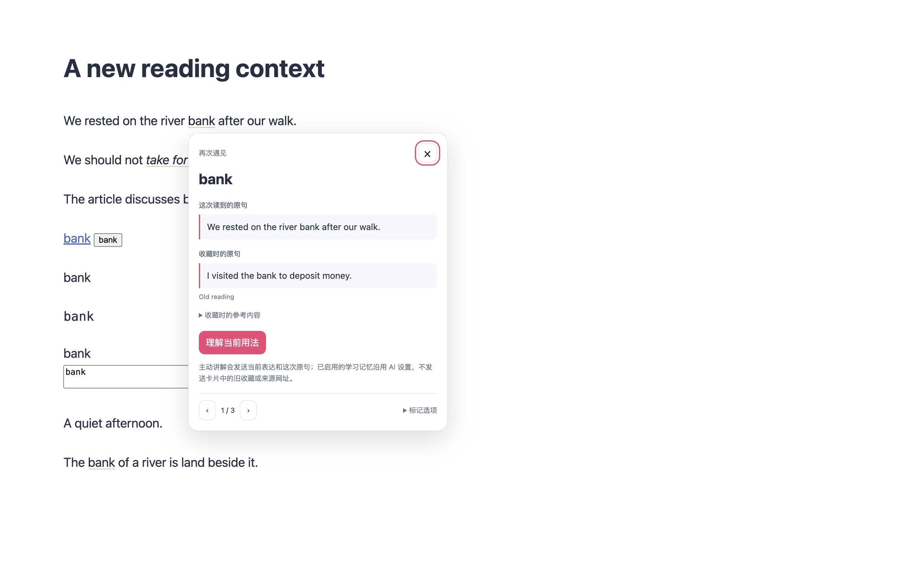
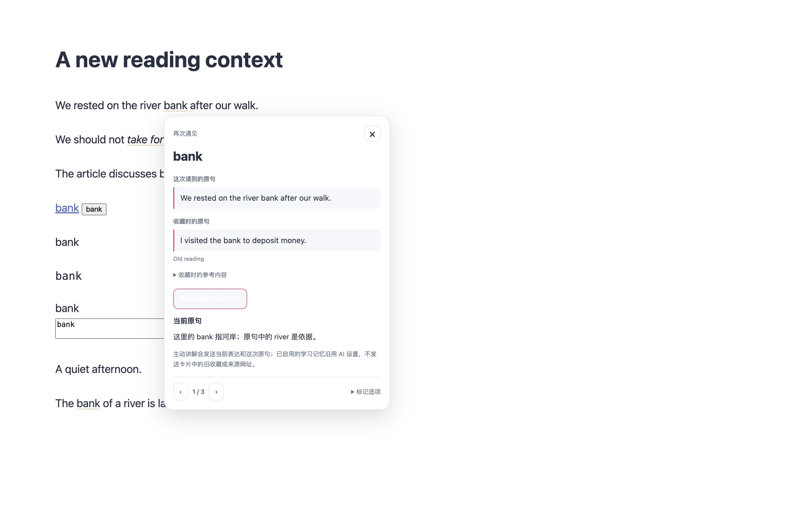
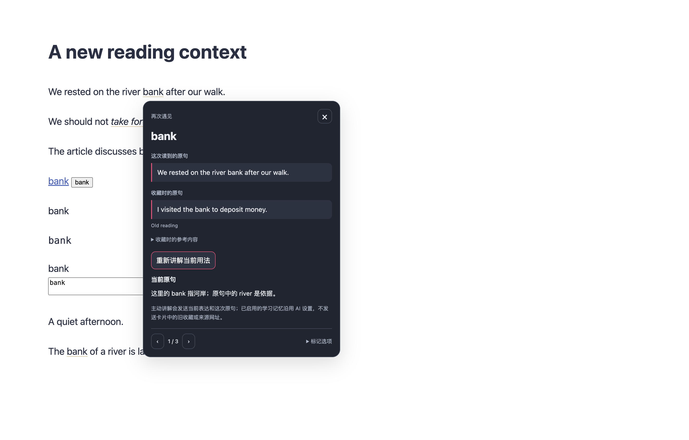
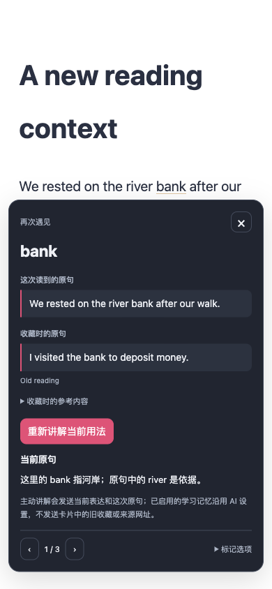

# 收藏表达再次遇见：实现与验证

2026-10-04。入口位于 **工具与学习 > 学习中心 > 收藏 > 再次遇见收藏表达**，独立开关默认关闭。

新网页中的收藏表达使用原生文字范围绘制点状下划线，不包裹、替换原文或改变布局。附近匹配支持跨内联标签的短语、Unicode 坐标、动态正文与开放 Shadow DOM。链接、编辑器、代码、公式、隐藏区域与插件译文不参与匹配。点击或键盘入口打开当前原句与收藏原句对照，旧参考内容单独折叠。

打开卡片不会请求模型；主动讲解沿用现有阅读助手的 AI、原句授权与学习记忆设置。支持停止、失败重试、本次访问暂停与永久关闭。浏览、打开和讲解均不写入收藏次数、掌握度或复习计划。全局暂停、站点禁用、导航与扩展失效都会清理资源。

## 确定性验证

- 新匹配算法、正文扫描、绘制和挂载生命周期，以及受影响的词书后台处理器：40 项测试通过，所选 5 个可执行业务模块的 statements、branches、functions、lines 均为 100%。覆盖不包含 Vue 模板或整个配置模块。
- 受影响的配置迁移与差异、词书组件、内容运行时与功能生命周期、消息和 UI 运行时、既有逐句高亮、架构边界、源码注释及油猴语言资源：合并专项 15 个文件、985 项测试通过。测试清单审计通过（450 个测试文件、5784 个登记用例；审计不执行全量用例）。
- TypeScript/Vue 类型检查、Chrome 与 Firefox 生产构建、生成 manifest 验证、油猴构建与 verifier、文档构建通过。

## 真实浏览器证据

生产 Chrome MV3 扩展加载于临时 profile 的真实 Edge；使用本地 HTTP 正文与确定性模型响应。通过 16 个场景，详见 [完整报告](./browser-report.json)：

1. 默认关闭、已有收藏、跨内联短语和受保护内容排除；核对原文节点身份、HTML 和几何不变。
2. 普通点击保留网页事件；键盘入口和 Escape 可操作；打开对照不请求模型。
3. 未授权原句时禁止当前用法讲解；主动请求只使用当前表达和原句，旧卡片参考与来源 URL 不发送。
4. 讲解前后完整收藏与复习数据一致；延迟请求关闭后不复活，模型失败后可主动重试。
5. 浅色、深色与 390px 窄窗口；卡片完整保持在视口内。
6. 两轮全文翻译、恢复与再翻译；译文不被标记，恢复后原文及标记继续可用。
7. 动态正文使旧卡片失效、迟建开放 Shadow DOM、滚动后发现正文。
8. 本次暂停保留总偏好；跨页删除移除对应标记；总开关与网站禁用清理并恢复；永久关闭在刷新后持续生效。

启动模式为 `macos-background-cdp`，焦点策略为 `launchservices-no-foreground`；窗口位于第二屏，正常尺寸、可见且不抢前台焦点。专项脚本为 `scripts/testing/run-vocabulary-reencounter-test.cjs`，需要显式提供 Playwright 依赖根及 focus-safe helper，使用临时 profile 并自动清理。

以下截图来自此次真实浏览器执行：

## 证据边界

本次为针对性验证，没有运行全量回归；未验证线上模型回答质量、真实 Firefox 运行时、手机设备或商店发布。390px 仅证明桌面浏览器窄视口布局。无痕和油猴不启用该功能，缺少原生文字范围绘制能力时保留附近表达入口。没有读取或修改参考仓库，没有增加权限、依赖或数据库迁移。
