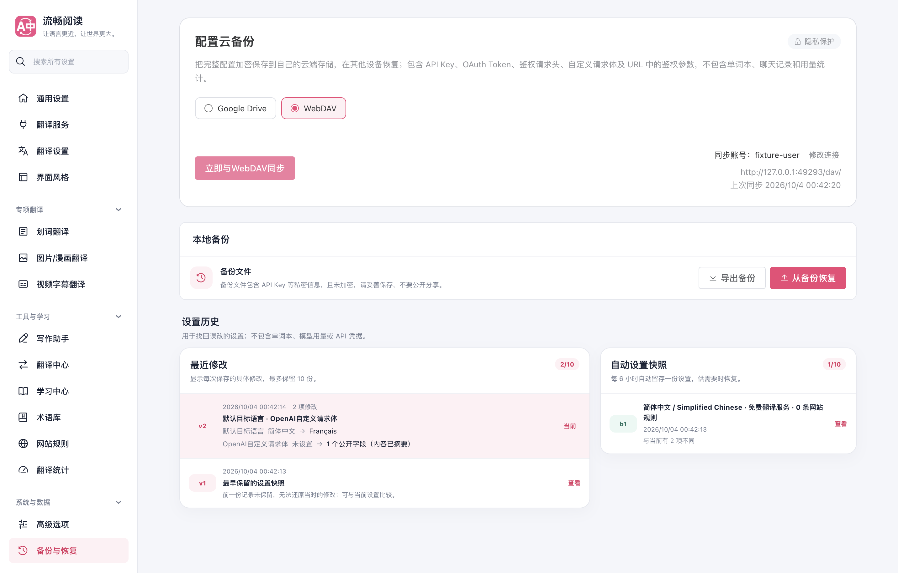
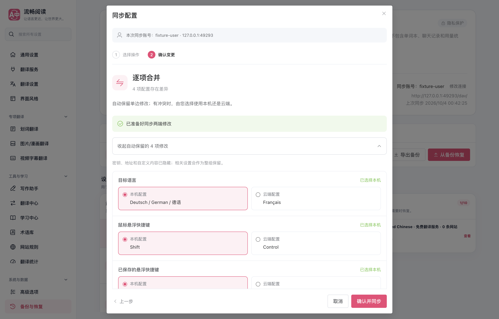
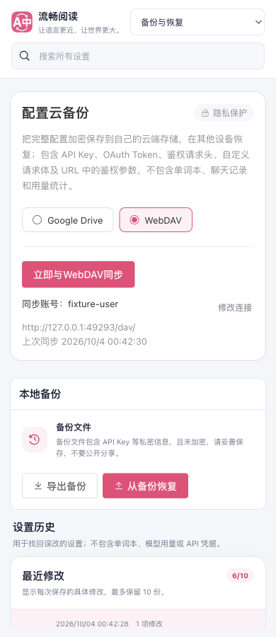
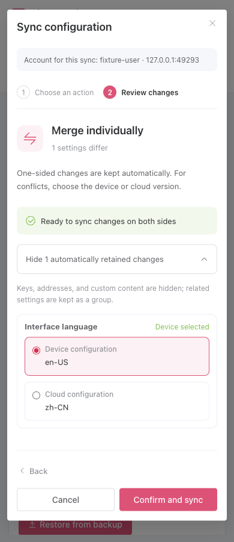

# WebDAV 更新兼容性与备份预览验证

日期：2026-10-04。生产扩展源快照：`49e1efb91a25f658fbba07cad64619fe8bcf576e`。

下载响应缺少 ETag 时，通过固定备份文件的 `DAV:getetag` 属性获取强版本，再用 `If-Match` 重读并核对密文，确认内容和版本一致。更新仍使用条件 PUT；弱版本、错误文件属性和并发更新不能触发无条件覆盖。配置一致或合并结果等于云端时不重新上传，基线沿用实际云端密文。

按钮上方不再重复显示 WebDAV 账号与地址；右侧统一显示当前连接、修改连接入口及该连接的上次同步时间。确认页默认显示变更，合并时冲突优先；已知设置复用稳定名称，连接变更展示类别，未知字段和私密内容继续隐藏。

## 已验证

- 云备份针对性套件：9 文件、51 用例；11 个协议和事务模块四维覆盖率均为 100%。真实本机 HTTP 覆盖 GET 有/无 ETag 两种情况、首次创建、修改后再次保存、鉴权、重定向拒绝及过期版本。
- 配置差异：2 文件、60 用例；`driveSync.ts` 与 `diff.ts` 四维覆盖率均为 100%。
- 预览模型与 i18n：2 文件、59 用例。
- 生产 Chrome MV3 扩展：隔离可见 Edge、真实本机 WebDAV HTTP 夹具，73 项断言通过，页面控制台错误为 0。首次预览取消不写入、首次保存、恢复全部凭据、412 保护、再次修改保存、配置一致不写入、更换账号清理旧时间、七语言确认页、390px 窄屏和深色界面均已覆盖。
- 类型检查、Chrome/Firefox/userscript 构建、manifest/userscript 验证及测试审计通过。文档构建和链接检查通过（75 页）。
- `launchMode=macos-background-cdp`，`focusPolicy=launchservices-no-foreground`，`windowPlacement.browserFrontmost=false`；窗口完整放置于第二块显示器，临时 profile 已关闭清理。

## 验证边界

这是本机协议夹具和生产产物验证，未登录真实坚果云账号验证其当前 ETag 返回格式与条件写入行为。弱 ETag 或完全不支持强版本及条件写入的服务器仍只能恢复，不能安全覆盖已有文件。Firefox 本轮只验证构建与清单；未进行真实 Firefox 账号操作。没有运行全量回归，没有发布扩展商店版本。

## 复现

运行 `pnpm build` 后执行：

```sh
node scripts/testing/run-webdav-backup-ui-test.cjs --extension-dir .output/chrome-mv3 --artifacts-dir /private/tmp/fluentread-webdav-update-ui --playwright-root <Playwright 包目录> --focus-safe-helper <focus-safe-browser.cjs 路径>
```

真实坚果云复测：加载修复后的扩展，保存一项普通设置，再次同步应显示该项差异；确认保存后再点同步应提示配置一致。换设备或临时扩展配置选择恢复，核对普通设置及凭据恢复。不要在截图、HAR 或公开报告中暴露应用密码与鉴权请求头。





