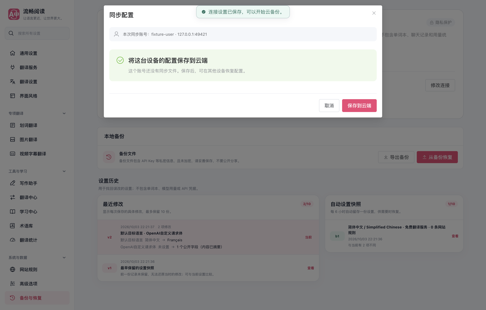

# WebDAV 首次备份 409 修复验证

基础提交：`83d8cf12b5407d15827ef30ee476c6a70f55ddac`。本报告对应同提交中的客户端修复、协议回归和生产浏览器夹具变更。

用户提供的 HAR 记录了两次请求：`PROPFIND https://dav.jianguoyun.com/dav/` 返回 207，随后 `GET https://dav.jianguoyun.com/dav/FluentRead/fluentread-config.encrypted.json` 返回 409。未保存 HAR 原文、请求头、响应正文、密码或配置。原实现只将 GET 404 视为没有备份，将 409 映射成目录不存在，因而在首次同步预览前停止。

修复后，GET 409 触发对入口与 FluentRead 专属目录的只读 Depth:0 PROPFIND。仅在入口有效、专属目录不存在时返回无备份；入口无效、鉴权或权限错误仍阻止同步。专属目录已存在时的未知 GET 409 保留为服务器错误。确认前不执行 MKCOL 或 PUT，创建与更新继续保留 If-None-Match、强 ETag 与 If-Match 防覆盖检查。

## 验证结果

- 新增协议回归在修复前失败：`WebDAV notFound`；应用修复后通过。
- `pnpm test:cloud-backup --coverage`：9 文件、47 项通过；限定的 11 模块 statements、branches、functions、lines 均为 100%。包含真实本机 HTTP 的缺少父目录 409、首次新建、条件更新、鉴权和重定向防护。
- `pnpm compile`、Chrome MV3、Firefox MV2 与 userscript 构建通过；扩展清单和 userscript verifier 通过。userscript 为 1,877,446 bytes。
- 生产 Chrome MV3 产物在独立临时 Edge profile 中运行：49 项断言通过，无页面控制台错误。夹具在目录尚未创建时返回 GET 409，验证只读预览、取消、确认创建密文、恢复凭据、ETag 412 防覆盖、七语言、390px 和深色界面。
- 浏览器 `launchMode=macos-background-cdp`、`focusPolicy=launchservices-no-foreground`、`windowPlacement.mode=background-visible-no-focus`、`browserFrontmost=false`，窗口完整位于第二块显示器。结束后关闭本次测试实例并清理临时 profile。
- 中英文文档构建与链接检查通过：75 页面、3,748 链接、712 锚点、102 图片。测试归属审计通过；未执行全量回归。
- `git diff --check` 通过。

详见 [生产浏览器报告](./browser-report.json)。

## 验证边界

HAR 确认了真实坚果云的失败请求；修复后的保存与恢复使用本机 HTTP 夹具。未访问或修改用户的真实坚果云文件，未验证其强 ETag 与条件更新实现，未完成真实坚果云账号的两设备验收。Firefox 仅完成构建，未运行其真实浏览器交互；未发布扩展商店版本。
