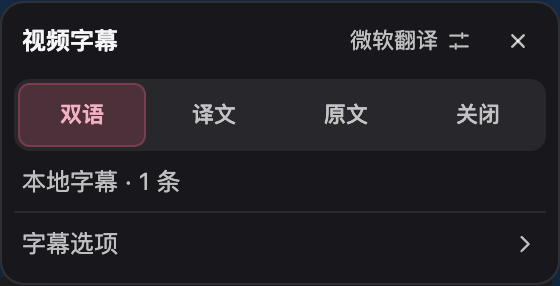
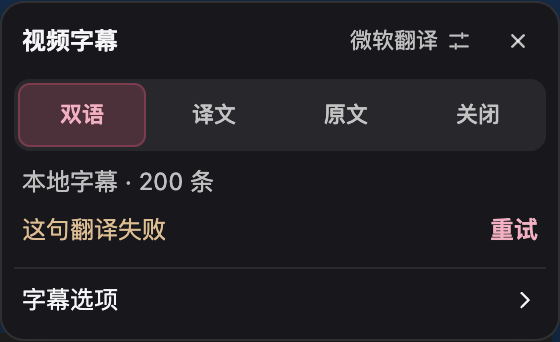
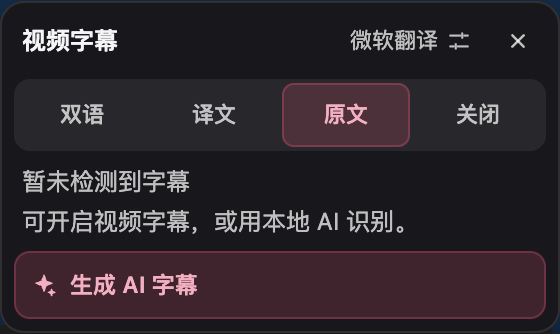
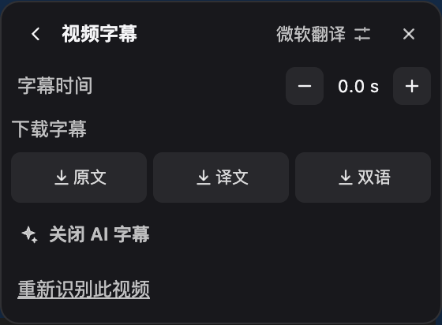
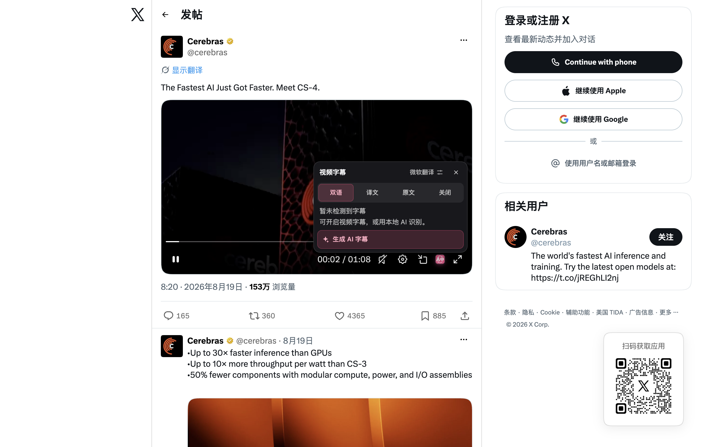

# X 视频字幕体验复核

本次围绕“找到字幕 → 看懂状态 → 选择显示方式 → 失败恢复”调整 FluentRead 的现有视频模块。沿用 WXT、TypeScript 和播放器内菜单，没有引入新的供应商、权限或依赖，也没有修改参考项目。

## 产品取舍

- **先说明现在有什么。** 显示方式下方以轻量状态行显示原生、本地或 AI 字幕及条数。尚无字幕用“暂未检测到”，同时说明可以开启网站字幕或使用本地 AI；不把网络尚未返回误报为视频一定没有字幕。
- **识别与翻译分别就绪。** 识别完成即提供时间轴，当前句优先、附近字幕预取。只看原文不发翻译请求，切回双语复用同一时间轴中已完成的译文。翻译服务失败不再使识别结果变成失败，也不等待整段视频翻译完才结束识别状态。
- **恢复操作对应具体问题。** 翻译失败旁的“重试”保留成功译文和识别结果；“重新识别此视频”绕过这段视频缓存，保留其他视频缓存和已下载模型。确认模型前继续显示现有字幕。
- **字幕来源稳定。** 原生字幕优先于自动恢复的缓存；用户主动生成后维持 AI 时间轴。原生时间轴的静音空档不混入旧 AI 或其他轨道的文字。切换源语言时重新选择字幕资源。
- **常用操作在第一层。** 双语、译文、原文、关闭保持一行；无字幕时才突出生成操作；校时、SRT 导出、重新识别放在同一弹层的“字幕选项”页，可一键返回。新状态使用现有深色播放器风格与品牌色，信息说明不反复遮挡视频。
- **小播放器需要实际测量。** 观看首页固定紧凑宽度，不因说明文字横向铺满播放器。次级选项和模型确认根据可用空间适配，必要时允许滚动。
- **可以放心退出。** Esc 先从字幕选项返回显示方式，再关闭菜单；关闭按钮直接关闭并返回入口焦点；菜单内方向键不触发播放器快进。检查模型时关闭菜单，迟到结果不会再启动识别。用户确认的模型下载仍可在后台完成。

## 实现边界

本地 Whisper 模型和音频处理算法保持不变。本次优化字幕来源选择、缓存恢复、翻译调度、错误恢复、菜单状态和可访问交互；没有宣称识别准确率提升。音频仍在本地处理，字幕文字发送到用户选择的翻译服务。

继续保留用户原有的服务、模型、显示方式、外观及校时配置。只看译文时仍遵循只显示译文的选择，不擅自加入原文。

## 验证入口

- `scripts/run-video-menu-state-test.cjs`：生产扩展、隔离浏览器、受控 X DOM、字幕缓存和翻译响应，验证显示模式、控件重建、全屏、小播放器、导出、200 句字幕按播放位置翻译、失败重试、重新识别确认、原生优先、字幕空档、原文模式及键盘操作。
- `scripts/run-youtube-subtitle-sync-test.cjs`：共享菜单和翻译缓存的 YouTube 播放回归。
- `scripts/run-x-video-live-test.cjs`：公开 X 页面入口、播放器与菜单检查；与受控字幕链路分开记录。

## 实际使用后的再次复核

对菜单遮挡和操作层级进行复核后，移除首页的大块来源卡片、就绪后的“关闭 AI 字幕”和三个重复下载按钮。首页只回答“看什么、现在什么状态、需要做什么”。

翻译失败说明缩为“这句翻译失败”，旁边只提供重试；重新识别放入字幕选项，避免把两个不同代价的恢复操作并列。已可用的原生字幕不会再搭配突出的生成按钮。

字幕选项使用独立可返回视图，而不是在原菜单下方继续展开长面板。切换视图复用节点，状态刷新不会把用户带回首页；返回恢复焦点，关闭后下次打开回到观看首页。

公开页面暴露了没有旧版播放器标记、由覆盖层接收指针事件的结构。定位器现在在有限祖先范围内查找唯一视频，并要求交互目标属于该视频的实际播放器；相邻帖子文字和多个视频的公共容器不能触发选中。

测试夹具最初没有返回视频 Range 响应，拖动后实际播放时间回到 0 秒。修正分段响应并加入实际播放时间断言后，再验证字幕空档，避免把测试媒体问题当作产品故障。

任务分支：`codex/x-video-experience-20260930`；开发基线：`df5552de`。没有借用参考仓库实现。

## 本次验证结果

| 范围 | 结果 | 证据边界 |
| --- | --- | --- |
| 相关单元与功能测试 | 17 文件，254 项通过 | 字幕来源、翻译调度/缓存、模型确认、播放器、菜单、外观与时间轴 |
| X 生产扩展受控浏览器 | 20 组检查通过，页面错误为零 | 真实 Edge，受控 DOM、缓存与翻译响应；未运行语音模型 |
| 公开 X 主页与帖子主视频 | 悬浮入口、菜单、当前视频归属、离开隐藏、关闭插件清理通过 | 菜单挂在帖子主视频；主视频时长 68.033 秒，readyState 4 |
| YouTube 共享字幕链路 | 29 项生产扩展浏览器检查通过，页面错误为零 | 受控页面和翻译响应；包括原文/译文、校时、全屏、延迟结果与清理 |
| Chrome / Firefox | 两种生产构建通过 | Firefox 未进行实机 UI 验证 |
| 类型、文档与测试审计 | vue-tsc、VitePress 文档构建通过；test:audit 为 ok | 审计涉及400个测试文件的归类，并不代表运行全量5153个测试 |

观看首页宽度为 280px（受播放器可用宽度约束）。在 390×220 播放器内，已就绪状态高 142px、翻译失败高 170px、无字幕高 166px，均无横向溢出和纵向滚动。旧版错误菜单约 311px 高，本次缩为 170px；普通主视频不再被自动铺成 440px 宽面板。

浏览器使用临时 profile，第二显示器上的后台可见窗口；报告为 macos-background-cdp / launchservices-no-foreground，browserFrontmost=false。没有使用日常浏览器配置。构建临时复用已有 node_modules，不将其描述为全新依赖安装验证。

公开 X 检查没有验证语音识别准确率、真实翻译服务质量或模型下载速度。主页未观察到用于链接命中测试的旧式 article 链接，不能据此声称该项通过。公开站点的全屏按钮被 X 自己的媒体链接覆盖，点击检查超时，因此没有宣称公开站点全屏通过；受控浏览器中的全屏进入、退出和控件重建检查独立通过。站点有404和登录提供方控制台提示，无页面脚本异常。

原始临时证据保存在 /private/tmp/fluentread-x-experience-proof、/private/tmp/fluentread-x-experience-live 与 /private/tmp/fluentread-x-experience-youtube；可保留的结构化结果见同目录的 JSON 文件。

## 界面截图

正常观看首页：

翻译失败只突出一次重试：

无字幕时提供明确的生成入口：

次级选项保留校时、三种导出和重新识别：

公开 X 主视频中的实际大小：

